# RAG Workshop

<div class="text-6xl mb-8">📄 + 🤖 = 💡</div>

<div class="text-2xl opacity-75">Day 1: Keyword → BM25 → Vector Search</div>

<div class="abs-br m-6 text-sm opacity-50">
  HKPF Workshop
</div>

<!--
**Welcome (2 mins)**

- **What we're doing**: Over three days, we're building a working AI system from scratch — not just learning about AI, but engineering one
- **Cooking analogy**: Most people think AI = calling ChatGPT's API. That's like saying "cooking" = ordering takeout. We're going to learn to cook — every ingredient, every technique
- **Prerequisites**: No AI experience needed — just Python. If you can write a for-loop and call a function, you're set. The AI part is what I'm here to teach
- **Goal**: By the end, you'll build AI systems that are grounded, measurable, and production-ready
-->

---
layout: center
---

# ⚙️ Setup & Prerequisites

<div class="grid grid-cols-3 gap-4 text-left text-xs mt-4">

<div class="p-3 border border-blue-500 rounded-lg overflow-hidden">
  <div class="text-lg mb-2">1️⃣ Clone Repo</div>

```bash
git clone https://github.com/
  YOUR-ORG/hkpf-rag-workshop.git
cd hkpf-rag-workshop
```

</div>

<div class="p-3 border border-green-500 rounded-lg overflow-hidden">
  <div class="text-lg mb-2">2️⃣ Install Dependencies</div>

```bash
curl -LsSf \
  https://astral.sh/uv/install.sh | sh
uv venv && source .venv/bin/activate
uv sync
```

</div>

<div class="p-3 border border-purple-500 rounded-lg overflow-hidden">
  <div class="text-lg mb-2">3️⃣ Download Models</div>

```bash
ollama pull granite4:350m
ollama serve
```

</div>

</div>

<v-click>
<div class="mt-6 text-center text-yellow-400">
  ⏰ Do this now while we talk! (~5 min)
</div>
</v-click>

<!--
**Setup & Prerequisites (5 mins)**

- **Preheating the oven**: Let's get your machines warmed up while we talk — start downloads now so everything's ready later
- **Step 1 — Clone the repo**: This is our recipe book for the whole workshop. No git? Download the zip
- **Step 2 — Install with `uv`**: Modern Python package manager from the Ruff team. Blazing fast, handles virtual environments automatically — pip on steroids
- **Step 3 — Download local LLM**: Granite4, 350M parameters, runs on your laptop. No API keys, no cloud costs, no data leaving your machine
- **Run these now!** While things download, I'll paint the big picture
- **Troubleshooting**: Windows → try PowerShell for uv; Ollama fails → check port 11434 is free. Raise your hand if stuck
- **Verify**: Run `ollama list` to confirm the model is there
-->

---
layout: center
---

# 🗺️ Workshop Journey: 3 Days

<div class="grid grid-cols-3 gap-8 text-center mt-4">
  <v-click>
  <div class="p-6 border-2 border-blue-500 rounded-xl">
    <div class="text-4xl mb-3">📅</div>
    <div class="font-bold text-xl text-blue-400">Day 1</div>
    <div class="text-sm opacity-75 mt-2">Keyword → BM25 → Vector</div>
    <div class="text-xs mt-2 opacity-50">Build the retrieval foundation</div>
  </div>
  </v-click>
  <v-click>
  <div class="p-6 border-2 border-green-500 rounded-xl">
    <div class="text-4xl mb-3">📅</div>
    <div class="font-bold text-xl text-green-400">Day 2</div>
    <div class="text-sm opacity-75 mt-2">Hybrid Search + Docling</div>
    <div class="text-xs mt-2 opacity-50">Combine methods + document ingestion</div>
  </div>
  </v-click>
  <v-click>
  <div class="p-6 border-2 border-purple-500 rounded-xl">
    <div class="text-4xl mb-3">📅</div>
    <div class="font-bold text-xl text-purple-400">Day 3</div>
    <div class="text-sm opacity-75 mt-2">Production-Ready RAG</div>
    <div class="text-xs mt-2 opacity-50">Query intel + prompt engineering</div>
  </div>
  </v-click>
</div>

<v-click>
<div class="mt-6 text-center text-lg">
  From <span class="text-blue-400">simple retrieval</span> to <span class="text-purple-400">autonomous agents</span> 🚀
</div>
</v-click>

<!--
**Workshop Journey - 3 Days (5 mins)**

- **Road trip analogy**: Let me show you the map so each turn makes sense
- **Day 1 (today) — Retrieval**: The "R" in RAG. Start with keyword counting, progressively upgrade to smarter methods. By end of day: three retrieval engines + hard numbers proving which works best
- **Day 2 — Hybrid Search**: Like cooking — sometimes the best dish is the combination. Merge keyword + vector search, add a Reranker "judge." Also: ingest real PDFs and Word files, not just toy strings
- **Day 3 — Production RAG**: Intelligence on the input side (understand what users really mean) + engineering on the output side (keep LLM faithful, no hallucination). A/B test prompts with real metrics
- **Key insight**: Each day builds on the previous one. Today's foundation makes tomorrow possible — resist the urge to skip ahead
-->

---
layout: center
---

# 📘 Simple RAG Pipeline (Days 1-2)

```mermaid {scale: 0.85}
flowchart LR
    Q[❓ Query] --> R[🔍 Retrieve]
    R --> A[📝 Augment]
    A --> G[🤖 Generate]
    G --> O[💬 Answer]

    style Q fill:#3b82f6,color:#fff
    style R fill:#22c55e,color:#000
    style A fill:#eab308,color:#000
    style G fill:#a855f7,color:#fff
    style O fill:#6b7280,color:#fff
```



<div class="grid grid-cols-3 gap-6 mt-6 text-sm">
  <v-click>
  <div class="p-3 border border-green-500 rounded text-center">
    <div class="text-green-400 font-bold">🔍 Retrieve</div>
    <div class="opacity-75 text-xs mt-1">Keyword → BM25 → Vector → Hybrid</div>
  </div>
  </v-click>
  <v-click>
  <div class="p-3 border border-yellow-500 rounded text-center">
    <div class="text-yellow-400 font-bold">📝 Augment</div>
    <div class="opacity-75 text-xs mt-1">"Here are docs: [1]... [2]..."</div>
  </div>
  </v-click>
  <v-click>
  <div class="p-3 border border-purple-500 rounded text-center">
    <div class="text-purple-400 font-bold">🤖 Generate</div>
    <div class="opacity-75 text-xs mt-1">One-shot, no retry</div>
  </div>
  </v-click>
</div>

<v-click>
<div class="mt-6 text-center text-sm opacity-75">
  ⚠️ <span class="text-yellow-400">Limitation:</span> Single-pass. No query improvement. No hallucination prevention.
</div>
</v-click>

<!--
**Simple RAG Pipeline - Days 1-2 (4 mins)**

- **Assembly line with 4 stations**: Question → Retrieve (search docs) → Augment (inject into prompt like a cheat sheet) → Generate (LLM answers)
- **Research assistant analogy**: You ask a question, they go to the library, pull the right books, open to the right pages, write you a summary. That's RAG
- **Key limitation**: Single-pass pipeline. LLM gets one shot. Wrong documents retrieved? LLM confidently answers based on wrong context. Can't go back and search again
- **But**: This simple pipeline solves ~80% of real-world use cases. The other 20%? That's Day 3
- **Today's focus**: The green "Retrieve" box. Retrieval quality determines everything downstream — wrong documents in = wrong answers out
-->

---
layout: center
---

# 🚀 Production-Ready RAG (Day 3)

<div class="mb-4">


</div>

<div class="grid grid-cols-4 gap-4 text-xs">
<v-click>
<div class="p-2 border border-blue-500 rounded bg-blue-900/20 text-center">
  <div class="font-bold">🧠 Query Intel</div>
  <div class="opacity-75">Rewrite, classify</div>
</div>
</v-click>
<v-click>
<div class="p-2 border border-green-500 rounded bg-green-900/20 text-center">
  <div class="font-bold">📋 Faithfulness</div>
  <div class="opacity-75">+15-30%</div>
</div>
</v-click>
<v-click>
<div class="p-2 border border-purple-500 rounded bg-purple-900/20 text-center">
  <div class="font-bold">✅ JSON Output</div>
  <div class="opacity-75">+20%</div>
</div>
</v-click>
<v-click>
<div class="p-2 border border-yellow-500 rounded bg-yellow-900/20 text-center">
  <div class="font-bold">📈 A/B Test</div>
  <div class="opacity-75">0.6 → 0.85+</div>
</div>
</v-click>
</div>

<v-click>
<div class="mt-6 text-center text-yellow-400">
  🎯 Same R-A-G core + smart input/output = production-ready!
</div>
</v-click>

<v-click>
<div class="mt-2 text-xs opacity-50 text-center">
  (Don't worry about the details yet — we'll build up to this step by step!)
</div>
</v-click>

<!--
**Production-Ready RAG - Day 3 (5 mins)**

- **Don't panic**: This diagram looks complex — by Day 3 you'll understand every piece. Right now, just see the destination
- **Driving analogy**: Today = learning to drive in a parking lot. Day 3 = highway with GPS, lane assist, collision detection. Same car, same engine — smarter systems wrapped around it
- **Same core pipeline** (Retrieve → Augment → Generate) + two smart layers:
  - **Input side**: Query Intelligence — rewrites and classifies the user's question before searching
  - **Output side**: Validation — faithfulness checks, structured JSON output, citations
- **Real impact numbers**:
  - Adding "ONLY use the provided context" → +15-30% faithfulness
  - Structured JSON output with citations → +20% answer relevancy
- **Example**: "What's the policy on overtime?" Basic system might hallucinate. Production system returns structured answer with exact citations + confidence score
- **Key point**: None of this matters if retrieval is broken. Best prompt engineering can't fix bad search results. That's why we spend today on retrieval
-->

---
layout: center
---

# Today's Goal

<div class="grid grid-cols-4 gap-6 text-center">
  <v-click>
  <div class="p-6 border-2 border-blue-500 rounded-xl">
    <div class="text-5xl mb-4">🔨</div>
    <div class="font-bold">Build</div>
    <div class="text-sm opacity-75">Keyword RAG</div>
  </div>
  </v-click>
  <v-click>
  <div class="p-6 border-2 border-green-500 rounded-xl">
    <div class="text-5xl mb-4">📊</div>
    <div class="font-bold">Upgrade</div>
    <div class="text-sm opacity-75">BM25 Algorithm</div>
  </div>
  </v-click>
  <v-click>
  <div class="p-6 border-2 border-purple-500 rounded-xl">
    <div class="text-5xl mb-4">🧠</div>
    <div class="font-bold">Embed</div>
    <div class="text-sm opacity-75">Vector Search</div>
  </div>
  </v-click>
  <v-click>
  <div class="p-6 border-2 border-yellow-500 rounded-xl">
    <div class="text-5xl mb-4">🎯</div>
    <div class="font-bold">Measure</div>
    <div class="text-sm opacity-75">DeepEval Baseline</div>
  </div>
  </v-click>
</div>

<!--
**Today's Goal (3 mins)**

- **Four waypoints today**:
  - **Build**: Keyword search RAG pipeline from scratch — no frameworks, no LangChain, just Python. See every moving part under the hood
  - **Upgrade**: BM25 — the algorithm powering Elasticsearch, Google Scholar, and most search engines. Industry standard since the 1990s
  - **Embed**: Vector embeddings — teach the computer to understand meaning, not just match words. "Car" and "automobile" finally become the same thing
  - **Measure**: Every upgrade → run same tests → record scores. No hand-waving, no "I think it's better." Hard numbers
- **End of day**: Three retrieval methods + a scoreboard proving which one wins
-->

---
layout: center
---

# The Problem

<div class="text-8xl mb-8">🤥</div>

<v-click>
<div class="text-xl mb-4">Ask an LLM: <span class="text-blue-400">"What happened in the news yesterday?"</span></div>
</v-click>

<v-click>
<div class="text-2xl text-red-400 p-4 border border-red-500 rounded-lg bg-red-900/20">
  "I don't have access to real-time information..."
</div>
</v-click>

<v-click>
<div class="mt-6 text-yellow-400">LLMs are trained on static data. They hallucinate when they don't know.</div>
</v-click>

<!--
**The Problem (3 mins)**

- **Try it**: Ask ChatGPT "What happened in the news yesterday?" — it either refuses or confidently makes something up. That's hallucination
- **Your work context**: "What's our department's policy on overtime?" The LLM has never seen your internal docs. It might still answer — confidently wrong
- **The fundamental problem**: LLMs are trained on a frozen snapshot of the internet. They don't know your data, don't know recent events, and when uncertain, they don't say "I don't know" — they hallucinate
- **The question**: How do we give an LLM access to knowledge it was never trained on?
-->

---
layout: center
---

# The Solution: RAG

<div class="text-xl mb-8">Like an <span class="text-green-400 font-bold">open-book exam</span> 📖</div>

<Transform :scale="1.8" origin="center">


</Transform>

<v-click>
<div class="mt-10 text-center text-lg">
  Give the LLM a <span class="text-green-400">textbook</span> to look up answers!
</div>
</v-click>

<!--
**The Solution - RAG (3 mins)**

- **RAG = Retrieval-Augmented Generation**
- **Open-book exam analogy**:
  - Closed-book exam = LLM by itself. Rely on what you memorized. Didn't study that topic? You guess — might write something completely wrong with great confidence
  - Open-book exam = RAG. Same questions, but now you have a textbook. Look up relevant pages, read context, write a grounded answer. Not guessing — citing
- **What RAG does**: Give the LLM a textbook (your documents, your data) and let it look up the answer before responding → grounded answers instead of hallucinations
- **The flow**: Question → Find relevant pages → LLM reads context → Grounded answer
-->

---
layout: center
---

# R-A-G

<div class="grid grid-cols-3 gap-16 text-center">
  <v-click>
  <div>
    <div class="text-8xl mb-4">🔍</div>
    <div class="text-2xl font-bold text-blue-400">Retrieve</div>
    <div class="text-sm opacity-75 mt-2">Find relevant docs</div>
  </div>
  </v-click>
  <v-click>
  <div>
    <div class="text-8xl mb-4">📝</div>
    <div class="text-2xl font-bold text-green-400">Augment</div>
    <div class="text-sm opacity-75 mt-2">Inject into prompt</div>
  </div>
  </v-click>
  <v-click>
  <div>
    <div class="text-8xl mb-4">🤖</div>
    <div class="text-2xl font-bold text-purple-400">Generate</div>
    <div class="text-sm opacity-75 mt-2">LLM answers</div>
  </div>
  </v-click>
</div>

<!--
**R-A-G Breakdown (3 mins)**

- **Three letters, three steps** — order matters enormously:
  - **R — Retrieve**: The librarian step. Search documents for the most relevant ones. Today we try three different methods — you'll see how dramatically the method matters
  - **A — Augment**: The "cheat sheet" step. Inject found documents into the LLM's prompt: "Hey LLM, here are some documents. Use THESE to answer the question"
  - **G — Generate**: LLM reads augmented prompt (question + context) and writes a grounded answer
- **Critical insight for the entire workshop**: Retrieval quality determines everything. Wrong documents → LLM confidently generates wrong answers. Like giving a student the wrong textbook for an open-book exam — beautiful, well-structured, completely wrong answer
- **Takeaway**: Get the "R" right, and the "A" and "G" almost take care of themselves
-->

---
layout: center
---

# RAG Architecture

```mermaid
flowchart LR
    DS[(📚 Docs)] --> RET[🔍 Retriever]
    U[❓ Query] --> RET
    RET --> CB[📝 Context]
    CB --> LLM[🤖 LLM]
    LLM --> A[💬 Answer]

    style DS fill:#3b82f6,color:#fff
    style RET fill:#22c55e,color:#000
    style CB fill:#eab308,color:#000
    style LLM fill:#a855f7,color:#fff
    style A fill:#6b7280,color:#fff
```

<div class="mt-8">
<Transform :scale="2.2" origin="center">



</Transform>
</div>

<v-click>
<div class="mt-4 text-center text-yellow-400">
  Today we focus on the <span class="font-bold">Retriever</span> 🔍
</div>
</v-click>

<!--
**RAG Architecture (5 mins)**

- **Kitchen layout analogy** — every station has a job:
  - **Document Store** (pantry): Where all your data lives. Today: Python list of strings. Tomorrow: real documents
  - **Retriever** (chef): Searches the store, pulls most relevant documents. We swap this out three times today: keyword → BM25 → vector
  - **Context Builder** (sous chef): Formats search results into a clean prompt: "Here are some relevant documents: [1]... [2]..."
  - **LLM** (head chef): Reads prepared context, crafts the final answer
- **Concrete example**: User asks "What is machine learning?" → Retriever finds Doc A (ML basics) + Doc B (neural networks) → Context builder formats prompt → LLM generates grounded answer
- **Debugging RAG**: Check each station. Did retriever find right docs? Did builder format correctly? Did LLM use the context? Pipeline thinking is your superpower
- **Today's focus**: The Retriever — where the magic and the mistakes happen
-->

---
layout: center
---

# Why RAG Wins

<div class="grid grid-cols-4 gap-8 text-center">
  <v-click>
  <div>
    <div class="text-6xl mb-4">📅</div>
    <div class="font-bold">Up-to-date</div>
    <div class="text-xs opacity-75">Update docs, not model</div>
  </div>
  </v-click>
  <v-click>
  <div>
    <div class="text-6xl mb-4">🎯</div>
    <div class="font-bold">Grounded</div>
    <div class="text-xs opacity-75">Answers from your data</div>
  </div>
  </v-click>
  <v-click>
  <div>
    <div class="text-6xl mb-4">👁️</div>
    <div class="font-bold">Transparent</div>
    <div class="text-xs opacity-75">Cite your sources</div>
  </div>
  </v-click>
  <v-click>
  <div>
    <div class="text-6xl mb-4">💰</div>
    <div class="font-bold">Low Cost</div>
    <div class="text-xs opacity-75">No retraining needed</div>
  </div>
  </v-click>
</div>

<!--
**Why RAG Wins (3 mins)**

- **Why not fine-tuning?** You can retrain the model on your data, but it's like renovating your entire kitchen every time you get a new recipe — expensive, slow, repeat whenever data changes
- **RAG is different**: Data changes? Just update the documents. Model stays the same. Like swapping the textbook for the open-book exam — student doesn't need to re-study
- **Four big wins**:
  - **Up-to-date**: Update your docs, not your model
  - **Grounded**: Answers from your actual data, not hallucinated from training
  - **Transparent**: Trace every answer back to source. "Where did you get that?" becomes answerable
  - **Low cost**: No GPU clusters, no weeks of training
- **Key insight**: This combination is why RAG is the default architecture for enterprise AI — practical, auditable, affordable
-->

---
layout: center
---

# Why Keyword Search First?

<div class="grid grid-cols-2 gap-12 text-center">
  <v-click>
  <div class="p-6 border rounded-xl">
    <div class="text-5xl mb-4">🐣</div>
    <div class="font-bold text-xl">Hello World</div>
    <div class="text-sm opacity-75 mt-2">Build the plumbing first</div>
  </div>
  </v-click>
  <v-click>
  <div class="p-6 border rounded-xl">
    <div class="text-5xl mb-4">📏</div>
    <div class="font-bold text-xl">Baseline</div>
    <div class="text-sm opacity-75 mt-2">Must beat this to prove value</div>
  </div>
  </v-click>
</div>

<v-click>
<div class="mt-8 text-center text-green-400">
  Fast, free, no GPU needed! ⚡
</div>
</v-click>

<!--
**Why Keyword Search First? (5 mins)**

- **"Why not skip to vectors/OpenAI/Pinecone?"** — When you learned to program, did you start with Kubernetes? No. You started with `print("Hello World")`
- **Keyword search = our Hello World**: Forces us to build all the plumbing (document store, retriever interface, prompt builder, LLM call) without neural network complexity. Once plumbing works, upgrading = just swapping one component
- **Engineering reason — baseline**: Like a speed test before upgrading your internet. If you don't know current speed, how do you know the upgrade was worth it? Must prove fancier methods actually beat the simple approach
- **Bonus**: Fast, free, intuitive. Search "cat" → get docs with "cat." Everyone understands it. That intuition helps you debug later
-->

---
layout: two-cols
---

# Step 1: Retrieval (Keyword Search)

```python {all|2|3-7|3-7|8-10}
def search(query, docs, top_k=3):
    words = query.lower().split()
    scores = []
    for doc in docs:
        score = sum(1 for w in words
                    if w in doc.lower())
        scores.append(score)
    return sorted(range(len(scores)),
           key=lambda i: scores[i],
           reverse=True)[:top_k]
```

::right::

<div class="pl-8 pt-8">

<v-click at="1">
<div class="mb-3 p-3 bg-blue-900/30 rounded border border-blue-500">
  <div class="text-xs opacity-75">Query:</div>
  <code>"What is Machine Learning?"</code>
  <div class="text-xs opacity-75 mt-2">→ ["what", "is", "machine", "learning"]</div>
</div>
</v-click>

<v-click at="2">
<div class="mb-3 p-3 bg-green-900/30 rounded border border-green-500">
  <div class="text-xs opacity-75">Doc 0:</div>
  <div class="text-sm">"<span class="text-green-400">Machine learning</span> <span class="text-green-400">is</span> AI..."</div>
  <div class="text-xs mt-2">Score: <span class="text-green-400 font-bold">3</span> <span class="opacity-50">(machine + learning + is)</span></div>
</div>
</v-click>

<v-click at="3">
<div class="mb-3 p-3 bg-yellow-900/30 rounded border border-yellow-500">
  <div class="text-xs opacity-75">Doc 1:</div>
  <div class="text-sm">"Deep <span class="text-yellow-400">learning</span> <span class="text-yellow-400">is</span> powerful..."</div>
  <div class="text-xs mt-2">Score: <span class="text-yellow-400 font-bold">2</span> <span class="opacity-50">(learning + is)</span></div>
</div>
</v-click>

<v-click at="4">
<div class="p-3 bg-gray-800 rounded border">
  <div class="text-xs opacity-75">Result:</div>
  <code>[0, 1, ...]</code>
  <div class="text-xs text-green-400 mt-1">✓ Sorted by score</div>
</div>
</v-click>

</div>

<!--
**Keyword Search Algorithm (5 mins)**

- **Pure Python, no libraries, no magic** — let's read the code together
- **Line 2**: Lowercase + split into words. Why lowercase? "Apple" and "apple" should match
- **Lines 3-7 — Scoring loop**: For every document, count how many query words appear. That count = the score. "machine learning" in a doc with both words → score 2
- **Example on right**: "What is Machine Learning?" → 4 tokens. Doc 0 has "machine" + "learning" + "is" → score 3. Doc 1 has "learning" + "is" → score 2. Doc 0 ranks higher
- **Lines 8-10**: Sort by score (highest first), return top-k
- **Start spotting the bugs**:
  - "car" but doc says "automobile"? Score: zero
  - Typo "Phython" instead of "Python"? Zero
  - 10-page essay mentions "Python" once vs focused tutorial? Same score
- **Keep these limitations in mind** — we fix every one of them today
-->

---
layout: center
---

# Step 2: Augmentation

Building the prompt with retrieved context

```markdown {all|1-2|4-8|10|12}
Use the following documents to answer the question.

---DOCUMENTS---
Doc 1: Machine learning is a subset of AI...
Doc 2: Deep learning uses neural networks...
---END DOCUMENTS---

Question: What is machine learning?

Answer based on the documents above:
```

<v-clicks at="1">

- **Step 1**: Instructions for the LLM
- **Step 2**: Inject retrieved documents as context
- **Step 3**: Include the user's question
- **Step 4**: Prompt for grounded answer

</v-clicks>

<!--
**Step 2: Augmentation (3 mins)**

- **The "A" in RAG** — really just string formatting, but structure matters
- **Prompt template breakdown**:
  - **Instructions**: "Use the following documents to answer the question" — tells LLM to use OUR context, not training data
  - **Document injection**: Retrieved docs between clear markers (DOCUMENTS / END DOCUMENTS) — helps LLM know where context begins and ends
  - **User's question**: The actual query
  - **Grounding nudge**: "Answer based on the documents above" — reinforces we want grounded, not creative answers
- **Research assistant analogy**: "Here are the source materials. Here's the question. Answer using ONLY these sources"
- **Day 3 preview**: We'll make this prompt much more sophisticated — faithfulness constraints, JSON output, citations. For now, this gets the job done
-->

---
layout: center
---

# Step 3: Generation

<div class="flex items-center justify-center gap-8">
  <div class="p-6 border-2 border-blue-500 rounded-xl text-center">
    <div class="text-5xl">📝</div>
    <div class="font-bold mt-2">Prompt</div>
  </div>
  <div class="text-4xl">→</div>
  <div class="p-8 border-2 border-green-500 rounded-xl text-center">
    <div class="text-6xl">🤖</div>
    <div class="font-bold mt-2 text-lg">LLM</div>
  </div>
  <div class="text-4xl">→</div>
  <div class="p-6 border-2 border-purple-500 rounded-xl text-center">
    <div class="text-5xl">✅</div>
    <div class="font-bold mt-2">Answer</div>
  </div>
</div>

<v-click>
<div class="mt-8 text-center text-xl text-green-400">
  Grounded in your documents!
</div>
</v-click>

<!--
**Step 3: Generation (2 mins)**

- **The payoff**: Hand our carefully constructed prompt (instructions + documents + question) to the LLM
- **Result**: LLM generates an answer grounded in your documents — not hallucinated, not guessed
- **Open-book exam callback**: Student has textbook open, found the right pages, now writing their answer. That's exactly what's happening here
- **That green checkmark = the whole point**: From an LLM that hallucinates → one that cites your data. Three steps: Retrieve, Augment, Generate = RAG
- **Now let's stop talking and build it!**
-->

---
layout: section
---

# ☕ Mini Hands-on Part 1
## Build & Run Your First RAG Pipeline

---
layout: center
---

# ☕ Mini Hands-on Part 1

<div class="text-6xl mb-8">🔨</div>

<div class="text-2xl mb-6">Build & Run Your First RAG Pipeline</div>

<v-clicks>

1. Load sample documents into memory
2. Implement keyword search function
3. Build the augmentation prompt
4. Query Ollama for answers

</v-clicks>

<v-click>
<div class="mt-8 p-4 border-2 border-yellow-500 rounded-lg bg-yellow-900/20 text-center">
  <div class="text-lg">🎯 Pay attention: What works? What fails?</div>
  <div class="text-sm opacity-75 mt-2">Try: "Python", "laptop", "AI software"</div>
</div>
</v-click>

<!--
**Mini Hands-on Part 1 (intro - 2 mins)**

- **Your turn!** Build a complete RAG pipeline from scratch
- **Four steps**: Load sample docs → implement keyword search → build augmentation prompt → query local Ollama model
- **Code is in your workshop repo** — follow the notebook, fill in the pieces
- **What I really want you to do**: Pay attention to what works AND what fails
  - Try "Python" → should work fine
  - Try "laptop" when docs say "notebook computer" → what happens?
  - Try "AI software" when docs say "machine learning tools" → what happens?
- **Notice the failures. Feel the frustration.** That frustration = motivation for everything we build next
- **I won't tell you what's wrong yet** — discover it yourself. We'll discuss as a group when done. Go!
-->

---
layout: center
---

# 🤔 Discussion: What Did You Observe?

<div class="grid grid-cols-2 gap-8 mt-8">
  <v-click>
  <div class="p-6 border-2 border-green-500 rounded-xl bg-green-900/20">
    <div class="text-3xl mb-4">✅ What Worked?</div>
    <div class="text-sm opacity-75">Exact word matches</div>
    <div class="text-sm opacity-75">Simple queries</div>
  </div>
  </v-click>
  <v-click>
  <div class="p-6 border-2 border-red-500 rounded-xl bg-red-900/20">
    <div class="text-3xl mb-4">❌ What Failed?</div>
    <div class="text-sm opacity-75">Synonyms?</div>
    <div class="text-sm opacity-75">Misspellings?</div>
  </div>
  </v-click>
</div>

<v-click>
<div class="mt-8 text-center text-xl text-yellow-400">
  Let's understand WHY it failed...
</div>
</v-click>

<!--
**Discussion: What Did You Observe? (5 mins)**

- **What happened?** Raise your hand if exact keyword matches worked. "Python" found Python docs? Good — that's the happy path
- **Who tried a synonym?** "Laptop" when doc says "notebook"? Zero results or wrong documents
- **Who tried a misspelling?** Same thing — total failure
- **This is exactly what I wanted you to experience**: System works perfectly when user uses the exact same words as the document. But in the real world? Synonyms, abbreviations, different phrasing — keyword search is completely blind to all of it
- **Understanding the failure = first step to fixing it**
-->

---
layout: center
---

# Keyword Limitations

<div class="grid grid-cols-2 gap-8">
  <v-click>
  <div class="p-6 border-2 border-red-500 rounded-xl bg-red-900/20">
    <div class="text-4xl mb-4">🛑 Stop Word Problem</div>
    <div class="text-sm">Query: <code>"The best data tool"</code></div>
    <div class="mt-2 text-red-400">"the" matches everything!</div>
  </div>
  </v-click>
  <v-click>
  <div class="p-6 border-2 border-orange-500 rounded-xl bg-orange-900/20">
    <div class="text-4xl mb-4">📜 Essay Problem</div>
    <div class="text-sm">Long doc mentions "Python" once</div>
    <div class="mt-2 text-orange-400">Same score as focused doc!</div>
  </div>
  </v-click>
</div>

<v-click>
<div class="mt-8 text-center text-xl text-yellow-400">
  Not all words are equal. Not all docs are equal.
</div>
</v-click>

<!--
**Keyword Limitations (5 mins)**

- **Two specific problems** that explain most failures:
- **Stop Word Problem**: Search "The best data tool" — keyword counter treats every word equally. "the" (appears in every doc) gets same weight as "data" or "tool." Like asking a librarian for "data tools" and they keep recommending books because they contain "the." Noise drowns out signal
- **Essay Problem (length bias)**: Doc A = focused one-paragraph Python explanation. Doc B = 10-page essay mentioning "Python" once. Same score: 1 match each. But Doc A is obviously more relevant — it's dense with the topic
- **Core insight**: Not all words are equal. Not all documents are equal. We need a system that automatically downweights common words and rewards documents where search terms appear densely
- **Next**: We'll fix this — but first, we need a way to measure whether our fix actually works
-->

---
layout: section
---

# 📊 How Do We Measure Improvement?

<!--
**Section Transition (1 min)**

- **We've seen the problems**: Stop words, length bias, no semantic understanding. Keyword search is limited. We're itching to fix it
- **But hold on**: Before we fix anything — how do we PROVE our fix actually works?
- **Mechanic analogy**: If a mechanic says "I fixed your car," you'd want to test-drive it. Before we upgrade our search engine, we need a speedometer — a way to measure performance and say with numbers "BM25 is X% better than keyword search"
- **Next up**: Setting up our measurement system for the entire workshop
-->

---
layout: center
---

# The Problem: "It Works on My Machine"

<div class="text-6xl mb-8">🤷</div>

<div class="grid grid-cols-3 gap-6 text-center">
  <v-click>
  <div class="p-4 border-2 border-red-500 rounded-lg bg-red-900/20">
    <div class="text-3xl mb-2">😊</div>
    <div class="text-sm">"Looks good to me!"</div>
    <div class="text-xs opacity-75 mt-2">Subjective</div>
  </div>
  </v-click>
  <v-click>
  <div class="p-4 border-2 border-red-500 rounded-lg bg-red-900/20">
    <div class="text-3xl mb-2">🎲</div>
    <div class="text-sm">"Sometimes it works"</div>
    <div class="text-xs opacity-75 mt-2">Non-reproducible</div>
  </div>
  </v-click>
  <v-click>
  <div class="p-4 border-2 border-red-500 rounded-lg bg-red-900/20">
    <div class="text-3xl mb-2">🔮</div>
    <div class="text-sm">"I think it's better"</div>
    <div class="text-xs opacity-75 mt-2">No proof</div>
  </div>
  </v-click>
</div>

<v-click>
<div class="mt-8 text-center text-xl text-yellow-400">
  "If you can't measure it, you can't improve it."
</div>
</v-click>

<!--
**The Problem: "It Works on My Machine" (3 mins)**

- **Without measurement**, three failure modes:
  - 😊 "Looks good to me!" — pure vibes, no data (subjective)
  - 🎲 "Sometimes it works" — can't reproduce results, can't tell your manager if it's reliable (non-reproducible)
  - 🔮 "I think it's better" — imagine a doctor saying "I think this medicine works." Would you take it? You'd want clinical trials, data, proof (no proof)
- **Engineering principle**: "If you can't measure it, you can't improve it" — not just a nice quote
- **Our commitment**: Every upgrade today → proved with numbers. No hand-waving, no vibes. Data
-->

---
layout: center
---

# Why Evaluate?

<div class="grid grid-cols-3 gap-12 text-center">
  <v-click>
  <div>
    <div class="text-7xl mb-4">📊</div>
    <div class="text-xl font-bold">Measure</div>
    <div class="text-sm opacity-75">Know if changes help</div>
  </div>
  </v-click>
  <v-click>
  <div>
    <div class="text-7xl mb-4">🐛</div>
    <div class="text-xl font-bold">Debug</div>
    <div class="text-sm opacity-75">Find weak points</div>
  </div>
  </v-click>
  <v-click>
  <div>
    <div class="text-7xl mb-4">🎛️</div>
    <div class="text-xl font-bold">Tune</div>
    <div class="text-sm opacity-75">Optimize parameters</div>
  </div>
  </v-click>
</div>

<v-click>
<div class="mt-8 text-center text-green-400">
  Evaluation = Engineering discipline for AI
</div>
</v-click>

<!--
**Why Evaluate? (3 mins)**

- **Three things evaluation gives us**:
  - **Measure**: Swap keyword for BM25 — did it actually help or make things worse? Without measurement, you're flying blind
  - **Debug**: Wrong answer? Where did it go wrong — retriever pulling bad docs? Prompt unclear? LLM ignoring context? Metrics pinpoint the weak link — like a dashboard with warning lights for each component
  - **Tune**: BM25 has parameters, vector search has parameters, prompts have infinite variations. Test them, compare scores. Data-driven decisions, not gut feelings
- **Key insight**: Evaluation turns AI from art into engineering. Artists say "I feel like this is good." Engineers say "I measured this, and it's 0.85 out of 1.0." We're going to be engineers
-->

---
layout: center
---

# Introducing DeepEval

<div class="text-6xl mb-8">🎯</div>

<div class="text-2xl mb-6">Like <code class="text-green-400">pytest</code> for AI 🧪</div>

<v-click>
<div class="grid grid-cols-3 gap-6 text-center">
  <div class="p-4 border rounded-lg">
    <div class="text-3xl mb-2">🐍</div>
    <div class="font-bold">Python Native</div>
    <div class="text-xs opacity-75">pip install deepeval</div>
  </div>
  <div class="p-4 border rounded-lg">
    <div class="text-3xl mb-2">🤖</div>
    <div class="font-bold">LLM-as-Judge</div>
    <div class="text-xs opacity-75">GPT-4 grades answers</div>
  </div>
  <div class="p-4 border rounded-lg">
    <div class="text-3xl mb-2">📊</div>
    <div class="font-bold">Metrics</div>
    <div class="text-xs opacity-75">0.0 → 1.0 scores</div>
  </div>
</div>
</v-click>

<!--
**Introducing DeepEval (5 mins)**

- **DeepEval = pytest for AI**. You already know unit tests — write test, assert behavior, pass/fail. DeepEval does the same for LLM outputs
- **Three key features**:
  - **Python-native**: Just `pip install deepeval`
  - **LLM-as-Judge**: GPT-4 grades your system's answers objectively
  - **Scores 0.0 → 1.0**: Just like a test score
- **Why it's powerful**: Write test cases once, run automatically every time you change something. Changed retriever? Run tests. Changed prompt? Run tests. Same discipline as software dev, applied to AI
- **By end of today**: A test suite that automatically scores your RAG pipeline. Every upgrade (keyword → BM25 → vectors) → run same tests → watch scores climb
-->

---
layout: center
---

# DeepEval Metrics for Day 1

<div class="grid grid-cols-2 gap-12 text-center max-w-2xl mx-auto">
  <v-click>
  <div class="p-6 border-2 border-green-500 rounded-xl">
    <div class="text-5xl mb-4">🟢</div>
    <div class="font-bold">Context Precision</div>
    <div class="text-sm opacity-75 mt-2">Did we retrieve the right docs?</div>
    <div class="text-xs text-green-400 mt-2">← Primary focus today!</div>
  </div>
  </v-click>
  <v-click>
  <div class="p-6 border-2 border-blue-500 rounded-xl">
    <div class="text-5xl mb-4">🔵</div>
    <div class="font-bold">Answer Relevancy</div>
    <div class="text-sm opacity-75 mt-2">Does it answer the question?</div>
  </div>
  </v-click>
</div>

<v-click>
<div class="mt-6 text-center text-sm opacity-75">
  All scores: 0.0 (bad) → 1.0 (perfect)
</div>
</v-click>

<v-click>
<div class="mt-4 text-center text-xs opacity-50">
  💡 We'll add Faithfulness metrics in Day 3 when we cover prompt engineering!
</div>
</v-click>

<!--
**DeepEval Metrics for Day 1 (3 mins)**

- **Two metrics today** (deliberately focused):
  - **Context Precision** ⭐ (star metric): "Did we retrieve the RIGHT documents?" Search "machine learning" → retriever returns cooking docs? Score = 0. Returns perfect ML doc at top? Score = 1.0. Directly measures retrieval quality — our entire focus today
  - **Answer Relevancy**: "Does the generated answer actually address the question?" Could retrieve perfect docs but LLM goes off on a tangent. This catches that
- **"What about hallucination/faithfulness?"** Great question — we add Faithfulness metrics on Day 3 with prompt engineering. Today = focus on the "R" in RAG
- **Score scale**: 0.0 (terrible) → 1.0 (perfect). Think grades: 0.5 = F, 0.7 = C, 0.85 = B+, 0.95 = A
-->

---
layout: section
---

# ☕ Mini Hands-on Part 2
## Add Evaluation to Your Pipeline

---
layout: center
---

# ☕ Mini Hands-on Part 2

<div class="text-6xl mb-8">📊</div>

<div class="text-2xl mb-6">Add Evaluation to Your Pipeline</div>

<v-clicks>

1. Install DeepEval: `pip install deepeval`
2. Add test case to your keyword RAG script
3. Run evaluation and record baseline scores
4. Note your Context Precision score

</v-clicks>

<v-click>
<div class="mt-8 p-4 border-2 border-yellow-500 rounded-lg bg-yellow-900/20 text-center">
  <div class="text-lg">📋 Record your baseline: Context Precision = ____</div>
  <div class="text-sm opacity-75 mt-2">We'll beat this with BM25!</div>
</div>
</v-click>

<!--
**Mini Hands-on Part 2 (intro - 2 mins)**

- **Time to install our speedometer!**
- **Four steps**: Install DeepEval → add test case to keyword RAG → run evaluation → write down Context Precision score
- **Literally write it down** — paper, note, wherever. This is your baseline, your "before" photo. Every upgrade from here on, we compare against this number
- **Fitness scale analogy**: Like stepping on a scale before starting a program. Number might not be great — that's fine! The point is having a starting point to prove improvement
- **Expected result**: Something like "Context Precision: 0.5" or "0.6." That's our target to beat. Spoiler: we're going to crush it with BM25
-->

---
layout: section
---

# 📈 Upgrading to BM25

---
layout: center
---

# Introducing TF (Term Frequency)

<div class="text-6xl mb-8">📊</div>

<div class="text-xl mb-6">How often does a word appear in a document?</div>

<v-click>
<div class="grid grid-cols-2 gap-8 text-center">
  <div class="p-4 border-2 border-green-500 rounded-lg bg-green-900/20">
    <div class="text-sm opacity-75">Doc A</div>
    <div class="text-sm">"RAG RAG RAG is great"</div>
    <div class="text-2xl font-bold text-green-400 mt-2">TF(RAG) = 3</div>
  </div>
  <div class="p-4 border-2 border-yellow-500 rounded-lg bg-yellow-900/20">
    <div class="text-sm opacity-75">Doc B</div>
    <div class="text-sm">"RAG is a technique"</div>
    <div class="text-2xl font-bold text-yellow-400 mt-2">TF(RAG) = 1</div>
  </div>
</div>
</v-click>

<v-click>
<div class="mt-6 text-center text-yellow-400">
  More mentions = Higher score... but what about "the"?
</div>
</v-click>

<!--
**Introducing TF - Term Frequency (3 mins)**

- **Let's start fixing keyword search** — two simple ideas that, combined, become incredibly powerful
- **TF = Term Frequency**: How many times does a word appear in a specific document?
- **Counting votes analogy**: Search "RAG" — Doc A mentions it 3 times, Doc B once. More votes for "RAG" = more about RAG. Doc A wins
- **Example**: Doc A "RAG RAG RAG is great" → TF = 3. Doc B "RAG is a technique" → TF = 1
- **But wait — the problem**: What about "the"? Might appear 50 times. Does that make the doc about "the"? Of course not. TF alone can't tell important words from noise. We need something else
-->

---
layout: center
---

# Introducing IDF (Inverse Document Frequency)

<div class="text-6xl mb-8">⚖️</div>

<div class="text-xl mb-6">How <span class="text-green-400">rare</span> is this word across ALL documents?</div>

<v-click>
<div class="grid grid-cols-2 gap-8 text-center">
  <div class="p-4 border-2 border-red-500 rounded-lg bg-red-900/20">
    <div class="text-sm opacity-75">"the"</div>
    <div class="text-sm">Appears in 99% of docs</div>
    <div class="text-2xl font-bold text-red-400 mt-2">IDF ≈ 0</div>
  </div>
  <div class="p-4 border-2 border-green-500 rounded-lg bg-green-900/20">
    <div class="text-sm opacity-75">"DeepEval"</div>
    <div class="text-sm">Appears in 1 doc</div>
    <div class="text-2xl font-bold text-green-400 mt-2">IDF ≈ High</div>
  </div>
</div>
</v-click>

<v-click>
<div class="mt-6 text-center text-green-400">
  Rare words = More important!
</div>
</v-click>

<!--
**Introducing IDF - Inverse Document Frequency (3 mins)**

- **IDF = Inverse Document Frequency**: How rare is this word across ALL documents?
- **Rare baseball cards analogy**: Card every kid has? Worth nothing. Card only one person has? Priceless. Same logic
- **Examples**: "the" appears in 99% of docs → IDF ≈ 0 (tells you nothing). "DeepEval" appears in 1 doc → IDF sky-high (almost certainly what they want)
- **Elegant solution**: Solves stop word problem automatically. No manual list of words to ignore — the math does it. Common words → near-zero IDF. Rare, meaningful words → high scores
- **Key insight**: Rare words are more important. When we combine this with TF, something beautiful happens...
-->

---
layout: center
---

# TF-IDF Combined

<div class="text-5xl mb-8 text-center font-mono">
  <span class="text-blue-400">TF</span> × <span class="text-purple-400">IDF</span> = <span class="text-green-400">Weight</span>
</div>

<div class="grid grid-cols-2 gap-8">
  <v-click>
  <div class="p-4 border-2 border-red-500 rounded-lg bg-red-900/20">
    <div class="text-lg font-bold mb-2">"the" in Long Essay</div>
    <div class="text-sm">High TF (50×) × Low IDF (0.01)</div>
    <div class="text-xl font-bold text-red-400 mt-2">= 0.5 👎</div>
  </div>
  </v-click>
  <v-click>
  <div class="p-4 border-2 border-green-500 rounded-lg bg-green-900/20">
    <div class="text-lg font-bold mb-2">"RAG" in Short Doc</div>
    <div class="text-sm">Low TF (2×) × High IDF (5.0)</div>
    <div class="text-xl font-bold text-green-400 mt-2">= 10.0 👍</div>
  </div>
  </v-click>
</div>

<v-click>
<div class="mt-8 text-center text-yellow-400">
  Automatically filters out stop words!
</div>
</v-click>

<!--
**TF-IDF Combined (3 mins)**

- **TF × IDF = Weight** of a word in a document
- **Example 1**: "the" in long essay — High TF (50×) × Low IDF (0.01) = 0.5 👎 Math automatically says "this word is noise"
- **Example 2**: "RAG" in short doc — Low TF (2×) × High IDF (5.0) = 10.0 👍 Math says "highly relevant match"
- **What happened?** No rules about stop words. No manual ignore list. Multiplication automatically filters common words and amplifies rare, meaningful ones. Mathematically elegant
- **TF-IDF = huge leap** from raw keyword counting. But not perfect — one more problem to solve before BM25...
-->

---
layout: center
---

# The Saturation Problem

<div class="text-xl mb-6">TF-IDF: More mentions = Linear growth</div>

<v-click>
<div class="p-6 border-2 border-yellow-500 rounded-xl bg-yellow-900/20 text-center">
  <div class="text-sm opacity-75">Doc spams "banana" 100 times</div>
  <div class="text-2xl mt-2">Is it <span class="text-yellow-400">100x</span> more relevant than a recipe?</div>
  <div class="text-4xl mt-4">🍌🍌🍌...🍌</div>
</div>
</v-click>

<v-click>
<div class="mt-8 text-center text-xl">
  We need diminishing returns: <span class="text-green-400 font-bold">Saturation</span>
</div>
</v-click>

<!--
**The Saturation Problem (3 mins)**

- **TF-IDF's remaining flaw**: TF grows linearly — 100 mentions = 100× the score. But is a doc mentioning "banana" 100 times really 100× more relevant than a recipe mentioning it once?
- **Pizza slice analogy**: First slice? Amazing. Second? Great. Fifth? OK. Tenth? Barely tasting it. That's diminishing returns
- **Same with word frequency**: First mention of "banana" = very informative. Second confirms it. 50th? 100th? Not adding new info. Keyword spamming ≠ more relevant — might just be poorly written or a log file
- **What we need**: A ceiling — a saturation point where additional mentions barely move the needle. That's exactly what BM25 gives us
-->

---
layout: center
---

# Enter BM25 (Best Matching 25)

<div class="text-6xl mb-8">🏆</div>

<div class="grid grid-cols-3 gap-6 text-center">
  <v-click>
  <div class="p-4 border rounded-lg">
    <div class="text-3xl mb-2">📅</div>
    <div class="font-bold">1980s-90s</div>
    <div class="text-xs opacity-75">Still industry standard</div>
  </div>
  </v-click>
  <v-click>
  <div class="p-4 border rounded-lg">
    <div class="text-3xl mb-2">📈</div>
    <div class="font-bold">Saturation</div>
    <div class="text-xs opacity-75">Diminishing returns</div>
  </div>
  </v-click>
  <v-click>
  <div class="p-4 border rounded-lg">
    <div class="text-3xl mb-2">📏</div>
    <div class="font-bold">Length Norm</div>
    <div class="text-xs opacity-75">Penalize long docs</div>
  </div>
  </v-click>
</div>

<v-click>
<div class="mt-8 text-center text-sm opacity-75">
  Used by Elasticsearch, Lucene, Solr, and most search engines
</div>
</v-click>

<!--
**Enter BM25 - Best Matching 25 (3 mins)**

- **BM25 = Best Matching 25**: 25th iteration of a ranking formula from the 1980s-90s. Still the industry standard 30+ years later — that's how good it is
- **TF-IDF + two critical improvements**:
  - **Saturation**: Pizza slice effect — additional mentions give diminishing returns instead of linear growth
  - **Length normalization**: Penalizes long documents fairly — 10-page essay doesn't automatically beat a focused paragraph
- **Used everywhere**: Elasticsearch, Lucene, Solr, Google Scholar, legal search tools — all BM25 under the hood. Battle-tested at massive scale
- **Best part**: About 3 lines of Python. Let me show you how it works
-->

---
layout: center
---

# BM25 Saturation

<div class="text-xl mb-4">The TF part has a <span class="text-green-400">ceiling</span></div>

<v-click>
<div class="p-6 bg-gray-800/50 rounded-xl font-mono text-center text-xl">
  TF_saturated = <span class="text-blue-400">TF</span> / <span class="text-purple-400">(TF + k1)</span>
</div>
</v-click>

<v-click>
<div class="grid grid-cols-3 gap-4 mt-8 text-center">
  <div class="p-3 border rounded-lg">
    <div class="text-sm opacity-75">TF = 1</div>
    <div class="text-lg font-bold text-green-400">Score = 0.71</div>
  </div>
  <div class="p-3 border rounded-lg">
    <div class="text-sm opacity-75">TF = 10</div>
    <div class="text-lg font-bold text-yellow-400">Score = 0.96</div>
  </div>
  <div class="p-3 border rounded-lg">
    <div class="text-sm opacity-75">TF = 100</div>
    <div class="text-lg font-bold text-orange-400">Score = 0.99</div>
  </div>
</div>
</v-click>

<v-click>
<div class="mt-6 text-center text-yellow-400">
  First mention matters most! Spamming doesn't help.
</div>
</v-click>

<!--
**BM25 Saturation (3 mins)**

- **Don't memorize the formula** — what matters is the intuition
- **Key insight**: Formula has a ceiling. Score approaches but never exceeds 1:
  - TF = 1 → Score = 0.71 (already pretty high! First mention carries a lot of weight)
  - TF = 10 → Score = 0.96 (not 10× better — only ~35% better)
  - TF = 100 → Score = 0.99 (barely distinguishable from 10)
- **The pattern**: 1→10 mentions = meaningful boost. 10→100 = almost nothing. First mention is most valuable — exactly like pizza slices
- **Why BM25 resists keyword spamming**: Artificially repeating a term doesn't give unfair advantage. Math naturally rewards genuine relevance over repetition
-->

---
layout: center
---

# BM25 Parameters: k1 and b

<div class="grid grid-cols-2 gap-8">
  <v-click>
  <div class="p-6 border-2 border-blue-500 rounded-xl">
    <div class="text-3xl mb-4">🎚️ k1 (Saturation)</div>
    <div class="text-sm mb-2">Controls how fast TF saturates</div>
    <div class="text-xs opacity-75">• k1 = 0: Binary (just present/absent)</div>
    <div class="text-xs opacity-75">• k1 = 2.0: TF matters a lot</div>
    <div class="text-xs text-green-400 mt-2">Default: 1.2 - 1.5</div>
  </div>
  </v-click>
  <v-click>
  <div class="p-6 border-2 border-purple-500 rounded-xl">
    <div class="text-3xl mb-4">📏 b (Length)</div>
    <div class="text-sm mb-2">Controls length penalty</div>
    <div class="text-xs opacity-75">• b = 0: Ignore length</div>
    <div class="text-xs opacity-75">• b = 1: Strict normalization</div>
    <div class="text-xs text-green-400 mt-2">Default: 0.75</div>
  </div>
  </v-click>
</div>

<v-click>
<div class="mt-8 text-center text-yellow-400">
  Tunable knobs for your specific dataset!
</div>
</v-click>

<!--
**BM25 Parameters: k1 and b (3 mins)**

- **Two tuning knobs** — like bass and treble on a stereo:
  - **k1 (saturation speed)**: k1=0 → binary (present/absent). k1=2.0 → frequency matters a lot. Default sweet spot: 1.2-1.5
  - **b (length normalization)**: b=0 → don't care about doc length. b=1.0 → strictly penalize long docs. Default: 0.75 — "length matters, but don't be too harsh"
- **Engineering insight**: These aren't academic — tune them for YOUR data. All same-length docs (product descriptions)? Lower b. Mix of tweets and essays? Keep b high
- **This is where evaluation comes in**: Try different values, run DeepEval, let the numbers guide you
-->

---
layout: two-cols
---

# rank_bm25

```python {all|1|3-6|8-9}
from rank_bm25 import BM25Okapi

corpus = [
    ["machine", "learning", "is", "ai"],
    ["deep", "learning", "uses", "networks"],
]

bm25 = BM25Okapi(corpus)
scores = bm25.get_scores(["machine", "learning"])
```

::right::

<div class="pl-8 pt-8">

<v-click at="1">
<div class="mb-4 p-3 bg-blue-900/30 rounded border border-blue-500">
  <div class="text-xs opacity-75">The Library</div>
  <div class="text-sm">Pure Python, no dependencies</div>
</div>
</v-click>

<v-click at="2">
<div class="mb-4 p-3 bg-green-900/30 rounded border border-green-500">
  <div class="text-xs opacity-75">The Corpus</div>
  <div class="text-sm">List of tokenized documents</div>
</div>
</v-click>

<v-click at="3">
<div class="p-3 bg-purple-900/30 rounded border border-purple-500">
  <div class="text-xs opacity-75">The Output</div>
  <div class="text-sm">Array of scores per doc</div>
</div>
</v-click>

</div>

<!--
**rank_bm25 Library (3 mins)**

- **You don't implement the math yourself** — `rank_bm25` does it in ~3 lines
- **Line 1**: Import BM25Okapi — the "Okapi" variant, most commonly used
- **Lines 3-6**: Corpus = list of lists (each doc already split into words). Only preprocessing needed — library handles TF, IDF, saturation, length normalization internally
- **Lines 8-9**: Create BM25 object, get scores. `bm25.get_scores()` returns a score per document. Higher = more relevant
- **Pure Python**, no heavy dependencies. `pip install rank_bm25` and you're ready
- **Compare to our keyword search**: Same interface, same idea — but with 30 years of IR research baked in
-->

---
layout: two-cols
---

# BM25 in Action

```python {all|1-2|4-7|9-10}
query = "What is Machine Learning?"
tokens = ["what", "is", "machine", "learning"]

# BM25 considers:
# - Term frequency (with saturation)
# - Inverse document frequency
# - Document length normalization

scores = bm25.get_scores(tokens)
# [1.82, 0.65, 0.23]
```

::right::

<div class="pl-8 pt-4">

<v-click at="1">
<div class="mb-3 p-3 bg-blue-900/30 rounded border border-blue-500">
  <div class="text-xs opacity-75">Query:</div>
  <code>"What is Machine Learning?"</code>
  <div class="text-xs opacity-75 mt-2">→ ["what", "is", "machine", "learning"]</div>
</div>
</v-click>

<v-click at="2">
<div class="mb-3 p-3 bg-green-900/30 rounded border border-green-500">
  <div class="text-xs opacity-75">Doc 0: (45 words)</div>
  <div class="text-sm">"<span class="text-green-400">Machine learning</span> <span class="text-green-400">is</span> a subset of AI..."</div>
  <div class="text-xs mt-2">BM25: <span class="text-green-400 font-bold">1.82</span></div>
  <div class="text-xs opacity-50">TF saturated + IDF weighted + length normalized</div>
</div>
</v-click>

<v-click at="3">
<div class="mb-3 p-3 bg-yellow-900/30 rounded border border-yellow-500">
  <div class="text-xs opacity-75">Doc 1: (120 words)</div>
  <div class="text-sm">"Deep <span class="text-yellow-400">learning</span> <span class="text-yellow-400">is</span> powerful... <span class="text-yellow-400">learning learning learning</span>..."</div>
  <div class="text-xs mt-2">BM25: <span class="text-yellow-400 font-bold">0.65</span></div>
  <div class="text-xs opacity-50">Repeated "learning" saturates, long doc penalized</div>
</div>
</v-click>

<v-click at="4">
<div class="p-3 bg-gray-800 rounded border">
  <div class="text-xs opacity-75">Result:</div>
  <code>[Doc 0, Doc 1, ...]</code>
  <div class="text-xs text-green-400 mt-1">✓ Better ranking than keyword count!</div>
</div>
</v-click>

</div>

<!--
**BM25 in Action (3 mins)**

- **Same query as keyword search**: "What is Machine Learning?"
- **Doc 0** (short, focused ML doc) → Score: 1.82. Why? Query terms appear densely in a short document. BM25 loves that — high TF in a compact package
- **Doc 1** (longer, repeats "learning" 4×) → Score: 0.65. Two things working against it:
  - **Saturation**: Repeating "learning" 4× ≠ 4× the score (pizza slices!)
  - **Length normalization**: 120 words vs Doc 0's 45 words → penalized for being less focused
- **Key insight**: BM25 rewards relevance density, not just word count. Short, focused doc beats long, rambling one. Exactly the behavior we wanted when we identified the "essay problem"
-->

---
layout: center
---

# Keyword vs BM25

<div class="grid grid-cols-2 gap-8">
  <v-click>
  <div class="p-6 border-2 border-yellow-500 rounded-xl bg-yellow-900/20">
    <div class="text-3xl mb-4">🔤 Keyword</div>
    <div class="text-sm mb-2">Query: "error message"</div>
    <div class="text-xs opacity-75">Returns: Longest system log</div>
    <div class="text-xs opacity-75">("error" appears 50 times)</div>
    <div class="text-red-400 mt-2">❌ Wrong doc!</div>
  </div>
  </v-click>
  <v-click>
  <div class="p-6 border-2 border-green-500 rounded-xl bg-green-900/20">
    <div class="text-3xl mb-4">📊 BM25</div>
    <div class="text-sm mb-2">Query: "error message"</div>
    <div class="text-xs opacity-75">Returns: FAQ "Common Error Messages"</div>
    <div class="text-xs opacity-75">(dense, focused content)</div>
    <div class="text-green-400 mt-2">✅ Right doc!</div>
  </div>
  </v-click>
</div>

<v-click>
<div class="mt-8 text-center text-green-400">
  Expect Context Precision: 0.6 → 0.8+ 📈
</div>
</v-click>

<!--
**Keyword vs BM25 (3 mins)**

- **Side by side comparison** — this is where it clicks:
  - **Keyword**: Query "error message" → returns longest system log (word "error" appears 50×). Massive log file, not helpful. ❌ Wrong answer
  - **BM25**: Same query → returns FAQ "Common Error Messages" — focused, concise, dense with relevant context. ✅ Right answer
- **Same query, same documents, completely different results**. Only the scoring algorithm changed — naive counting → statistical ranking
- **The exciting part**: Context Precision expected to jump from ~0.6 → 0.8+. Not a guess — you're about to prove it with DeepEval. Remember that baseline number? Time to beat it
-->

---
layout: section
---

# ☕ Morning Hands-on Part 3
## Upgrade Your RAG Pipeline to BM25

---
layout: center
---

# ☕ Morning Hands-on Part 3

<div class="text-6xl mb-8">📊</div>

<div class="text-2xl mb-6">Upgrade Your RAG Pipeline to BM25</div>

<v-clicks>

1. Install `rank_bm25` library
2. Replace keyword search with **BM25Okapi**
3. Re-run **DeepEval** on same test cases
4. Compare scores: Keyword baseline vs BM25

</v-clicks>

<v-click>
<div class="mt-8 p-4 border-2 border-green-500 rounded-lg bg-green-900/20 text-center">
  <div class="text-lg">📈 Expected improvement: 0.5-0.6 → 0.7-0.8</div>
  <div class="text-sm opacity-75 mt-2">Prove it with your own measurements!</div>
</div>
</v-click>

<!--
**Morning Hands-on Part 3 (intro - 2 mins)**

- **Time for the upgrade!** The moment we've been building toward all morning
- **What you're doing**: Swap keyword search for BM25. Same documents, same prompt, same LLM, same test cases. ONLY the retriever changes — isolate the variable to measure impact
- **Four steps**: Install rank_bm25 → replace keyword search with BM25Okapi → re-run DeepEval with same test cases → compare scores
- **Pull out that baseline number**: When you see your new Context Precision score, you'll have hard proof. Not "I think it's better" — "it went from 0.55 to 0.78." That's engineering
- **Finish early?** Experiment with k1 and b parameters. See if you can squeeze out more points. Go!
-->

---
layout: section
---

# ☀️ Afternoon: Vector Embeddings & Semantic Search

---
layout: center
---

# Morning Recap

<div class="grid grid-cols-2 gap-12">
  <div class="p-6 border-2 border-green-500 rounded-xl bg-green-900/20">
    <div class="text-4xl mb-4">✅ What We Built</div>
    <div class="text-sm">Keyword Search → BM25</div>
    <div class="text-sm">DeepEval baseline established</div>
  </div>
  <div class="p-6 border-2 border-red-500 rounded-xl bg-red-900/20">
    <div class="text-4xl mb-4">❌ The Semantic Gap</div>
    <div class="text-sm">"Laptop" ≠ "Notebook"</div>
    <div class="text-sm">"Flat tire" ≠ "Punctured wheel"</div>
  </div>
</div>

<v-click>
<div class="mt-8 text-center text-xl">
  Time to upgrade: <span class="text-green-400 font-bold">Semantic Search</span>
</div>
</v-click>

<!--
**Morning Recap (3 mins)**

- **Welcome back from lunch!** Let's take stock before the afternoon
- **Your accomplishment** (left side): Built two retrieval engines, proved with numbers that BM25 beats keyword search. Naive word counting → statistically sophisticated ranking. Measured with DeepEval. That's real engineering
- **The remaining gap** (right side): "laptop" when doc says "notebook computer"? BM25 score: zero. "Flat tire" when doc says "punctured wheel"? Zero. Same concept, different words — BM25 is blind to it
- **The semantic gap**: Fundamental limitation of any word-based approach. No matter how clever the statistics, if words don't match → nothing
- **This afternoon**: Fix it. Teach our search engine to understand meaning, not just match words. The tool: vector embeddings
-->

---
layout: center
---

# The Semantic Gap Problem

<div class="space-y-8">
  <v-click>
  <div class="flex items-center justify-center gap-8">
    <div class="text-center">
      <div class="text-6xl">🚗</div>
      <div class="mt-2">car</div>
    </div>
    <div class="text-5xl text-red-400">≠</div>
    <div class="text-center">
      <div class="text-6xl">🚙</div>
      <div class="mt-2">automobile</div>
    </div>
  </div>
  </v-click>
  <v-click>
  <div class="flex items-center justify-center gap-8">
    <div class="text-center">
      <div class="text-6xl">💻</div>
      <div class="mt-2">laptop</div>
    </div>
    <div class="text-5xl text-red-400">≠</div>
    <div class="text-center">
      <div class="text-6xl">📓</div>
      <div class="mt-2">notebook</div>
    </div>
  </div>
  </v-click>
</div>

<v-click>
<div class="mt-8 text-center text-2xl text-yellow-400">
  Keywords can't understand meaning!
</div>
</v-click>

<!--
**The Semantic Gap Problem (3 mins)**

- **Look at the screen**:
  - "Car" and "automobile" — same thing. You know it, I know it. BM25? Zero overlap. Score: zero
  - "Laptop" and "notebook computer" — same device. To a word-matching algorithm? Completely different things
- **The semantic gap**: Chasm between words and meaning. Not an edge case — happens constantly:
  - Customer asks "cancellation policy" → FAQ says "refund terms"
  - Developer searches "crash" → docs say "unhandled exception"
- **No amount of statistical cleverness can fix this**: BM25 handles stop words, length bias, keyword spamming — but fundamentally cannot understand that two different words mean the same thing
- **We need a completely different approach**: From matching words → matching meanings
-->

---
layout: center
---

# What is a Vector/Embedding?

<div class="text-6xl mb-8">ğŸ“</div>

<div class="text-2xl mb-6">A list of numbers representing <span class="text-green-400">meaning</span></div>

<v-click>
<div class="grid grid-cols-3 gap-6 text-center">
  <div class="p-4 border rounded-lg">
    <div class="text-3xl mb-2">🐱</div>
    <div class="text-sm">"Cat"</div>
    <div class="text-xs font-mono text-green-400 mt-2">[0.9, -0.2, 0.5]</div>
  </div>
  <div class="p-4 border rounded-lg">
    <div class="text-3xl mb-2">🐕</div>
    <div class="text-sm">"Dog"</div>
    <div class="text-xs font-mono text-green-400 mt-2">[0.88, -0.18, 0.52]</div>
  </div>
  <div class="p-4 border rounded-lg">
    <div class="text-3xl mb-2">🚗</div>
    <div class="text-sm">"Car"</div>
    <div class="text-xs font-mono text-yellow-400 mt-2">[0.1, 0.8, -0.4]</div>
  </div>
</div>
</v-click>

<v-click>
<div class="mt-6 text-center text-yellow-400">
  Similar meanings → Similar coordinates!
</div>
</v-click>

<!--
**What is a Vector/Embedding? (3 mins)**

- **Vectors (embeddings)** = how we represent meaning mathematically
- **GPS coordinates analogy**: Every place on Earth has lat/long. Nearby places → similar coordinates. Hong Kong & Shenzhen = similar. Hong Kong & London = very different
- **Vectors do the same for meaning**: Instead of 2 numbers for location, hundreds of numbers for semantic location. Each word/sentence/document gets coordinates in "meaning space"
- **Examples on screen**: "Cat" [0.9, -0.2, 0.5] and "Dog" [0.88, -0.18, 0.52] — very close numbers because semantically similar (both pets, animals). "Car" [0.1, 0.8, -0.4] — completely different coordinates
- **Key insight**: Similar meanings → similar coordinates. THAT closes the semantic gap. "Car" and "automobile" get nearly identical coordinates, despite sharing zero words
-->

---
layout: center
---

# Visualizing Semantic Space

<div class="text-6xl mb-8">🌌</div>

<div class="grid grid-cols-3 gap-6 text-center">
  <v-click>
  <div class="p-4 border-2 border-purple-500 rounded-lg bg-purple-900/20">
    <div class="text-sm font-bold text-purple-400 mb-2">Cluster A</div>
    <div class="text-xs">King, Queen, Prince, Palace</div>
  </div>
  </v-click>
  <v-click>
  <div class="p-4 border-2 border-green-500 rounded-lg bg-green-900/20">
    <div class="text-sm font-bold text-green-400 mb-2">Cluster B</div>
    <div class="text-xs">Apple, Banana, Orange, Fruit</div>
  </div>
  </v-click>
  <v-click>
  <div class="p-4 border-2 border-blue-500 rounded-lg bg-blue-900/20">
    <div class="text-sm font-bold text-blue-400 mb-2">Cluster C</div>
    <div class="text-xs">Computer, Code, Python, Algorithm</div>
  </div>
  </v-click>
</div>

<v-click>
<div class="mt-8 text-center text-green-400">
  Search for "King" → Find "Monarch", "Ruler" nearby!
</div>
</v-click>

<!--
**Visualizing Semantic Space (3 mins)**

- **Imagine a city of meaning** — similar concepts live in the same neighborhood:
  - **Cluster A** (royalty): King, Queen, Prince, Palace
  - **Cluster B** (food): Apple, Banana, Orange, Fruit
  - **Cluster C** (tech): Computer, Code, Python, Algorithm
- **The magic**: Search "King" → find everything in that neighborhood: "Monarch," "Ruler," "Crown," "Throne" — even if those words never appear in the query. They're neighbors in vector space
- **Fundamentally different**: BM25 finds docs that share words. Vector search finds docs that share meaning. Like looking up a word in a dictionary vs asking a librarian who actually understands you
- **Bonus**: Works across languages! "King" and "國王" can be neighbors in vector space — same meaning
-->

---
layout: center
---

# Sparse vs Dense Vectors

<div class="grid grid-cols-2 gap-12">
  <v-click>
  <div class="p-6 border-2 border-yellow-500 rounded-xl bg-yellow-900/20">
    <div class="text-3xl mb-4">📊 Sparse (BM25)</div>
    <div class="text-sm">50,000 slots (vocabulary size)</div>
    <div class="text-sm">Most are zeros</div>
    <div class="text-xs font-mono mt-2 opacity-75">[0,0,0,2.5,0,0,1.2,0,0...]</div>
  </div>
  </v-click>
  <v-click>
  <div class="p-6 border-2 border-green-500 rounded-xl bg-green-900/20">
    <div class="text-3xl mb-4">🧠 Dense (Embeddings)</div>
    <div class="text-sm">384 slots (fixed size)</div>
    <div class="text-sm">Every slot has meaning</div>
    <div class="text-xs font-mono mt-2 opacity-75">[0.12,-0.45,0.78,0.33...]</div>
  </div>
  </v-click>
</div>

<v-click>
<div class="mt-8 text-center text-green-400">
  Dense = Compact, semantic, powerful!
</div>
</v-click>

<!--
**Sparse vs Dense Vectors (3 mins)**

- **Elegant contrast** between BM25 and embeddings:
- **Sparse vectors** (BM25): 50,000 slots — one per word in vocabulary. Doc has "machine" + "learning" → 2 slots have values, 49,998 are zeros. Like a phone book where most entries are blank
- **Dense vectors** (embeddings): Only 384 slots, but every one has a meaningful value. No zeros. Each number captures some aspect of meaning — "technical vs casual," "positive vs negative," "concrete vs abstract." Together = rich fingerprint of meaning
- **Phone book vs GPS analogy**: Sparse = phone book (which words are present). Dense = GPS (where the meaning lives). Phone book matches exact entries. GPS tells you what's nearby, even if you've never been there
- **Key point**: 384 numbers capture the meaning of any sentence — encoding relationships, not just presence
-->

---
layout: center
---

# Cosine Similarity

<div class="text-6xl mb-8">ğŸ“</div>

<div class="text-xl mb-6">Measure the <span class="text-blue-400">angle</span> between vectors</div>

<v-click>
<div class="grid grid-cols-3 gap-6 text-center">
  <div class="p-4 border-2 border-green-500 rounded-lg bg-green-900/20">
    <div class="text-2xl mb-2">→ →</div>
    <div class="text-sm">Same direction</div>
    <div class="text-lg font-bold text-green-400">Sim = 1.0</div>
  </div>
  <div class="p-4 border-2 border-yellow-500 rounded-lg bg-yellow-900/20">
    <div class="text-2xl mb-2">→ ↑</div>
    <div class="text-sm">Perpendicular</div>
    <div class="text-lg font-bold text-yellow-400">Sim = 0.0</div>
  </div>
  <div class="p-4 border-2 border-red-500 rounded-lg bg-red-900/20">
    <div class="text-2xl mb-2">→ ←</div>
    <div class="text-sm">Opposite</div>
    <div class="text-lg font-bold text-red-400">Sim = -1.0</div>
  </div>
</div>
</v-click>

<v-click>
<div class="mt-6 text-center text-yellow-400">
  Length-agnostic: short doc ≈ long doc if same topic!
</div>
</v-click>

<!--
**Cosine Similarity (3 mins)**

- **How do we measure vector similarity?** Cosine similarity — the most popular distance metric
- **Intuition**: Two arrows from the center of a room:
  - **Same direction** → 1.0 (identical meaning). "Car" and "automobile" ≈ 1.0
  - **Right angles** → 0.0 (completely unrelated). "Car" and "banana"
  - **Opposite directions** → -1.0 (opposite meaning). "Hot" and "cold"
- **Key advantage — length-agnostic**: Only cares about direction, not magnitude. Short doc and long doc about same topic → same direction. Remember the essay problem? Cosine similarity solves it naturally — measures what a doc is ABOUT, not how long it is
-->

---
layout: center
---

# DuckDB VSS

<div class="text-6xl mb-8">🦆</div>

<div class="text-xl mb-6">Vector Similarity Search in SQL</div>

<v-click>
<div class="grid grid-cols-3 gap-6 text-center">
  <div class="p-4 border rounded-lg">
    <div class="text-3xl mb-2">📦</div>
    <div class="font-bold">Single File</div>
    <div class="text-xs opacity-75">No containers needed</div>
  </div>
  <div class="p-4 border rounded-lg">
    <div class="text-3xl mb-2">⚡</div>
    <div class="font-bold">HNSW Index</div>
    <div class="text-xs opacity-75">Fast nearest neighbor</div>
  </div>
  <div class="p-4 border rounded-lg">
    <div class="text-3xl mb-2">🔗</div>
    <div class="font-bold">SQL + Vectors</div>
    <div class="text-xs opacity-75">Best of both worlds</div>
  </div>
</div>
</v-click>

<v-click>
<div class="mt-6 text-center text-sm opacity-75">
  No Pinecone, no Milvus—just Python + DuckDB!
</div>
</v-click>

<!--
**DuckDB VSS (3 mins)**

- **Where to store and search vectors?** Pinecone, Milvus, Weaviate are great for production but overkill for learning. We use DuckDB + VSS extension
- **Three reasons DuckDB is perfect**:
  - **Single file**: No containers, no servers, no cloud. Just Python + a database file. Like SQLite with superpowers
  - **HNSW index**: Hierarchical Navigable Small World — graph of shortcuts for fast vector search. Like an express train — skips most stops, gets to the right neighborhood quickly
  - **SQL + Vectors**: You already know SQL. Now write `SELECT * FROM docs ORDER BY vector_distance` — familiarity of SQL + power of semantic search
- **No Pinecone, no Milvus, no API costs**. Just Python + DuckDB. Let's build it
-->

---
layout: two-cols
---

# sentence-transformers

```python {all|1-2|4|5}
from sentence_transformers import (
    SentenceTransformer
)

model = SentenceTransformer('all-MiniLM-L6-v2')
embedding = model.encode("Your text here")
```

::right::

<div class="pl-8 pt-8">

<v-click at="1">
<div class="mb-4 p-3 bg-blue-900/30 rounded border border-blue-500">
  <div class="text-xs opacity-75">The Library</div>
  <div class="text-sm">HuggingFace's embedding toolkit</div>
</div>
</v-click>

<v-click at="2">
<div class="mb-4 p-3 bg-green-900/30 rounded border border-green-500">
  <div class="text-xs opacity-75">The Model</div>
  <div class="text-sm">384 dimensions, fast on CPU</div>
</div>
</v-click>

<v-click at="3">
<div class="p-3 bg-purple-900/30 rounded border border-purple-500">
  <div class="text-xs opacity-75">The Output</div>
  <div class="text-sm">numpy array of floats</div>
</div>
</v-click>

</div>

<!--
**sentence-transformers (3 mins)**

- **sentence-transformers by HuggingFace** — gold standard for text embeddings
- **Two lines of code**:
  - **Line 1**: Load model `all-MiniLM-L6-v2` — 384 dimensions, fast on CPU, great for general English. Swiss Army knife of embedding models
  - **Line 2**: `model.encode("Your text here")` → numpy array of 384 floats. Those numbers ARE the GPS coordinates for that text's meaning
- **Key details**: From HuggingFace (thousands of AI models). Small enough for your laptop, no GPU. Output = numpy array — do math, store, compare
- **Two lines to convert any text into a meaning vector** — standing on the shoulders of giants
-->

---
layout: center
---

# Vector Search Pipeline

```mermaid
flowchart LR
    D[📚 Docs] --> E[🧠 Encode]
    E --> DB[(🦆 DuckDB)]
    Q[❓ Query] --> EQ[🧠 Encode]
    EQ --> DB
    DB --> R[📄 Results]

    style E fill:#a855f7,color:#fff
    style EQ fill:#a855f7,color:#fff
    style DB fill:#22c55e,color:#000
```

<div class="mt-8">
<Transform :scale="2.0" origin="center">



</Transform>
</div>

<v-click>
<div class="mt-10 text-center text-yellow-400">
  Encode once (offline) → Search instantly (online)
</div>
</v-click>

<!--
**Vector Search Pipeline (3 mins)**

- **Two flows** — understanding the difference is crucial:
  - **Offline (do once)**: Docs → encode with sentence-transformers → store in DuckDB. Like building the library's catalog
  - **Online (every query)**: Query → encode with SAME model → search DuckDB for nearest vectors → results ranked by semantic similarity
- **Two critical insights**:
  - **Encode once, search many times**: Expensive part (encoding docs) happens once. Each search = quick vector comparison
  - **MUST use same encoder** for docs and queries. Different models = different coordinate spaces. Like GPS from two different maps — won't match up
- **Same model, same space, same language of meaning**
-->

---
layout: two-cols
---

# Store in DuckDB

```sql {all|1-5|7-8}
CREATE TABLE vector_store (
    id INTEGER,
    text TEXT,
    embedding FLOAT[384]
);

CREATE INDEX vec_idx ON vector_store
USING HNSW (embedding);
```

::right::

<div class="pl-8 pt-8">

<v-click at="1">
<div class="mb-4 p-3 bg-blue-900/30 rounded border border-blue-500">
  <div class="text-xs opacity-75">Schema</div>
  <div class="text-sm">Fixed-size array column</div>
</div>
</v-click>

<v-click at="2">
<div class="p-3 bg-green-900/30 rounded border border-green-500">
  <div class="text-xs opacity-75">HNSW Index</div>
  <div class="text-sm">Hierarchical Navigable Small World</div>
  <div class="text-xs opacity-75 mt-1">Graph of shortcuts for fast search</div>
</div>
</v-click>

</div>

<!--
**Store in DuckDB (3 mins)**

- **SQL you already know, with one twist**:
  - **CREATE TABLE**: Three columns — id, text, embedding. `FLOAT[384]` = fixed-size array of 384 floats. Meaning vectors live alongside original text
  - **CREATE INDEX using HNSW**: Secret sauce for fast search. Without index = compare against every doc (O(n)). Gets slow with millions of docs
- **HNSW = graph-based index**: Like a social network where similar vectors are "friends." Search by hopping through friends, getting closer each hop. O(log n) — dramatically faster
- **DuckDB handles it all**: You write SQL, it does graph traversal behind the scenes. Just know it makes vector search fast enough for real-time use
-->

---
layout: two-cols
---

# Query Vectors

```sql {all|1-4|5|6}
SELECT text,
       array_distance(embedding, ?)
       AS distance
FROM vector_store
ORDER BY distance ASC
LIMIT 3;
```

::right::

<div class="pl-8 pt-8">

<v-click at="1">
<div class="mb-4 p-3 bg-blue-900/30 rounded border border-blue-500">
  <div class="text-xs opacity-75">Distance Function</div>
  <div class="text-sm">Cosine distance (1 - similarity)</div>
</div>
</v-click>

<v-click at="2">
<div class="mb-4 p-3 bg-green-900/30 rounded border border-green-500">
  <div class="text-xs opacity-75">Sort Order</div>
  <div class="text-sm">Lower distance = More similar</div>
</div>
</v-click>

<v-click at="3">
<div class="p-3 bg-purple-900/30 rounded border border-purple-500">
  <div class="text-xs opacity-75">Top-K</div>
  <div class="text-sm">Return best matches</div>
</div>
</v-click>

</div>

<!--
**Query Vectors (3 mins)**

- **The payoff** — look how clean this SQL is:
  - **`array_distance(embedding, ?)`**: Query vector goes in `?`. Computes cosine distance (1 - similarity). Distance 0 = identical, 2 = opposite
  - **`ORDER BY distance ASC`**: Smallest distances first = most similar. Opposite of BM25 (higher = better). Just a convention difference
  - **`LIMIT 3`**: Top-k parameter — return 3 most similar docs
- **Vector search in pure SQL**: No special APIs, no complex libraries. Only new concept = `array_distance()`. Everything else = standard SELECT, ORDER BY, LIMIT
- **Same interface pattern**: Query in → ranked documents out. We keep swapping the engine, but the car looks the same from the outside
-->

---
layout: center
---

# Vector Search: Pros & Cons

<div class="grid grid-cols-2 gap-8">
  <v-click>
  <div class="p-6 border-2 border-green-500 rounded-xl bg-green-900/20">
    <div class="text-3xl mb-4">✅ Pros</div>
    <div class="text-sm mb-2">• Semantic recall (synonyms work!)</div>
    <div class="text-sm mb-2">• Multilingual support</div>
    <div class="text-sm">• No feature engineering</div>
  </div>
  </v-click>
  <v-click>
  <div class="p-6 border-2 border-red-500 rounded-xl bg-red-900/20">
    <div class="text-3xl mb-4">❌ Cons</div>
    <div class="text-sm mb-2">• "Black box" debugging</div>
    <div class="text-sm mb-2">• Weak on exact IDs (Error 0x5F3)</div>
    <div class="text-sm">• Encoding takes time</div>
  </div>
  </v-click>
</div>

<v-click>
<div class="mt-8 text-center text-yellow-400">
  Tomorrow: Combine BM25 + Vectors for best of both!
</div>
</v-click>

<!--
**Vector Search: Pros & Cons (3 mins)**

- **Pros** ✅:
  - **Semantic recall**: Synonyms, paraphrases, cross-lingual queries work. "Canine" finds "dog." "Automobile" finds "car"
  - **Multilingual**: Chinese query can find English documents
  - **No feature engineering**: No stop word lists, stemming rules, manual work. Model handles it all
- **Cons** ❌:
  - **"Black box" debugging**: BM25 shows exactly why (word matched). Vectors give a distance score but can't easily explain WHY
  - **Weak on exact identifiers**: Search "Error 0x5F3" → vectors return docs about errors in general. BM25 would nail the exact code
  - **Encoding takes time**: Neural network is slower than simple word matching
- **Tomorrow**: Combine BM25 + vectors into Hybrid Search — best of both worlds
-->

---
layout: section
---

# ☀️ Afternoon Hands-on
## Vector Embeddings & Semantic Search

---
layout: center
---

# ☀️ Afternoon Hands-on

<div class="text-6xl mb-8">🔧</div>

<v-clicks>

1. Install `sentence-transformers` & `duckdb`
2. Encode corpus with `all-MiniLM-L6-v2`
3. Store vectors in DuckDB with HNSW index
4. Implement vector search function
5. **Re-run DeepEval** on vector pipeline

</v-clicks>

<v-click>
<div class="mt-8 text-xl text-green-400">
  Test: "Canine" should find "Dog" docs! 🐕
</div>
</v-click>

<!--
**Afternoon Hands-on (intro - 2 mins)**

- **The big one!** Create a complete vector search pipeline from scratch
- **Five steps**: Install libraries → encode corpus → store in DuckDB with HNSW → build search function → re-run DeepEval and compare against BM25 baseline
- **The acid test**: Search "canine" — if it returns docs about dogs, you've closed the semantic gap. "Canine" doesn't appear in your docs, but the model knows it means "dog." That's semantic understanding
- **Try more synonym pairs**: "Automobile" for "car." "Notebook" for "laptop." All queries that failed with BM25 should work now
- **Most satisfying hands-on of the day** — your search engine understands meaning for the first time. Go build it!
-->

---
layout: center
---

# Step 1: Install & Import

```python {all|1-2|4-5}
# Terminal
pip install sentence-transformers duckdb

from sentence_transformers import SentenceTransformer
import duckdb
```

<v-click>
<div class="mt-8 p-4 border-2 border-yellow-500 rounded-lg bg-yellow-900/20">
  <div class="text-sm">⚠️ First run downloads ~90MB model</div>
</div>
</v-click>

<!--
**Step 1: Install & Import (2 mins)**

- **Simple start**: Install and import two packages — sentence-transformers (embeddings) + duckdb (storage & search)
- **If you ran morning setup**, already installed. If not, `pip install` handles it
- **Heads-up**: First model load downloads ~90MB (neural network weights). After first download, cached locally and loads instantly
-->

---
layout: center
---

# Step 2: Encode Your Corpus

```python {all|1|3-4|6-7}
model = SentenceTransformer('all-MiniLM-L6-v2')

# documents = ["Python is a language...", "RAG uses...", ...]
embeddings = model.encode(documents)

print(embeddings.shape)
# (num_docs, 384)
```

<v-click>
<div class="mt-8 text-center text-yellow-400">
  Each document → 384-dimensional vector
</div>
</v-click>

<!--
**Step 2: Encode Your Corpus (3 mins)**

- **The transformation** — text becomes vectors:
  - **Line 1**: Load model `all-MiniLM-L6-v2` — 384 dimensions, fast on CPU. Same model for queries later
  - **Lines 3-4**: Encode ALL docs in one batch. `model.encode(documents)` → NumPy array. 100 docs = 100×384 matrix. Each row = one doc's meaning vector
- **Batch encoding is important**: Much faster than one-at-a-time — model processes in parallel on CPU
- **Output shape**: (num_docs, 384). Hundreds of words compressed into exactly 384 numbers capturing meaning. That's the magic — infinite text variety, fixed-size representation
-->

---
layout: center
---

# Step 3: Create DuckDB Table

```sql {all|1-5|7-8}
CREATE TABLE vector_store (
    id INTEGER,
    text TEXT,
    embedding FLOAT[384]
);

CREATE INDEX vec_idx ON vector_store
USING HNSW (embedding);
```

<v-click>
<div class="mt-8 grid grid-cols-2 gap-4 text-center">
  <div class="p-3 border rounded-lg">
    <div class="text-sm opacity-75">HNSW</div>
    <div class="text-xs">Hierarchical Navigable Small World</div>
  </div>
  <div class="p-3 border rounded-lg">
    <div class="text-sm opacity-75">Speed</div>
    <div class="text-xs">O(log n) instead of O(n)</div>
  </div>
</div>
</v-click>

<!--
**Step 3: Create DuckDB Table (3 mins)**

- **Same SQL from theory slide**, now in your actual code
- **Two statements**: CREATE TABLE (id, text, embedding FLOAT[384]) + CREATE INDEX using HNSW. That's it — vector database ready
- **Why HNSW matters**: Without index = 10,000 docs means 10,000 comparisons. With HNSW = ~15-20 comparisons. O(log n) vs O(n). Workshop corpus = doesn't matter. Production with millions = difference between milliseconds and minutes
- **No external services**: No Docker, no cloud, no API keys. Single file on your machine. DuckDB philosophy — perfect for learning and prototyping
-->

---
layout: center
---

# Step 4: Insert Vectors

```python {all|1-2|4-8}
con = duckdb.connect('rag_vectors.db')
con.execute("INSTALL vss; LOAD vss;")

for i, (text, emb) in enumerate(zip(documents, embeddings)):
    con.execute(
        "INSERT INTO vector_store VALUES (?, ?, ?)",
        [i, text, emb.tolist()]
    )
```

<v-click>
<div class="mt-8 text-center text-green-400">
  Vectors persisted to disk!
</div>
</v-click>

<!--
**Step 4: Insert Vectors (3 mins)**

- **Populate the database** — vectors meet their permanent home:
  - **Line 1**: Connect to DuckDB. File doesn't exist? Creates one
  - **Line 2**: Install + load VSS extension — gives DuckDB vector superpowers
  - **Insert loop**: For each doc, insert ID + original text + embedding. Note `emb.tolist()` — convert numpy array to Python list for DuckDB
- **Persisted to disk**: Close Python, restart computer — vectors still there. No re-encoding. That's the beauty of a real database vs in-memory
- **Performance note**: Few seconds for our corpus. Production = batch insert for efficiency. For learning, this loop is clear and easy to understand
-->

---
layout: center
---

# Step 5: Vector Search Function

```python {all|1-3|5-7|9-10}
def vector_search(query: str, top_k: int = 3):
    query_emb = model.encode(query)

    results = con.execute("""
        SELECT text, array_distance(embedding, ?) as dist
        FROM vector_store
        ORDER BY dist ASC
        LIMIT ?
    """, [query_emb.tolist(), top_k]).fetchall()

    return results
```

<!--
**Step 5: Vector Search Function (3 mins)**

- **Everything comes together** in one function:
  - **Same interface**: `vector_search(query, top_k=3)` — same as keyword search and BM25. Swapping search engines = changing one function call
  - **Line 2**: Encode query with SAME model as documents. Crucial — different model = different spaces = meaningless distances. Same model, always
  - **Lines 4-9**: SQL we just learned. `array_distance()` for cosine distance, `ORDER BY ASC` for most similar first, `LIMIT ?` for top-k
  - **Line 11**: Return list of (text, distance) tuples
- **Your complete vector search engine**: Encode query → run SQL → return results. Three steps from word matching to meaning matching. Plug into RAG pipeline in place of BM25 → semantic search
-->

---
layout: center
---

# Step 6: Test the Semantic Gap

<div class="grid grid-cols-2 gap-8">
  <v-click>
  <div class="p-4 border-2 border-green-500 rounded-lg bg-green-900/20">
    <div class="text-sm opacity-75">Query:</div>
    <div class="font-mono">"canine"</div>
    <div class="mt-2 text-green-400">✅ Finds "dog" documents!</div>
  </div>
  </v-click>
  <v-click>
  <div class="p-4 border-2 border-green-500 rounded-lg bg-green-900/20">
    <div class="text-sm opacity-75">Query:</div>
    <div class="font-mono">"automobile"</div>
    <div class="mt-2 text-green-400">✅ Finds "car" documents!</div>
  </div>
  </v-click>
</div>

<v-click>
<div class="mt-8 text-center text-2xl text-green-400">
  The semantic gap is closed! 🎉
</div>
</v-click>

<!--
**Step 6: Test the Semantic Gap (3 mins)**

- **The moment of truth** — this is why we built all of this
- **Try queries that failed with BM25**:
  - Search "canine" → see documents about dogs? ✅ Semantic gap closed!
  - Search "automobile" → see documents about cars? ✅ Another win!
- **Celebration moment**: "Canine" doesn't appear in your docs. Neither does "automobile." BM25 = zero results. But vector search understands "canine" MEANS "dog" — learned from billions of sentences during training
- **The power of dense embeddings**: Don't match words — match meanings. Fundamental shift in how search works
- **Try more pairs**: "Notebook" → "laptop." "Physician" → "doctor." "Residence" → "house." Each success = proof your search engine understands language, not just strings
-->

---
layout: center
---

# Step 7: Re-run DeepEval

```python {all|1-4|6-7}
# Update your RAG pipeline to use vector_search
retrieval_context = vector_search(question)

# Run the same test cases
deepeval test run test_vector_rag.py
```

<v-click>
<div class="mt-8 grid grid-cols-2 gap-8 text-center">
  <div class="p-4 border-2 border-yellow-500 rounded-xl">
    <div class="text-sm opacity-75">BM25 Baseline</div>
    <div class="text-2xl font-bold text-yellow-400">Context Precision: 0.8</div>
  </div>
  <div class="p-4 border-2 border-green-500 rounded-xl">
    <div class="text-sm opacity-75">Vector Search</div>
    <div class="text-2xl font-bold text-green-400">Context Precision: 0.9+</div>
  </div>
</div>
</v-click>

<!--
**Step 7: Re-run DeepEval (3 mins)**

- **The proof** — run DeepEval with exact same test cases as keyword search and BM25. Same questions, same expected answers, same metrics. Only variable = the retriever
- **Swap in `vector_search`** instead of BM25, then run tests
- **Expected results**: BM25 baseline ~0.8 Context Precision. Vector search should push to 0.9+. Why? Finds semantically relevant docs BM25 missed — synonym queries, paraphrase queries, "same meaning, different words"
- **Three data points now**: Keyword → BM25 → Vector search. A story told in numbers — naive word counting → statistical ranking → semantic understanding
- **This is engineering**: Not "I think it's better" — "I measured it, Context Precision went from 0.55 to 0.78 to 0.92." Data-driven improvement, every step
-->

---
layout: center
---

# Day 1 Complete

<div class="flex justify-center gap-4 items-center">
  <v-click>
  <div class="text-center p-3 border rounded-xl">
    <div class="text-4xl">🔤</div>
    <div class="mt-2 text-xs">Keyword</div>
  </div>
  </v-click>
  <v-click><div class="text-2xl text-green-400">→</div></v-click>
  <v-click>
  <div class="text-center p-3 border-2 border-green-500 rounded-xl bg-green-900/20">
    <div class="text-4xl">📊</div>
    <div class="mt-2 text-xs">BM25</div>
  </div>
  </v-click>
  <v-click><div class="text-2xl text-green-400">→</div></v-click>
  <v-click>
  <div class="text-center p-3 border-2 border-purple-500 rounded-xl bg-purple-900/20">
    <div class="text-4xl">🧠</div>
    <div class="mt-2 text-xs">Vectors</div>
  </div>
  </v-click>
  <v-click><div class="text-2xl">+</div></v-click>
  <v-click>
  <div class="text-center p-3 border-2 border-blue-500 rounded-xl bg-blue-900/20">
    <div class="text-4xl">🎯</div>
    <div class="mt-2 text-xs">DeepEval</div>
  </div>
  </v-click>
</div>

<v-click>
<div class="mt-8 text-center">
  <div class="text-2xl text-green-400 mb-2">From words to meanings!</div>
  <div class="text-sm opacity-75">Lexical → Statistical → Semantic search in one day.</div>
</div>
</v-click>

<!--
**Day 1 Complete (3 mins)**

- **Appreciate what you accomplished today** — look at the progression:
  - **Keyword search**: Simplest approach. Count matching words, rank by count. Worked for exact matches, failed on everything else
  - **BM25**: Statistical sophistication — saturation, length normalization, IDF weighting. Same algorithm powering Elasticsearch and Google Scholar. Scores jumped
  - **Vector search**: From matching words to matching meanings. Synonyms work. Paraphrases work. Semantic gap closed. Scores jumped again
  - **DeepEval throughout**: Your measurement system, speedometer, proof. Every upgrade backed by numbers, not vibes
- **From words to meanings**: Lexical → statistical → semantic. In one day. Three retrieval methods + hard data proving which works best
- **That's not just learning — that's engineering** 👏
-->

---
layout: center
---

# Tomorrow: Day 2

<div class="text-xl mb-8">Combining <span class="text-yellow-400">BM25</span> + <span class="text-green-400">Vectors</span></div>

<div class="grid grid-cols-2 gap-12 text-center">
  <v-click>
  <div class="p-6 border-2 border-blue-500 rounded-xl">
    <div class="text-6xl mb-4">🔀</div>
    <div class="text-xl font-bold">Hybrid Search (RRF)</div>
    <div class="text-sm opacity-75 mt-2">Reciprocal Rank Fusion</div>
  </div>
  </v-click>
  <v-click>
  <div class="p-6 border-2 border-purple-500 rounded-xl">
    <div class="text-6xl mb-4">🏆</div>
    <div class="text-xl font-bold">Reranking</div>
    <div class="text-sm opacity-75 mt-2">BGE Reranker via Ollama</div>
  </div>
  </v-click>
</div>

<v-click>
<div class="mt-8 text-center text-green-400">
  The 4-way Bake-off: BM25 vs Vector vs Hybrid vs Rerank 🎯
</div>
</v-click>

<!--
**Tomorrow: Day 2 (2 mins)**

- **Remember the trade-offs?** Vector = great at semantics, weak at exact matches. BM25 = great at exact matches, weak at semantics. What if we combine them?
- **Hybrid Search (RRF)**: Reciprocal Rank Fusion — takes ranked results from BM25 + vector search, merges intelligently. Best of both worlds
- **Reranker**: Think of it as a judge. BM25 and vector search nominate candidates, reranker reads each carefully and re-orders. Like a panel of experts reviewing results before showing the user
- **Four-way bake-off**: BM25 vs Vector vs Hybrid vs Rerank. Same test cases, same DeepEval metrics. May the best retriever win
- **Also**: Ingest real documents — PDFs, Word files — not just toy strings. RAG system starts feeling like a real product
- **Get some rest tonight. Tomorrow we level up** 🚀
-->

---
layout: center
class: text-center
---

# Questions?

<div class="text-6xl mb-8">🤔</div>

<div class="opacity-75 mb-4">
  Day 1 Complete!
</div>

<div class="text-sm opacity-50">
  Great work today. See you tomorrow for Hybrid Search & Reranking.
</div>

<!--
**Questions? (5 mins)**

- **The floor is yours** — concepts, code, math, anything at all
- **Common questions I get**:
  - **"BM25 for code search?"** — Absolutely. Very effective because code has specific keywords and identifiers BM25 handles well
  - **"Stemming/lemmatization?"** — We skipped it for simplicity, but "running"/"runs"/"ran" → "run" can significantly improve BM25. Nice optimization to explore on your own
  - **"Millions of documents?"** — HNSW scales well, designed for it. Very large scale → sharding or dedicated vector DB. But DuckDB handles surprisingly large datasets on a single machine
- **Recap**: Three retrieval methods built — keyword, BM25, vector search. Baselines established, improvement proved at every step with DeepEval. Words → meanings
- **Tomorrow**: Hybrid Search and Reranking. Great work today, everyone! 🎉
-->
