# RAG Workshop - Day 2

<div class="text-6xl mb-8">🔗 + 📄 = 🚀</div>

<div class="text-2xl opacity-75">Hybrid Search, Reranking & Document Ingestion</div>

<div class="abs-br m-6 text-sm opacity-50">
  HKPF Workshop
</div>

<!--
**Welcome to Day 2 (2 mins)**

- Recap Day 1: We built three retrieval systems (Keyword, BM25, Vector)
- Ask the room: "What were your average Context Precision scores?"
- Typical: Keyword (0.889), BM25 (0.750), Vector (1.000)
- Day 2 Goal: Combine the best of both worlds - use BOTH keyword AND vector simultaneously
- Two Pillars: Hybrid Search (merge intelligently) + Reranking (LLM judge)
- Promise: 4-way comparison showing BM25 → Vector → Hybrid → Hybrid+Rerank progression
-->

---
layout: center
---

# Day 1 Recap

<div class="grid grid-cols-3 gap-8 text-center mt-8">
  <v-click>
  <div class="p-6 border-2 border-blue-500 rounded-xl">
    <div class="text-4xl mb-3">🔍</div>
    <div class="font-bold text-xl text-blue-400">Keyword</div>
    <div class="text-sm opacity-75 mt-2">0.889 precision</div>
  </div>
  </v-click>
  <v-click>
  <div class="p-6 border-2 border-green-500 rounded-xl">
    <div class="text-4xl mb-3">📊</div>
    <div class="font-bold text-xl text-green-400">BM25</div>
    <div class="text-sm opacity-75 mt-2">0.750 precision</div>
  </div>
  </v-click>
  <v-click>
  <div class="p-6 border-2 border-purple-500 rounded-xl">
    <div class="text-4xl mb-3">🧠</div>
    <div class="font-bold text-xl text-purple-400">Vector</div>
    <div class="text-sm opacity-75 mt-2">1.000 precision</div>
  </div>
  </v-click>
</div>

<v-click>
<div class="mt-8 text-center text-xl text-yellow-400">
  Today: Combine strengths → 0.9+ precision! 📈
</div>
</v-click>

<!--
**Day 1 Recap (3 mins)**

- Review the progression: Keyword → BM25 → Vector
- Emphasize the learning curve and score improvements
- Build anticipation for today's target: 0.9+ precision
-->

---
layout: center
---

# The Problem with Single Methods

<div class="grid grid-cols-2 gap-12">
  <v-click>
  <div class="p-6 border-2 border-blue-500 rounded-xl">
    <div class="text-3xl mb-4 text-blue-400">🔍 BM25</div>
    <div class="text-sm mb-2"><span class="text-green-400">✓</span> Exact matches</div>
    <div class="text-sm mb-2"><span class="text-green-400">✓</span> Rare terms, IDs</div>
    <div class="text-sm mb-2"><span class="text-red-400">✗</span> Misses synonyms</div>
    <div class="text-sm"><span class="text-red-400">✗</span> No semantics</div>
  </div>
  </v-click>
  <v-click>
  <div class="p-6 border-2 border-purple-500 rounded-xl">
    <div class="text-3xl mb-4 text-purple-400">🧠 Vector</div>
    <div class="text-sm mb-2"><span class="text-green-400">✓</span> Synonyms</div>
    <div class="text-sm mb-2"><span class="text-green-400">✓</span> Concepts</div>
    <div class="text-sm mb-2"><span class="text-red-400">✗</span> Misses exact IDs</div>
    <div class="text-sm"><span class="text-red-400">✗</span> Smooths rare terms</div>
  </div>
  </v-click>
</div>

<v-click>
<div class="mt-8 text-center text-xl text-yellow-400">
  What if we could have BOTH? 🤔
</div>
</v-click>

<!--
**The Problem with Single Methods (5 mins)**

- Trade-off: Every method has strengths AND weaknesses
- BM25 Strengths: Excellent for exact matches, rare terms, IDs, codes
- BM25 Weaknesses: Fails on synonyms ("Laptop" won't find "Notebook")
- Vector Strengths: Excellent for semantics, understands concepts
- Vector Weaknesses: Can miss exact matches on rare terms ("Error 404" might get smoothed)
- The Question: What if we could get BM25 precision for exact terms AND Vector recall for concepts?
-->

---
layout: center
---

# Introducing Hybrid Search

```mermaid
flowchart LR
    Q[❓ Query] --> BM25[🔍 BM25]
    Q --> VEC[🧠 Vector]
    BM25 --> RRF[🔗 RRF Merge]
    VEC --> RRF
    RRF --> RES[📋 Results]

    style Q fill:#3b82f6,color:#fff
    style BM25 fill:#22c55e,color:#000
    style VEC fill:#a855f7,color:#fff
    style RRF fill:#eab308,color:#000
    style RES fill:#6b7280,color:#fff
```

<div class="text-xl mb-8">Run BOTH searches, merge intelligently</div>

<Transform :scale="1.6" origin="center">



</Transform>

<v-click>
<div class="mt-10 text-center text-lg text-green-400">
  Best of both worlds! 🎯
</div>
</v-click>

<!--
**Introducing Hybrid Search (4 mins)**

- Concept: Run BOTH searches independently, then merge results
- Visual Analogy: Two detectives searching for a suspect
  - BM25 detective checks exact descriptions and IDs
  - Vector detective checks behavior patterns and psychological profiles
  - Together they catch more criminals
- Pipeline: User Query → [BM25 || Vector] → Merge → Rerank → Final Answer
- The Challenge: How to MERGE two completely different score types?
  - BM25 scores: Arbitrary floats (e.g., 2.45, 0.12)
  - Vector scores: Cosine similarity (e.g., 0.89, 0.76)
  - Can't just add them - different scales!
-->

---
layout: center
---

# The Merging Problem

<div class="text-lg mb-6">Query: <span class="text-blue-400">"Python programming"</span></div>

<div class="grid grid-cols-2 gap-8">
  <v-click>
  <div class="p-4 border border-blue-500 rounded-lg">
    <div class="font-bold text-blue-400 mb-2">BM25 Scores</div>
    <div class="text-sm">Doc A: <span class="text-green-400">5.2</span></div>
    <div class="text-sm">Doc B: <span class="text-yellow-400">3.1</span></div>
    <div class="text-sm">Doc C: <span class="text-gray-400">1.8</span></div>
  </div>
  </v-click>
  <v-click>
  <div class="p-4 border border-purple-500 rounded-lg">
    <div class="font-bold text-purple-400 mb-2">Vector Scores</div>
    <div class="text-sm">Doc B: <span class="text-green-400">0.91</span></div>
    <div class="text-sm">Doc D: <span class="text-yellow-400">0.88</span></div>
    <div class="text-sm">Doc A: <span class="text-gray-400">0.85</span></div>
  </div>
  </v-click>
</div>

<v-click>
<div class="mt-6 p-4 border-2 border-red-500 rounded-lg bg-red-900/20">
  <div class="text-red-400">❌ Can't directly add: Different scales!</div>
  <div class="text-sm opacity-75 mt-2">BM25 scores: arbitrary floats | Vector scores: 0-1 cosine</div>
</div>
</v-click>

<!--
**The Merging Problem (5 mins)**

- Scenario: Query "Python programming"
- BM25 Results: Doc A (5.2), Doc B (3.1), Doc C (1.8)
- Vector Results: Doc B (0.91), Doc D (0.88), Doc A (0.85)
- The Problem: Doc A is #1 for BM25 but #3 for Vector
- Doc B is #2 for BM25 but #1 for Vector
- Doc D only appears in Vector results
- Which is best? Can't tell from raw scores!
- Naive Solution (DON'T DO THIS): Normalize scores to 0-1 and add
  - Why it fails: BM25 scores can be highly skewed, one outlier dominates
- Better Solution: Use RANK instead of SCORE
-->

---
layout: center
---

# Reciprocal Rank Fusion (RRF)

<div class="text-xl mb-6">Use <span class="text-green-400 font-bold">RANK</span> instead of SCORE</div>

<div class="p-4 border border-yellow-500 rounded-lg bg-yellow-900/20 mb-6">
  <div class="text-center text-xl">
    <code>RRF_Score = Σ(1 / (k + rank))</code>
  </div>
  <div class="text-center text-sm opacity-75 mt-2">k = 60 (typical)</div>
</div>

<div class="grid grid-cols-3 gap-4 text-sm">
  <v-click>
  <div class="p-3 border border-gray-500 rounded">
    <div class="font-bold">Doc A</div>
    <div>BM25 Rank: 1</div>
    <div>Vector Rank: 3</div>
    <div class="text-yellow-400 mt-1">RRF: 0.0323</div>
  </div>
  </v-click>
  <v-click>
  <div class="p-3 border border-green-500 rounded bg-green-900/20">
    <div class="font-bold text-green-400">Doc B 🏆</div>
    <div>BM25 Rank: 2</div>
    <div>Vector Rank: 1</div>
    <div class="text-green-400 mt-1">RRF: 0.0325</div>
  </div>
  </v-click>
  <v-click>
  <div class="p-3 border border-gray-500 rounded">
    <div class="font-bold">Doc D</div>
    <div>BM25 Rank: ∞</div>
    <div>Vector Rank: 2</div>
    <div class="text-yellow-400 mt-1">RRF: 0.0161</div>
  </div>
  </v-click>
</div>

---
layout: center
---

# Why RRF Works

<div class="grid grid-cols-3 gap-8 text-center">
  <v-click>
  <div>
    <div class="text-6xl mb-4">⚖️</div>
    <div class="font-bold text-xl">No Normalization</div>
    <div class="text-sm opacity-75 mt-2">Only uses rank position</div>
  </div>
  </v-click>
  <v-click>
  <div>
    <div class="text-6xl mb-4">🗳️</div>
    <div class="font-bold text-xl">Democratic</div>
    <div class="text-sm opacity-75 mt-2">Both methods equal say</div>
  </div>
  </v-click>
  <v-click>
  <div>
    <div class="text-6xl mb-4">🛡️</div>
    <div class="font-bold text-xl">Robust</div>
    <div class="text-sm opacity-75 mt-2">Handles missing results</div>
  </div>
  </v-click>
</div>

<v-click>
<div class="mt-8 text-center text-lg text-green-400">
  k=60 prevents top ranks from dominating
</div>
</v-click>

<!--
**Why RRF Works (5 mins)**

- No Normalization Needed: RRF only cares about relative ordering, not actual scores
- Democratic: Both search methods get equal say
  - BM25 can't dominate just because its scores are larger numbers
- Robust to Missing Results: 
  - If a document only appears in one method, it still gets a fair score
  - Based on its rank in that method
- The k Parameter:
  - Default k=60 prevents top ranks from completely dominating
  - Without k, Rank 1 would be infinitely better than Rank 2
  - With k=60, Rank 1 is only ~1.6% better than Rank 2
- Research-Backed: RRF introduced in 2009 paper, proven effective
-->

---
layout: center
---

# ☕ Mini Hands-On: See RRF in Action

<div class="text-6xl mb-6">🎯</div>

<div class="text-xl mb-6">Observe how RRF "democratically" merges results</div>

<v-clicks>

<div class="text-left text-sm mb-4 p-3 border border-blue-500 rounded">
<strong>BM25 Top 3:</strong> Doc #5 (score: 4.2), Doc #12 (score: 3.8), Doc #7 (score: 2.1)
</div>

<div class="text-left text-sm mb-4 p-3 border border-purple-500 rounded">
<strong>Vector Top 3:</strong> Doc #12 (score: 0.91), Doc #5 (score: 0.85), Doc #3 (score: 0.82)
</div>

<div class="text-left text-sm mb-4 p-3 border border-green-500 rounded bg-green-900/20">
<strong>RRF Merged:</strong> Doc #12 🏆, Doc #5, Doc #7, Doc #3
</div>

<div class="text-left text-sm">
<strong>Notice:</strong> Doc #12 was #2 in BM25 but #1 in Vector → wins overall!
</div>

</v-clicks>

<v-click>
<div class="mt-4 p-4 border-2 border-yellow-500 rounded-lg bg-yellow-900/20 text-center">
  <div class="text-lg">🎯 RRF rewards documents that are consistently good across BOTH methods</div>
  <div class="text-sm opacity-75 mt-2">No math needed - just ranks!</div>
</div>
</v-click>

<!--
**Mini Hands-On: See RRF in Action (5 mins)**

- Purpose: Show how RRF works visually without diving into math
- Setup: Present concrete example with actual document IDs
- Show BM25 rankings (with arbitrary scores)
- Show Vector rankings (with cosine similarity scores)
- Show RRF merged result
- The "Aha!": Doc #12 wins because it was consistently ranked high in BOTH
- Key takeaway: RRF is democratic - rewards documents that both methods agree on
- NO MATH CALCULATION - just observation and understanding
- Transition: "Let's see how simple this is to implement in Python..."
-->

---
layout: two-cols
---

# RRF Algorithm

```python {all|1-2|4|5-6|7|8}
def rrf_merge(bm25_results, vector_results, k=60):
    rrf_scores = {}
    
    for rank, (doc_id, _, _) in enumerate(bm25_results):
        rrf_scores[doc_id] = 1.0 / (k + rank + 1)
    
    for rank, (doc_id, _, _) in enumerate(vector_results):
        rrf_scores[doc_id] += 1.0 / (k + rank + 1)
    
    return sorted(rrf_scores.items(), 
                  key=lambda x: x[1], reverse=True)
```

::right::

<div class="pl-8 pt-8">

<v-click at="1">
<div class="mb-3 p-3 bg-blue-900/30 rounded border border-blue-500">
  <div class="text-xs opacity-75">Input:</div>
  <div class="text-sm">Two ranked lists</div>
</div>
</v-click>

<v-click at="2">
<div class="mb-3 p-3 bg-yellow-900/30 rounded border border-yellow-500">
  <div class="text-xs opacity-75">Accumulator:</div>
  <div class="text-sm">Dict for RRF scores</div>
</div>
</v-click>

<v-click at="3">
<div class="mb-3 p-3 bg-green-900/30 rounded border border-green-500">
  <div class="text-xs opacity-75">BM25 contribution:</div>
  <div class="text-sm">1/(k + rank)</div>
</div>
</v-click>

<v-click at="4">
<div class="mb-3 p-3 bg-purple-900/30 rounded border border-purple-500">
  <div class="text-xs opacity-75">Vector contribution:</div>
  <div class="text-sm">1/(k + rank)</div>
</div>
</v-click>

<v-click at="5">
<div class="p-3 bg-gray-800 rounded border">
  <div class="text-xs opacity-75">Output:</div>
  <div class="text-sm text-green-400">Sorted by RRF score</div>
</div>
</v-click>

</div>

<!--
**RRF Algorithm (5 mins)**

- Step-by-Step Pseudocode:
  1. Run BM25 search, get ranked list A
  2. Run Vector search, get ranked list B
  3. Create dictionary: rrf_scores = {}
  4. For each doc in list A: rrf_scores[doc] += 1/(60 + rank_in_A)
  5. For each doc in list B: rrf_scores[doc] += 1/(60 + rank_in_B)
  6. Sort rrf_scores by value descending
  7. Return top K
- Complexity: O(N log N) where N is total unique docs
- Very fast!
- Extensibility: Can add more search methods! RRF works with 3, 4, or even 10 retrievers
-->

---
layout: center
---

# When Hybrid Helps Most

<div class="grid grid-cols-3 gap-6">
  <v-click>
  <div class="p-4 border border-blue-500 rounded-lg">
    <div class="text-2xl mb-2">🔤</div>
    <div class="font-bold text-sm">Acronyms</div>
    <div class="text-xs opacity-75 mt-2">"ML" finds "machine learning"</div>
  </div>
  </v-click>
  <v-click>
  <div class="p-4 border border-green-500 rounded-lg">
    <div class="text-2xl mb-2">🏷️</div>
    <div class="font-bold text-sm">Product Codes</div>
    <div class="text-xs opacity-75 mt-2">"iPhone 15" + "camera quality"</div>
  </div>
  </v-click>
  <v-click>
  <div class="p-4 border border-purple-500 rounded-lg">
    <div class="text-2xl mb-2">ğŸ“</div>
    <div class="font-bold text-sm">Mixed Vocabulary</div>
    <div class="text-xs opacity-75 mt-2">"flat tire" + "punctured wheel"</div>
  </div>
  </v-click>
</div>

<v-click>
<div class="mt-8 text-center text-lg text-yellow-400">
  BM25 catches exact terms, Vector catches meaning
</div>
</v-click>

<!--
**When Hybrid Helps Most (5 mins)**

- Case 1: Acronyms + Definitions - Query "What is ML?"
  - BM25 finds docs with "ML" (might be wrong context)
  - Vector finds docs about "machine learning" (correct context)
  - Hybrid: Combines both, surfaces doc mentioning both "ML" AND explaining ML
- Case 2: Product Codes + Descriptions - Query "iPhone 15 camera quality"
  - BM25 finds "iPhone 15" exactly
  - Vector finds "smartphone photography", "mobile camera"
  - Hybrid: Gets specific iPhone 15 doc AND related camera quality docs
- Case 3: Technical Terms + Layman Terms - Query "How to fix flat tire"
  - BM25 finds "fix" and "tire"
  - Vector finds "repair punctured wheel"
  - Hybrid: Gets both DIY guide and mechanic's manual
-->

---
layout: center
---

# The Limitation of Hybrid

<div class="text-xl mb-6">RRF merges rankings but doesn't RE-EVALUATE</div>

<v-click>
<div class="p-4 border border-red-500 rounded-lg bg-red-900/20 mb-4">
  <div class="text-red-400">Query: "Python" (programming language)</div>
  <div class="text-sm mt-2">Doc A: "<span class="text-yellow-400">Python snakes</span> are constrictors..." (20 mentions)</div>
  <div class="text-sm">Doc B: "<span class="text-green-400">Python programming</span> was created by..." (5 mentions)</div>
</div>
</v-click>

<v-click>
<div class="text-center text-lg mb-4">
  Both BM25 and Vector might rank <span class="text-yellow-400">Doc A</span> higher!
</div>
</v-click>

<v-click>
<div class="p-4 border border-green-500 rounded-lg bg-green-900/20">
  <div class="text-green-400">Solution: Add a "judge" that understands context</div>
  <div class="text-sm mt-2">→ Enter <span class="font-bold">Reranking</span></div>
</div>
</v-click>

<!--
**The Limitation of Hybrid (5 mins)**

- Problem: RRF merges results but doesn't RE-EVALUATE them
- Assumes rankings from BM25 and Vector are correct
- Scenario: BM25 ranks Doc A as #1 (contains query words 10 times)
- Vector ranks Doc A as #1 (semantically close)
- But what if Doc A is actually NOT the best answer?
- Example: Query "Python" (programming language)
  - Doc A: "Python snakes are constrictors..." (mentions "Python" 20 times)
  - Doc B: "Python programming language was created by..." (mentions "Python" 5 times)
  - Both BM25 and Vector might rank Doc A higher!
  - But Doc B is what the user wanted!
- The Need: A "judge" that can look at query AND document together
-->

---
layout: center
---

# Introducing Reranking

<div class="text-xl mb-6">Two-stage retrieval: Fast + Precise</div>

<Transform :scale="1.5" origin="center">


</Transform>

<v-click>
<div class="mt-10 grid grid-cols-2 gap-4 text-sm">
  <div class="p-3 border border-green-500 rounded">
    <div class="font-bold text-green-400">Stage 1: Fast</div>
    <div>Cast wide net quickly</div>
  </div>
  <div class="p-3 border border-purple-500 rounded">
    <div class="font-bold text-purple-400">Stage 2: Precise</div>
    <div>Deep analysis on candidates</div>
  </div>
</div>
</v-click>

<!--
**Introducing Reranking (5 mins)**

- Concept: Reranking is second-stage refinement
- Stage 1: Retrieve many candidates quickly (BM25, Vector, or Hybrid)
- Stage 2: Use powerful but slower model to reorder them
- Analogy:
  - Stage 1 (Retrieval): Cast wide net, catch 100 fish quickly
  - Stage 2 (Reranking): Expert examines 100 fish, picks 5 best ones
- Why This Architecture:
  - Reranking models are large, slow neural networks
  - Can't run on every document in corpus (might be millions)
  - CAN run on top 100 candidates
- Two-Stage Pipeline: Query → Fast Retrieval → Top 100 → Reranker → Top 5
-->

---
layout: center
---

# Cross-Encoders vs Bi-Encoders

<div class="grid grid-cols-2 gap-8">
  <v-click>
  <div class="p-6 border border-blue-500 rounded-xl">
    <div class="text-2xl mb-4 text-blue-400">Bi-Encoder</div>
    <div class="text-sm mb-2">Query → Vector</div>
    <div class="text-sm mb-2">Doc → Vector (pre-computed)</div>
    <div class="text-sm mb-4">Compare: Cosine similarity</div>
    <div class="text-xs text-red-400">❌ Query & doc never "see" each other</div>
  </div>
  </v-click>
  <v-click>
  <div class="p-6 border border-green-500 rounded-xl bg-green-900/10">
    <div class="text-2xl mb-4 text-green-400">Cross-Encoder 🏆</div>
    <div class="text-sm mb-2">[CLS] Query [SEP] Doc [SEP]</div>
    <div class="text-sm mb-2">Feed PAIR into model</div>
    <div class="text-sm mb-4">Output: Relevance score</div>
    <div class="text-xs text-green-400">✓ Deep query-doc interaction</div>
  </div>
  </v-click>
</div>

<v-click>
<div class="mt-6 text-center text-yellow-400">
  Trade-off: Cross-encoders are 10-100x slower but much more accurate
</div>
</v-click>

<!--
**Cross-Encoders vs Bi-Encoders (5 mins)**

- Bi-Encoder (What Vector Search Uses):
  - Encodes Query → Vector
  - Encodes Doc → Vector (pre-computed)
  - Compare: Cosine similarity
  - Limitation: Query and doc never "see" each other during encoding
  - Model can't do deep interaction
- Cross-Encoder (What Rerankers Use):
  - Concatenates: [CLS] Query [SEP] Document [SEP]
  - Feeds ENTIRE pair into model
  - Outputs: Single relevance score
  - Advantage: Model can attend to relationships between query words and doc words
  - Much more accurate!
- Trade-off: Cross-encoders are 10-100x slower but much more accurate
- That's why we only use them on top candidates
-->

---
layout: center
---

# BGE Reranker via Ollama

<div class="text-6xl mb-6">⚖️</div>

<div class="grid grid-cols-2 gap-8 text-left">
  <v-click>
  <div class="p-4 border border-blue-500 rounded-lg">
    <div class="font-bold text-blue-400 mb-2">Model</div>
    <div class="text-sm"><code>bge-reranker-large</code></div>
    <div class="text-xs opacity-75 mt-1">State-of-the-art from BAAI</div>
  </div>
  </v-click>
  <v-click>
  <div class="p-4 border border-green-500 rounded-lg">
    <div class="font-bold text-green-400 mb-2">Setup</div>
    <div class="text-sm"><code>ollama pull bge-reranker-large</code></div>
    <div class="text-xs opacity-75 mt-1">Simple, local, free</div>
  </div>
  </v-click>
</div>

<v-click>
<div class="mt-6 p-4 border border-yellow-500 rounded-lg bg-yellow-900/20">
  <div class="text-sm">After Hybrid Search gives top 10 → Reranker reorders → Final top 5</div>
</div>
</v-click>

<!--
**BGE Reranker via Ollama (5 mins)**

- Model: bge-reranker-large, state-of-the-art from BAAI
- Why Ollama: Instead of complex PyTorch setup, simple API call
- Installation: ollama pull bge-reranker-large
- Usage Pattern:
  - pairs = [[query, doc1], [query, doc2], [query, doc3]]
  - scores = reranker.compute_score(pairs)
- Output: Relevance score for each query-doc pair, higher = more relevant
- Integration: After Hybrid Search gives top 10, pass to reranker, get final top 5
-->

---
layout: center
---

# Complete Day 2 Pipeline

```mermaid
flowchart LR
    Q[❓ Query] --> BM25[🔍 BM25]
    Q --> VEC[🧠 Vector]
    BM25 --> RRF[🔗 RRF]
    VEC --> RRF
    RRF --> TOP20[📋 Top 20 candidates]
    TOP20 --> RERANK[⚖️ Reranker selects Top 5]
    RERANK --> TOP5[✅ Top 5]
    TOP5 --> LLM[🤖 LLM]

    style Q fill:#3b82f6,color:#fff
    style BM25 fill:#22c55e,color:#000
    style VEC fill:#a855f7,color:#fff
    style RRF fill:#eab308,color:#000
    style RERANK fill:#f97316,color:#000
    style LLM fill:#6b7280,color:#fff
```

<Transform :scale="1.3" origin="center">



</Transform>

<v-click>
<div class="mt-8 text-center text-green-400 text-lg">
  Each stage compensates for the previous! 🎯
</div>
</v-click>

<!--
**Complete Day 2 Pipeline (5 mins)**

- Visual Diagram showing full flow:
  - Query → [BM25 Search] → Ranked List A
  - Query → [Vector Search] → Ranked List B
  - [RRF Fusion] → Merged Top 20
  - [BGE Reranker] → Reordered Top 5
  - [LLM Generation] → Final Answer
- Each Stage's Role:
  1. BM25: Catches exact matches, rare terms
  2. Vector: Catches semantic matches, synonyms
  3. RRF: Intelligently merges without score normalization headaches
  4. Reranker: Deep analysis of query-doc relevance using cross-attention
  5. LLM: Generates final grounded answer
- The Beauty: Each stage compensates for weaknesses of the previous
-->

---
layout: center
---

# ☕ Mini Hands-On: The "Python" Problem

<div class="text-6xl mb-6">🐍</div>

<div class="text-xl mb-6">Observe the disambiguation challenge</div>

<v-clicks>

<div class="text-left text-sm mb-4 p-3 border border-gray-500 rounded">
<strong>Query:</strong> "Python programming tips"
</div>

<div class="text-left text-sm mb-4 p-3 border border-yellow-500 rounded bg-yellow-900/20">
<strong>Doc A:</strong> "<span class="text-yellow-400">Python snakes</span> are constrictors... They are not venomous."
</div>

<div class="text-left text-sm mb-4 p-3 border border-green-500 rounded bg-green-900/20">
<strong>Doc B:</strong> "<span class="text-green-400">Python programming</span> is popular for data science..."
</div>

<div class="text-left text-sm">
<strong>Question:</strong> Why might BOTH BM25 and Vector rank Doc A higher?
</div>

</v-clicks>

<v-click>
<div class="mt-4 p-4 border-2 border-yellow-500 rounded-lg bg-yellow-900/20 text-center">
  <div class="text-lg">🎯 Doc A mentions "Python" MORE times!</div>
  <div class="text-sm opacity-75 mt-2">This is why we need reranking - to understand CONTEXT</div>
</div>
</v-click>

<!--
**Mini Hands-On: The "Python" Problem (5 mins)**

- Purpose: Motivate WHY we need reranking, not just hybrid search
- Setup: Present disambiguation problem - query "Python programming" but two relevant docs exist
- Challenge: Ask students "Why might BOTH BM25 and Vector rank snake doc higher?"
- Answer:
  - Doc A (snakes) mentions "Python" 20 times
  - Doc B (programming) mentions "Python" only 5 times
  - Both methods are "dumb" - count mentions or semantic similarity
  - Don't understand CONTEXT
- "Aha!": Even hybrid search can't solve this - both methods agree snake doc is more "Python-y"
- Solution Preview: "We need judge that understands query AND document together → Reranking"
- NO CODING: Purely thought exercise to set up need for reranking
-->

---
layout: center
---

# The "Bake-off" Design

<div class="text-xl mb-6">Controlled experiment: Same queries, different methods</div>

<div class="grid grid-cols-4 gap-4 text-sm">
  <v-click>
  <div class="p-3 border border-blue-500 rounded-lg text-center">
    <div class="font-bold text-blue-400">1. BM25 Only</div>
    <div class="text-xs opacity-75 mt-1">Baseline</div>
  </div>
  </v-click>
  <v-click>
  <div class="p-3 border border-purple-500 rounded-lg text-center">
    <div class="font-bold text-purple-400">2. Vector Only</div>
    <div class="text-xs opacity-75 mt-1">Day 1 result</div>
  </div>
  </v-click>
  <v-click>
  <div class="p-3 border border-yellow-500 rounded-lg text-center">
    <div class="font-bold text-yellow-400">3. Hybrid (BM25 + Vector + RRF)</div>
    <div class="text-xs opacity-75 mt-1">Merged</div>
  </div>
  </v-click>
  <v-click>
  <div class="p-3 border border-green-500 rounded-lg text-center bg-green-900/10">
    <div class="font-bold text-green-400">4. Hybrid+Rerank 🏆</div>
    <div class="text-xs opacity-75 mt-1">Full pipeline</div>
  </div>
  </v-click>
</div>

<v-click>
<div class="mt-6 text-center text-yellow-400">
  Expected: Each step improves Context Precision 📈
</div>
</v-click>

<!--
**The "Bake-off" Design (5 mins)**

- Scientific Method: Need to PROVE each addition improves results
- Controlled experiment with same test cases, same LLM, same metrics
- Four Conditions:
  1. BM25 Only: Day 1 baseline
  2. Vector Only: Day 1 afternoon result
  3. Hybrid (BM25 + Vector + RRF): Merge approach
  4. Hybrid + Rerank: Full pipeline
- Independent Variable: Retrieval method
- Expected Result: Each step shows improvement in Context Precision and Answer Relevancy
-->

---
layout: center
---

# Speed vs Accuracy Trade-off

<div class="text-lg mb-6">Approximate latencies for 1000 documents</div>

<div class="grid grid-cols-4 gap-4">
  <v-click>
  <div class="p-4 border border-blue-500 rounded-lg text-center">
    <div class="text-3xl mb-2">⚡</div>
    <div class="font-bold text-blue-400">BM25</div>
    <div class="text-lg">~1ms</div>
  </div>
  </v-click>
  <v-click>
  <div class="p-4 border border-purple-500 rounded-lg text-center">
    <div class="text-3xl mb-2">🚀</div>
    <div class="font-bold text-purple-400">Vector</div>
    <div class="text-lg">~10ms</div>
  </div>
  </v-click>
  <v-click>
  <div class="p-4 border border-yellow-500 rounded-lg text-center">
    <div class="text-3xl mb-2">⚖️</div>
    <div class="font-bold text-yellow-400">Hybrid</div>
    <div class="text-lg">~12ms</div>
  </div>
  </v-click>
  <v-click>
  <div class="p-4 border border-green-500 rounded-lg text-center">
    <div class="text-3xl mb-2">🎯</div>
    <div class="font-bold text-green-400">+Rerank</div>
    <div class="text-lg">~200ms</div>
  </div>
  </v-click>
</div>

<v-click>
<div class="mt-6 text-center text-sm opacity-75">
  Reranker time scales with candidate count (10 vs 100)
</div>
</v-click>

<!--
**Speed vs Accuracy Trade-off (5 mins)**

- Reality: More accurate = More time, need to understand trade-offs
- Approximate Latencies (for 1000 documents):
  - BM25: ~1ms (extremely fast)
  - Vector: ~10ms (fast with HNSW index)
  - Hybrid: ~12ms (running both in parallel)
  - Hybrid + Rerank: ~200ms (reranker is bottleneck)
- Decision Matrix:
  - Need instant results? → BM25 only
  - Need good results fast? → Hybrid without rerank
  - Need best results, can wait? → Full pipeline with rerank
- Optimization: Reranker time scales with number of candidates
  - Reranking top 10 is faster than top 100
- The default in our workshop is Top 20 candidates → Rerank → Top 5 final
- These values can be tuned: fewer candidates = faster, more candidates = potentially more accurate
-->

---
layout: center
---

# Expected Score Progression

<div class="grid grid-cols-4 gap-4 text-center">
  <v-click>
  <div class="p-4 border border-blue-500 rounded-lg">
    <div class="text-2xl font-bold text-blue-400">0.65</div>
    <div class="text-sm">BM25</div>
  </div>
  </v-click>
  <v-click>
  <div class="p-4 border border-purple-500 rounded-lg">
    <div class="text-2xl font-bold text-purple-400">0.75</div>
    <div class="text-sm">Vector</div>
  </div>
  </v-click>
  <v-click>
  <div class="p-4 border border-yellow-500 rounded-lg">
    <div class="text-2xl font-bold text-yellow-400">0.82</div>
    <div class="text-sm">Hybrid</div>
  </div>
  </v-click>
  <v-click>
  <div class="p-4 border border-green-500 rounded-lg bg-green-900/20">
    <div class="text-2xl font-bold text-green-400">0.90+</div>
    <div class="text-sm">+Rerank 🏆</div>
  </div>
  </v-click>
</div>

<v-click>
<div class="mt-8 text-center text-xl text-green-400">
  38% improvement from BM25 to Hybrid+Rerank! 📈
</div>
</v-click>

<!--
**Expected Score Progression (5 mins)**

- What to Watch: Context Precision should improve at each stage
- Actual S17 Policy Results:
  - Keyword Only: 0.889 (surprisingly strong!)
  - BM25 Only: 0.750 (paradox: worse than keyword)
  - Vector Only: 1.000 (ceiling effect - questions well-matched)
  - Hybrid: 0.806 (benefit of combining methods)
  - Hybrid + Rerank: 1.000 (perfect precision with LLM judgment)
- Why BM25 < Keyword on This Corpus:
  - S17 documents use repetitive policy language ("shall", "security")
  - BM25's IDF downweights terms that appear in many documents
  - "Security" appears in almost every chunk → low IDF → low BM25 score
  - Overview documents (listing all 14 security areas) score artificially high
  - They contain many keywords but lack specific implementation details
- Why Vector Hits Ceiling (1.000):
  - Test questions were tuned to match specific chunks
  - No semantic traps that would fool pure vector search
  - This shows the corpus is well-constructed for vector retrieval
- Why Hybrid Helps: Balances keyword precision with semantic coverage
- "Aha" Moment: Reranker achieving perfect CP shows LLM judgment adds real value
-->

---
layout: center
---

# The BM25 Paradox 📊

<div class="text-lg mb-6">When sophisticated ranking loses to simple keyword matching</div>

<div class="grid grid-cols-2 gap-8">
  <v-click>
  <div class="p-4 border border-blue-500 rounded-lg">
    <div class="font-bold text-blue-400 mb-2">Keyword Search</div>
    <div class="text-sm">Context Precision: <span class="text-yellow-400">0.889</span></div>
    <div class="text-xs opacity-75 mt-2">Simple word counting</div>
  </div>
  </v-click>
  <v-click>
  <div class="p-4 border border-green-500 rounded-lg">
    <div class="font-bold text-green-400 mb-2">BM25</div>
    <div class="text-sm">Context Precision: <span class="text-yellow-400">0.750</span></div>
    <div class="text-xs opacity-75 mt-2">TF-IDF with normalization</div>
  </div>
  </v-click>
</div>

<v-click>
<div class="mt-6 p-4 border-2 border-orange-500 rounded-lg bg-orange-900/20">
  <div class="text-orange-400 font-bold">🤔 Wait... BM25 is WORSE than simple keyword?</div>
</div>
</v-click>

<!--
**The BM25 Paradox (5 mins)**

- Unexpected Result: BM25 (0.750) < Keyword (0.889) on S17 policy corpus
- Live Evidence from Evaluation Log:
  - Query: "What are the restrictions for public cloud services?"
  - BM25 Retrieved: Doc #1 first (overview, 'cloud'×3), Doc #57 second (correct!)
  - Judge Verdict: "Two irrelevant nodes ranked above the relevant one" → CP=0.5
- The Explanation with BM25 Formula:
  - Score = IDF × TF_score
  - TF_score over-rewards docs with high term frequency
  - Doc #1 mentioned "cloud" 3 times → high TF score
  - But Doc #1 is just an introduction, not specific implementation
  - Doc #57 (correct) mentioned "cloud" only 2 times → lower TF score
- Corpus Characteristics:
  - S17 has repetitive "shall" language (78% of docs)
  - "security" appears in 64% of docs → IDF is useless
  - Overview docs mention all topics → high TF for any query
  - Implementation docs are specific → lower TF but correct content
- Why Keyword Wins Here:
  - Binary presence check: Does "cloud" appear? (0 or 1)
  - Doesn't care about document frequency or term count
  - More robust to repetitive policy language
- Real-World Lesson:
  - BM25 assumes diverse vocabulary (news, research papers)
  - Policy/regulatory text defeats BM25's TF-IDF assumptions
  - Always evaluate on YOUR corpus - theory meets reality
-->

---
layout: center
---

# The BM25 Paradox: Evidence 🔍

## Query: "What are the restrictions for public cloud services?"

<div class="grid grid-cols-1 gap-4 text-sm">
<v-click>
<div class="p-3 border border-red-500 rounded bg-red-900/20">
  <div class="font-bold text-red-400">[1st] ❌ Doc #1 (Overview - Wrong!)</div>
  <div class="opacity-75">"With the effective use of Internet services and the general adoption of <span class="text-yellow-400">cloud</span> and mobile computing..."</div>
  <div class="text-xs mt-1">'cloud' count: <span class="text-yellow-400">3</span> | 'shall' count: 0 | Judge: <span class="text-red-400">"Irrelevant - just introduction"</span></div>
</div>
</v-click>

<v-click>
<div class="p-3 border border-green-500 rounded bg-green-900/20">
  <div class="font-bold text-green-400">[2nd] ✅ Doc #57 (CORRECT!)</div>
  <div class="opacity-75">"Cloud Computing Security. Information classified as RESTRICTED or above <span class="text-yellow-400">shall not be stored</span> in public cloud services..."</div>
  <div class="text-xs mt-1">'cloud' count: <span class="text-yellow-400">2</span> | 'shall' count: 2 | Judge: <span class="text-green-400">"Relevant - specific restriction"</span></div>
</div>
</v-click>

<v-click>
<div class="p-3 border border-red-500 rounded bg-red-900/20">
  <div class="font-bold text-red-400">[3rd] ❌ Doc #2 (14 Areas List - Wrong!)</div>
  <div class="opacity-75">"This document addresses 14 areas: Management responsibilities... <span class="text-yellow-400">Cryptography</span>... Compliance"</div>
  <div class="text-xs mt-1">'cloud' count: <span class="text-yellow-400">0</span> | 'security' count: 16 | Judge: <span class="text-red-400">"Irrelevant - table of contents"</span></div>
</div>
</v-click>
</div>

<v-click>
<div class="mt-4 p-4 border-2 border-yellow-500 rounded-lg bg-yellow-900/20 text-center">
  <div class="text-yellow-400 font-bold">Result: Contextual Precision = 0.5/1.0</div>
  <div class="text-sm opacity-75">"Two irrelevant nodes ranked above the relevant one"</div>
</div>
</v-click>

---

# Why BM25 Failed: The Math 📐

## BM25 Scoring Formula

<div class="text-center text-lg my-4">
<code>Score(D,Q) = Σ IDF(qᵢ) × [f(qᵢ,D) × (k₁ + 1)] / [f(qᵢ,D) + k₁ × (1 - b + b × |D|/avgdl)]</code>
</div>

<div class="grid grid-cols-3 gap-4 text-sm">
<v-click>
<div class="p-3 border border-blue-500 rounded">
  <div class="font-bold text-blue-400">IDF Component</div>
  <div class="text-xs opacity-75 mt-2">Weight rare terms higher</div>
  <div class="text-xs mt-2">S17 Problem: "security" in 64% docs → IDF ≈ 0.4 (useless)</div>
</div>
</v-click>

<v-click>
<div class="p-3 border border-yellow-500 rounded">
  <div class="font-bold text-yellow-400">TF Component</div>
  <div class="text-xs opacity-75 mt-2">Weight frequent terms higher</div>
  <div class="text-xs mt-2">S17 Problem: Doc #1 "cloud"×3 → High score (but irrelevant!)</div>
</v-click>

<v-click>
<div class="p-3 border border-purple-500 rounded">
  <div class="font-bold text-purple-400">Length Norm</div>
  <div class="text-xs opacity-75 mt-2">Penalize long docs less</div>
  <div class="text-xs mt-2">S17 Problem: Long overviews get boost</div>
</div>
</v-click>
</div>

<v-click>
<div class="mt-4 p-4 border-2 border-orange-500 rounded-lg bg-orange-900/20">
  <div class="text-orange-400 font-bold">The Problem</div>
  <div class="text-sm">BM25's TF over-rewards overview docs that mention topics frequently but lack specific implementation details!</div>
</div>
</v-click>

---

# Two Corpora, Two Stories 📊

## System Design: No One-Size-Fits-All

<div class="grid grid-cols-2 gap-6 text-sm">
<v-click>
<div class="p-4 border border-green-500 rounded">
  <div class="font-bold text-green-400 mb-2">Synthetic Corpus (Diverse)</div>
  <table class="w-full text-xs">
    <tr><td>Keyword</td><td class="text-right">0.33</td></tr>
    <tr><td>BM25</td><td class="text-right text-green-400">0.38 ✅</td></tr>
    <tr><td>Vector</td><td class="text-right">0.75</td></tr>
    <tr><td>Hybrid</td><td class="text-right">0.58</td></tr>
    <tr><td>+Rerank</td><td class="text-right text-green-400">0.75 ✅</td></tr>
  </table>
  <div class="text-xs mt-2 opacity-75">Clean progression - theory works!</div>
</div>
</v-click>

<v-click>
<div class="p-4 border border-yellow-500 rounded">
  <div class="font-bold text-yellow-400 mb-2">S17 Policy (Repetitive)</div>
  <table class="w-full text-xs">
    <tr><td>Keyword</td><td class="text-right text-green-400">0.89 ✅</td></tr>
    <tr><td>BM25</td><td class="text-right text-red-400">0.75 ⚠️</td></tr>
    <tr><td>Vector</td><td class="text-right">1.00</td></tr>
    <tr><td>Hybrid</td><td class="text-right">0.81</td></tr>
    <tr><td>+Rerank</td><td class="text-right text-green-400">0.94 ✅</td></tr>
  </table>
  <div class="text-xs mt-2 opacity-75">BM25 paradox - reality strikes!</div>
</div>
</v-click>
</div>

<v-click>
<div class="mt-4 p-3 border-2 border-purple-500 rounded-lg bg-purple-900/20">
  <div class="text-purple-400 font-bold text-center text-sm">🎯 The Critical Insight: Context Precision → Answer Relevance</div>
  <table class="w-full text-xs mt-2">
    <tr class="border-b border-gray-600">
      <th class="text-left py-1">Corpus</th>
      <th class="text-center">Keyword AR</th>
      <th class="text-center">BM25 AR</th>
      <th class="text-center">CP Gap</th>
      <th class="text-left">Lesson</th>
    </tr>
    <tr>
      <td class="py-1">Synthetic</td>
      <td class="text-center text-green-400">0.833</td>
      <td class="text-center text-green-400">0.833</td>
      <td class="text-center text-green-400">-</td>
      <td class="text-xs">LLM compensates for bad retrieval</td>
    </tr>
    <tr>
      <td class="py-1">S17</td>
      <td class="text-center text-yellow-400">0.833</td>
      <td class="text-center text-red-400">0.667</td>
      <td class="text-center text-red-400">-0.17</td>
      <td class="text-xs">Domain-specific: no compensation</td>
    </tr>
  </table>
  <div class="text-xs text-center mt-2 opacity-75 italic">
    Same BM25 implementation, different outcomes — because corpus characteristics differ
  </div>
</div>
</v-click>

<v-click>
<div class="mt-3 p-4 border-2 border-blue-500 rounded-lg bg-blue-900/20">
  <div class="text-blue-400 font-bold text-center">The Common Thread</div>
  <div class="text-sm text-center mt-2">
    In BOTH cases: <span class="text-green-400 font-bold">Hybrid + Rerank</span> provides the best or most stable results!
  </div>
  <div class="text-xs text-center mt-2 opacity-75">
    Design your system based on corpus characteristics, not just theory.
  </div>
</div>
</v-click>

---

# Root Cause: Corpus Characteristics 📊

## S17 Security Policy Document Analysis

<div class="grid grid-cols-2 gap-8">
<v-click>
<div>
  <div class="font-bold mb-2">Document Statistics</div>
  <table class="text-sm">
    <tr><td>Total Documents</td><td class="text-yellow-400">64</td></tr>
    <tr><td>'shall' in docs</td><td class="text-yellow-400">50/64 (78%)</td></tr>
    <tr><td>'security' in docs</td><td class="text-yellow-400">41/64 (64%)</td></tr>
    <tr><td>Vocab Diversity</td><td class="text-yellow-400">0.309 (LOW)</td></tr>
  </table>
</div>
</v-click>

<v-click>
<div>
  <div class="font-bold mb-2">Document Type Comparison</div>
  <div class="text-xs space-y-2">
    <div class="p-2 border border-red-500 rounded">
      <span class="text-red-400">Overview Docs</span><br/>
      Mention all 14 areas<br/>
      'shall' count: 0-1<br/>
      'security' count: 10-16
    </div>
    <div class="p-2 border border-green-500 rounded">
      <span class="text-green-400">Implementation Docs</span><br/>
      Specific requirements<br/>
      'shall' count: 3-5<br/>
      Specific topic only
    </div>
  </div>
</div>
</v-click>
</div>

<v-click>
<div class="mt-6 text-center text-lg text-yellow-400">
  Policy documents use standardized, repetitive language that defeats BM25's assumptions!
</div>
</v-click>

---

# The Reranking Paradox ⚠️

<div class="text-lg mb-6">When perfect retrieval produces worse answers</div>

<div class="grid grid-cols-2 gap-8">
  <v-click>
  <div class="p-4 border border-yellow-500 rounded-lg">
    <div class="font-bold text-yellow-400 mb-2">Hybrid (RRF)</div>
    <div class="text-sm">Context Precision: <span class="text-yellow-400">0.708</span></div>
    <div class="text-sm">Answer Relevancy: <span class="text-green-400">1.000 ✅</span></div>
  </div>
  </v-click>
  <v-click>
  <div class="p-4 border border-red-500 rounded-lg">
    <div class="font-bold text-red-400 mb-2">Hybrid + Rerank</div>
    <div class="text-sm">Context Precision: <span class="text-green-400">1.000 ✅</span></div>
    <div class="text-sm">Answer Relevancy: <span class="text-red-400">0.750</span></div>
  </div>
  </v-click>
</div>

<v-click>
<div class="mt-6 p-4 border-2 border-orange-500 rounded-lg bg-orange-900/20">
  <div class="text-orange-400 font-bold">🤔 Wait... Perfect CP produced worse AR?</div>
</div>
</v-click>

<!--
**The Reranking Paradox (5 mins)**

- The Unexpected Result: Hybrid+Rerank achieved CP=1.000 but AR dropped to 0.750
- Real Example from S17 Evaluation:
  - Query: "What are the requirements for managing cryptographic keys?"
  - Reranker returned Doc #53 (correct crypto keys doc) → CP=1.0 ✓
  - But also included overview docs that mentioned "cryptographic controls"
  - LLM got confused by conflicting information across retrieved docs
  - Answer mixed key management with general crypto principles
  - Judge: "Docs are relevant" ✓ CP=1.0, "But answer conflates different topics" ✗ AR=0.5
- The Explanation:
  - Relevant ≠ Useful - Reranker found docs that "mention" crypto, but multiple conflicting contexts
  - LLM struggles when retrieved docs cover related but different aspects
  - More context ≠ Better context
- Key Insight: "Perfect retrieval ranking doesn't guarantee good answers. Context COHERENCE matters more than quantity."
- Teaching Question: "Would you rather have 3 highly relevant docs on the same topic, or 5 docs covering related topics?"
- Preview Day 3: This is why we need faithfulness constraints and query-focused summarization
-->

---
layout: section
---

# ☕ Morning Hands-On
## Implement Hybrid & Rerank Pipeline

---
layout: center
---

# Hands-on Goals

<div class="grid grid-cols-2 gap-8">
  <v-click>
  <div class="p-6 border border-blue-500 rounded-xl">
    <div class="text-4xl mb-4">🔨</div>
    <div class="font-bold text-xl">Build</div>
    <div class="text-sm opacity-75 mt-2">RRF merge function</div>
    <div class="text-sm opacity-75">Ollama reranker</div>
  </div>
  </v-click>
  <v-click>
  <div class="p-6 border border-green-500 rounded-xl">
    <div class="text-4xl mb-4">📊</div>
    <div class="font-bold text-xl">Measure</div>
    <div class="text-sm opacity-75 mt-2">4-way bake-off</div>
    <div class="text-sm opacity-75">DeepEval comparison</div>
  </div>
  </v-click>
</div>

<v-click>
<div class="mt-8 text-center text-lg text-yellow-400">
  100 minutes - 4-Phase Evaluation! 💻
</div>
</v-click>

<!--
**Afternoon Hands-On Goals (2 mins)**

- Objective: 4-phase evaluation to understand mechanics AND real-world behavior
- 4-Phase Structure:
  1. Phase 1: Evaluate on Synthetic (learn mechanics) ~15 min
  2. Phase 2: Evaluate on S17 (real-world contrast) ~15 min
  3. Phase 3: Compare & Contrast (the "aha!" moment) ~10 min
  4. Phase 4: Deep Dive BM25 Paradox (design principles) ~15 min
- Deliverable: Understanding why same pipeline behaves differently on different corpora
- Time Budget: 100 minutes (extended from 90) - Pace yourself!
-->

---
layout: section
---

# 🌅 Afternoon Session
## Docling Ingestion & Chunking Strategies

---
layout: center
---

# The Document Ingestion Challenge

<div class="text-xl mb-6">Real documents are MESSY</div>

<div class="grid grid-cols-2 gap-6">
  <v-click>
  <div class="p-4 border border-red-500 rounded-lg bg-red-900/20">
    <div class="font-bold text-red-400 mb-2">PDFs</div>
    <div class="text-sm">Multi-column layouts</div>
    <div class="text-sm">Embedded images</div>
    <div class="text-sm">Headers/footers</div>
    <div class="text-sm">Tables</div>
  </div>
  </v-click>
  <v-click>
  <div class="p-4 border border-orange-500 rounded-lg bg-orange-900/20">
    <div class="font-bold text-orange-400 mb-2">Word Docs</div>
    <div class="text-sm">Styles & formatting</div>
    <div class="text-sm">Metadata</div>
    <div class="text-sm">Track changes</div>
    <div class="text-sm">Comments</div>
  </div>
  </v-click>
</div>

<v-click>
<div class="mt-6 text-center text-yellow-400">
  Plain text extraction loses structure!
</div>
</v-click>

<!--
**The Document Ingestion Challenge (5 mins)**

- Real-World Complexity:
  - PDFs: Multi-column layouts, embedded images, tables, headers/footers
  - Word Docs: Styles, metadata, track changes, comments
  - Scanned Documents: Images that need OCR
  - HTML: Navigation menus, ads, scripts mixed with content
- Why Plain Text Extraction Fails:
  - pdftotext might output: "Header Company Name Page 1 Introduction This is the..."
  - Header/footer noise pollutes semantic meaning
  - Tables become garbled: "Revenue 2023 2024 $1M $2M..." (lost structure)
- The Need: Parser that understands DOCUMENT STRUCTURE, not just extracts characters
-->

---
layout: center
---

# Introducing Docling

<div class="text-6xl mb-6">📄</div>

<div class="text-2xl mb-4">Open-source document parsing from <span class="text-blue-400">IBM</span></div>

<div class="grid grid-cols-3 gap-4 text-sm">
  <v-click>
  <div class="p-3 border border-blue-500 rounded-lg text-center">
    <div class="text-2xl mb-2">ğŸ“</div>
    <div class="font-bold">Layout Analysis</div>
    <div class="text-xs opacity-75">Headers, paragraphs, tables</div>
  </div>
  </v-click>
  <v-click>
  <div class="p-3 border border-green-500 rounded-lg text-center">
    <div class="text-2xl mb-2">📊</div>
    <div class="font-bold">Table Extraction</div>
    <div class="text-xs opacity-75">Preserves structure</div>
  </div>
  </v-click>
  <v-click>
  <div class="p-3 border border-purple-500 rounded-lg text-center">
    <div class="text-2xl mb-2">👁️</div>
    <div class="font-bold">OCR Support</div>
    <div class="text-xs opacity-75">Scanned PDFs</div>
  </div>
  </v-click>
</div>

<v-click>
<div class="mt-6 text-center text-green-400">
  Output: Clean Markdown optimized for RAG
</div>
</v-click>

<!--
**Introducing Docling (5 mins)**

- What is Docling: Open-source document conversion library from IBM
- Converts PDFs, Word docs, other formats to structured formats
- Key Features:
  - Layout Analysis: Identifies headers, paragraphs, tables, images, captions
  - Table Extraction: Preserves table structure (not just text soup)
  - OCR Support: Can extract text from scanned PDFs
  - Metadata Preservation: Keeps document properties, page numbers
- Output Formats: Markdown, HTML, JSON with structure annotations
- Why Docling: Designed for AI/LLM pipelines, output optimized for downstream RAG systems
-->

---
layout: two-cols
---

# Docling Usage

```python {all|1-2|4|6|8}
from docling import DocumentConverter

converter = DocumentConverter()

result = converter.convert("document.pdf")

markdown = result.document.export_to_markdown()
```

::right::

<div class="pl-8 pt-8">

<v-click at="1">
<div class="mb-3 p-3 bg-blue-900/30 rounded border border-blue-500">
  <div class="text-xs opacity-75">Import:</div>
  <div class="text-sm">DocumentConverter</div>
</div>
</v-click>

<v-click at="2">
<div class="mb-3 p-3 bg-yellow-900/30 rounded border border-yellow-500">
  <div class="text-xs opacity-75">Initialize:</div>
  <div class="text-sm">Converter instance</div>
</div>
</v-click>

<v-click at="3">
<div class="mb-3 p-3 bg-green-900/30 rounded border border-green-500">
  <div class="text-xs opacity-75">Parse:</div>
  <div class="text-sm">PDF → Document object</div>
</div>
</v-click>

<v-click at="4">
<div class="p-3 bg-gray-800 rounded border">
  <div class="text-xs opacity-75">Export:</div>
  <div class="text-sm text-green-400">Clean markdown!</div>
</div>
</v-click>

</div>

<!--
**Docling Usage (5 mins)**

- Simple Conversion:
  - from docling import DocumentConverter
  - converter = DocumentConverter()
  - result = converter.convert("document.pdf")
  - markdown = result.document.export_to_markdown()
- What You Get: Clean markdown with:
  - # Heading 1 for titles
  - ## Heading 2 for sections
  - Tables in markdown format
  - Images referenced (not embedded)
- The Difference: Compare raw pdftotext output vs Docling output
  - Docling removes headers/footers and preserves structure
-->

---
layout: center
---

# The Chunking Problem

<div class="text-xl mb-6">LLMs have context limits</div>

<v-click>
<div class="p-4 border border-red-500 rounded-lg bg-red-900/20 mb-4">
  <div class="text-red-400">Can't feed 100+ page documents!</div>
</div>
</v-click>

<v-click>
<div class="grid grid-cols-3 gap-4">
  <div class="p-3 border border-gray-500 rounded text-center">
    <div class="font-bold">Too Small</div>
    <div class="text-sm opacity-75">Lose context</div>
    <div class="text-sm opacity-75">Poor meaning</div>
  </div>
  <div class="p-3 border border-green-500 rounded text-center bg-green-900/10">
    <div class="font-bold text-green-400">Just Right 🏆</div>
    <div class="text-sm opacity-75">200-1000 tokens</div>
    <div class="text-sm opacity-75">Complete thoughts</div>
  </div>
  <div class="p-3 border border-gray-500 rounded text-center">
    <div class="font-bold">Too Large</div>
    <div class="text-sm opacity-75">Exceed limits</div>
    <div class="text-sm opacity-75">Dilute relevance</div>
  </div>
</div>
</v-click>

<!--
**The Chunking Problem (5 mins)**

- Issue: LLMs have context limits
- Can't feed entire documents (100+ pages) into retrieval system
- Solution: Break documents into smaller chunks
- Chunk Size Considerations:
  - Too small: Lose context, poor semantic meaning
  - Too large: Exceed context limits, dilute relevance
  - Typical range: 200-1000 tokens per chunk
- Trade-off:
  - Smaller chunks = more precise retrieval but more database entries
  - Larger chunks = less precise but fewer entries
-->

---
layout: center
---

# Fixed-Size Chunking

<div class="text-lg mb-4">Simple but can split mid-sentence</div>

```python
def fixed_chunk(text, chunk_size=500, overlap=50):
    chunks = []
    start = 0
    while start < len(text):
        chunk = text[start:start + chunk_size]
        chunks.append(chunk)
        start += chunk_size - overlap
    return chunks
```

<v-click>
<div class="mt-4 p-4 border border-red-500 rounded-lg bg-red-900/20">
  <div class="text-sm text-red-400">❌ "The quick brown fox jumps over the lazy dog. T..."</div>
  <div class="text-xs opacity-75 mt-1">Cut off mid-word!</div>
</div>
</v-click>

<!--
**Fixed-Size Chunking (5 mins)**

- Simplest Approach: Split text into fixed-size chunks with optional overlap
- Example code shown
- Pros: Simple, fast, predictable chunk sizes
- Cons:
  - Can split sentences/paragraphs mid-thought
  - May cut across semantic boundaries
  - Example: "The quick brown fox jumps over the lazy dog. The..." → "The quick brown fox jumps over the lazy dog. T" (cut off!)
-->

---
layout: center
---

# Semantic Chunking

<div class="text-lg mb-4">Split at natural boundaries</div>

<div class="grid grid-cols-3 gap-4 text-sm">
  <v-click>
  <div class="p-3 border border-blue-500 rounded-lg text-center">
    <div class="text-2xl mb-2">📄</div>
    <div class="font-bold">Paragraph</div>
    <div class="text-xs opacity-75">Natural breaks</div>
  </div>
  </v-click>
  <v-click>
  <div class="p-3 border border-green-500 rounded-lg text-center">
    <div class="text-2xl mb-2">📑</div>
    <div class="font-bold">Section</div>
    <div class="text-xs opacity-75">With headings</div>
  </div>
  </v-click>
  <v-click>
  <div class="p-3 border border-purple-500 rounded-lg text-center">
    <div class="text-2xl mb-2">🔄</div>
    <div class="font-bold">Recursive</div>
    <div class="text-xs opacity-75">Fallback strategy</div>
  </div>
  </v-click>
</div>

<v-click>
<div class="mt-6 text-center text-green-400">
  Docling provides structure for semantic chunking!
</div>
</v-click>

<!--
**Semantic Chunking (5 mins)**

- Better Approach: Split at natural boundaries (paragraphs, sections) while respecting size limits
- Docling-Assisted Chunking:
  - Use Docling's structure to chunk intelligently
  - Iterate through document elements
  - Keep headings with following content
- Advanced: Recursive Character Text Splitter
  - Try to split by paragraphs first
  - If too big, split by sentences
  - If still too big, split by words
  - Preserves semantic boundaries when possible
-->

---
layout: center
---

# Chunking Strategies Compared

<div class="grid grid-cols-3 gap-4 text-sm">
  <v-click>
  <div class="p-3 border border-blue-500 rounded-lg">
    <div class="font-bold text-blue-400 mb-2">Fixed Size</div>
    <div class="text-xs mb-1"><span class="text-green-400">✓</span> Simple, fast</div>
    <div class="text-xs mb-1"><span class="text-red-400">✗</span> Splits sentences</div>
    <div class="text-xs"><span class="text-red-400">✗</span> Loses context</div>
  </div>
  </v-click>
  <v-click>
  <div class="p-3 border border-green-500 rounded-lg">
    <div class="font-bold text-green-400 mb-2">Paragraph</div>
    <div class="text-xs mb-1"><span class="text-green-400">✓</span> Natural breaks</div>
    <div class="text-xs mb-1"><span class="text-green-400">✓</span> Preserves flow</div>
    <div class="text-xs"><span class="text-red-400">✗</span> Variable sizes</div>
  </div>
  </v-click>
  <v-click>
  <div class="p-3 border border-purple-500 rounded-lg bg-purple-900/10">
    <div class="font-bold text-purple-400 mb-2">Section 🏆</div>
    <div class="text-xs mb-1"><span class="text-green-400">✓</span> Headings preserved</div>
    <div class="text-xs mb-1"><span class="text-green-400">✓</span> Logical units</div>
    <div class="text-xs"><span class="text-green-400">✓</span> Metadata rich</div>
  </div>
  </v-click>
</div>

<!--
**Chunking Strategies Compared (5 mins)**

- Strategy 1: Fixed Size (500 tokens, 50 overlap)
  - Best for: Simple documents, quick prototyping
  - Watch out for: Split sentences, lost context
- Strategy 2: Paragraph-Based
  - Best for: Well-structured documents with clear paragraphs
  - Watch out for: Very long paragraphs exceeding limits
- Strategy 3: Section-Based (with Docling)
  - Best for: Structured documents (reports, policies)
  - Preserves: Heading context, logical sections
- Strategy 4: Sliding Window
  - Best for: When you need maximum coverage
  - Creates overlapping chunks to ensure no content is missed
-->

---
layout: center
---

# The Overlap Strategy

<div class="text-lg mb-4">Prevent information loss at boundaries</div>

<v-click>
<div class="p-4 border border-yellow-500 rounded-lg bg-yellow-900/20 mb-4">
  <div class="text-sm">Chunk 1: "The policy states that employees must..."</div>
  <div class="text-sm mt-2">Chunk 2: "...<span class="text-yellow-400">employees must</span> submit requests 48 hours in advance."</div>
</div>
</v-click>

<v-click>
<div class="text-center text-lg mb-4">
  Query: <span class="text-blue-400">"How much advance notice?"</span>
</div>
</v-click>

<v-click>
<div class="p-4 border border-green-500 rounded-lg bg-green-900/20">
  <div class="text-green-400">✓ Overlap ensures complete answers!</div>
  <div class="text-sm opacity-75 mt-1">Typical: 10-20% of chunk size</div>
</div>
</v-click>

<!--
**The Overlap Strategy (5 mins)**

- Problem: If we split at chunk boundaries, information spanning boundary might be lost
- Example:
  - Chunk 1: "The policy states that employees must..."
  - Chunk 2: "...submit requests 48 hours in advance."
  - Query: "How much advance notice is required?"
  - Neither chunk alone has complete answer!
- Solution: Overlapping chunks, each chunk includes last N tokens of previous
- Trade-off: More storage, more processing, but better answer coverage
- Typical Overlap: 10-20% of chunk size (e.g., 500 token chunks with 50-100 token overlap)
-->

---
layout: center
---

# Chunk Size Impact

<div class="grid grid-cols-3 gap-4">
  <v-click>
  <div class="p-4 border border-gray-500 rounded-lg text-center">
    <div class="font-bold">Small</div>
    <div class="text-sm">100-200 tokens</div>
    <div class="text-xs opacity-75 mt-2">High precision</div>
    <div class="text-xs opacity-75">May lack context</div>
  </div>
  </v-click>
  <v-click>
  <div class="p-4 border border-green-500 rounded-lg text-center bg-green-900/10">
    <div class="font-bold text-green-400">Medium 🏆</div>
    <div class="text-sm">300-500 tokens</div>
    <div class="text-xs opacity-75 mt-2">Balanced</div>
    <div class="text-xs opacity-75">Good for most RAG</div>
  </div>
  </v-click>
  <v-click>
  <div class="p-4 border border-gray-500 rounded-lg text-center">
    <div class="font-bold">Large</div>
    <div class="text-sm">800-1000+ tokens</div>
    <div class="text-xs opacity-75 mt-2">Rich context</div>
    <div class="text-xs opacity-75">More noise</div>
  </div>
  </v-click>
</div>

<!--
**Chunk Size Impact (5 mins)**

- Small Chunks (100-200 tokens):
  - Retrieval: High precision, finds exact matches
  - Generation: May lack context for complete answers
  - Best for: Factoid Q&A, specific lookups
- Medium Chunks (300-500 tokens):
  - Retrieval: Balanced precision and context
  - Generation: Good balance of specificity and completeness
  - Best for: General RAG applications
- Large Chunks (800-1000+ tokens):
  - Retrieval: Lower precision, more noise
  - Generation: Rich context but may exceed LLM limits
  - Best for: Document summarization, broad questions
-->

---
layout: center
---

# Chunking with Metadata

<div class="text-lg mb-6">Enrich chunks for better retrieval</div>

```python
{
    "text": "The policy states...",
    "metadata": {
        "source": "HR_Policy_2024.pdf",
        "page": 5,
        "section": "Leave Policy",
        "doc_type": "policy"
    }
}
```

<v-click>
<div class="mt-6 text-center text-green-400">
  Filter by metadata: "Only search policy documents from 2024"
</div>
</v-click>

<!--
**Chunking with Metadata (5 mins)**

- Enhancement: Add metadata to each chunk for better retrieval
- Useful Metadata:
  - Source document name
  - Page number
  - Section heading
  - Document type
  - Creation date
- Example shown in code block
- Benefit: Can filter by metadata ("Only search policy documents from 2024")
- Enables more targeted retrieval
-->

---
layout: center
---

# DuckDB Schema for Chunks

```sql
CREATE TABLE chunks (
    id INTEGER,
    text TEXT,
    embedding FLOAT[384],
    source TEXT,
    page INTEGER,
    section TEXT,
    chunk_index INTEGER
);

CREATE INDEX chunk_idx ON chunks 
USING HNSW (embedding);
```

<v-click>
<div class="mt-6 text-center text-yellow-400">
  Store both text AND metadata for flexible querying
</div>
</v-click>

<!--
**DuckDB Schema for Chunks (5 mins)**

- Schema shown extends vector store to include chunk metadata
- Workflow:
  1. Parse document with Docling
  2. Chunk using chosen strategy
  3. Embed each chunk with sentence-transformers
  4. Insert into DuckDB with metadata
  5. Create HNSW index on embeddings
- Querying: Can now filter by metadata or do pure vector search
- Flexible querying with both semantic and metadata filters
-->

---
layout: center
---

# Expected Chunking Results

<div class="grid grid-cols-3 gap-4 text-center">
  <v-click>
  <div class="p-4 border border-blue-500 rounded-lg">
    <div class="text-2xl font-bold text-blue-400">~0.75</div>
    <div class="text-sm">Fixed-Size</div>
    <div class="text-xs opacity-75">May split key info</div>
  </div>
  </v-click>
  <v-click>
  <div class="p-4 border border-green-500 rounded-lg">
    <div class="text-2xl font-bold text-green-400">~0.80</div>
    <div class="text-sm">Paragraph</div>
    <div class="text-xs opacity-75">Better boundaries</div>
  </div>
  </v-click>
  <v-click>
  <div class="p-4 border border-purple-500 rounded-lg bg-purple-900/10">
    <div class="text-2xl font-bold text-purple-400">~0.85</div>
    <div class="text-sm">Section-Based 🏆</div>
    <div class="text-xs opacity-75">Preserves structure</div>
  </div>
  </v-click>
</div>

<v-click>
<div class="mt-6 text-center text-lg text-green-400">
  Section-based wins with Docling! 📈
</div>
</v-click>

<!--
**Expected Chunking Results (5 mins)**

- Expected Outcomes:
  - Fixed-size: ~0.75 Context Precision (may split important info)
  - Paragraph: ~0.80 Context Precision (better boundaries)
  - Section-based: ~0.85 Context Precision (preserves structure)
- Why Section-Based Wins:
  - Headings provide context ("Under Leave Policy...")
  - Complete thoughts stay together
  - Metadata enables filtering
- When Fixed-Size is Fine: For simple, unstructured text where semantic boundaries don't matter
-->

---
layout: section
---

# ☕ Afternoon Hands-On
## Build Docling Pipeline & Experiment with Chunking

---
layout: center
---

# Day 2 Summary

<div class="grid grid-cols-2 gap-8">
  <v-click>
  <div class="p-6 border border-blue-500 rounded-xl">
    <div class="text-2xl mb-4 text-blue-400">🌅 Morning</div>
    <div class="text-sm mb-2">✓ Hybrid Search (RRF)</div>
    <div class="text-sm mb-2">✓ BGE Reranking</div>
    <div class="text-sm">✓ 0.9+ scores!</div>
  </div>
  </v-click>
  <v-click>
  <div class="p-6 border border-green-500 rounded-xl">
    <div class="text-2xl mb-4 text-green-400">🌇 Afternoon</div>
    <div class="text-sm mb-2">✓ Docling parsing</div>
    <div class="text-sm mb-2">✓ Chunking strategies</div>
    <div class="text-sm">✓ Metadata enrichment</div>
  </div>
  </v-click>
</div>

<v-click>
<div class="mt-8 text-center text-xl text-yellow-400">
  Tomorrow: Production-Ready RAG with Query Intelligence! 🚀
</div>
</v-click>

<!--
**Day 2 Summary (5 mins)**

- Day 2 Achievements:
  - Built Hybrid Search with RRF
  - Added Reranking for 0.9+ scores
  - Implemented Docling document ingestion
  - Compared chunking strategies with DeepEval
- The Progression So Far:
  - Day 1: Keyword → BM25 → Vector (0.5 → 0.65 → 0.8)
  - Day 2: Hybrid → Hybrid+Rerank → Docling (0.82 → 0.9 → structured ingestion)
- Day 3 Preview: Production-Ready RAG
  - Query intelligence (rewriting, classification)
  - Prompt engineering for faithfulness
  - Final evaluation dashboard showing Day 1→2→3 progression
-->

---
layout: center
---

# Day 3 Preview

<div class="grid grid-cols-3 gap-6 text-center">
  <v-click>
  <div class="p-4 border border-blue-500 rounded-lg">
    <div class="text-4xl mb-2">🧠</div>
    <div class="font-bold">Query Intelligence</div>
    <div class="text-sm opacity-75">Rewrite, classify</div>
  </div>
  </v-click>
  <v-click>
  <div class="p-4 border border-green-500 rounded-lg">
    <div class="text-4xl mb-2">📝</div>
    <div class="font-bold">Faithfulness</div>
    <div class="text-sm opacity-75">Prompt engineering</div>
  </div>
  </v-click>
  <v-click>
  <div class="p-4 border border-purple-500 rounded-lg">
    <div class="text-4xl mb-2">📊</div>
    <div class="font-bold">Final Dashboard</div>
    <div class="text-sm opacity-75">Day 1→2→3 trends</div>
  </div>
  </v-click>
</div>

<v-click>
<div class="mt-8 text-center text-2xl text-green-400">
  See you tomorrow! 🎉
</div>
</v-click>

<!--
**Day 3 Preview (3 mins)**

- Query Intelligence: Rewrite, classify, and route queries
- Faithfulness: Prompt engineering for grounded responses
- Final Dashboard: Visualize Day 1→2→3 progression
- The culmination of the workshop - putting it all together
- See you tomorrow!
-->
