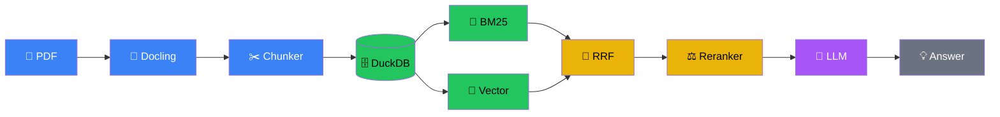
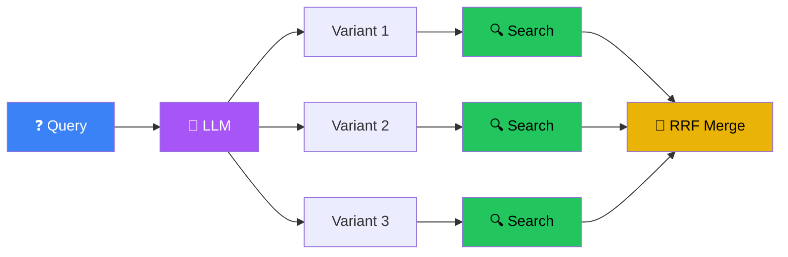
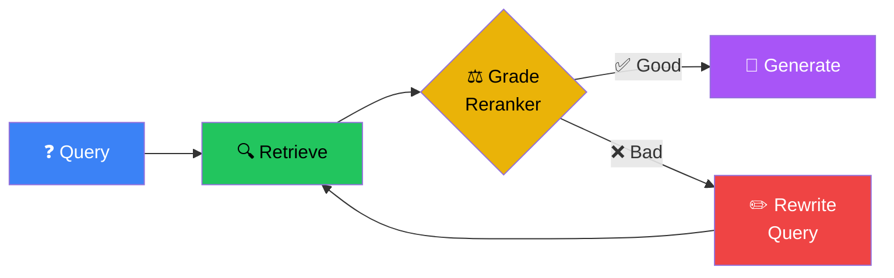
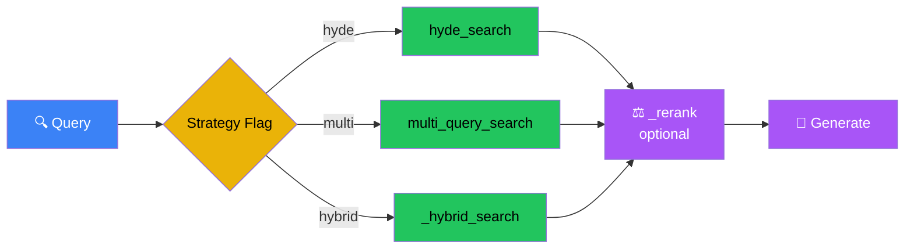
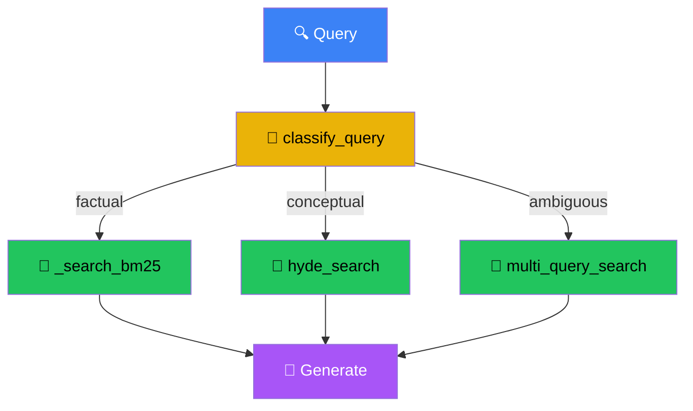
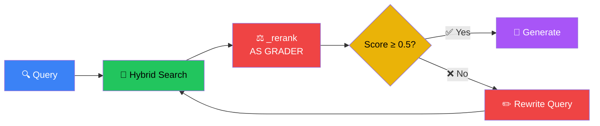
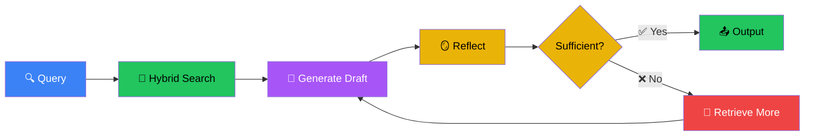
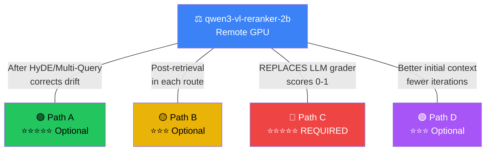
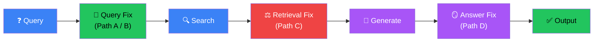

# RAG Workshop - Day 3

<div class="text-6xl mb-8">🧠 + 🛡️ = ⭐</div>

<div class="text-2xl opacity-75">Advanced RAG: Query Intelligence & Self-Correction</div>

<div class="abs-br m-6 text-sm opacity-50">
  HKPF Workshop
</div>

<!--
**Welcome to Day 3 (2 mins)**

- Day 1: We built the Engine (Keyword, BM25, Vector retrievers)
- Day 2: We built the Fuel Injection (Hybrid Search, Reranking, Docling)
- Day 3: Today, we build the **Driver** — systems that fix bad queries, route to the right tools, and correct their own mistakes
- The Shift: Days 1 & 2 assumed the query is perfect. Reality: users write bad queries. Documents are complex.

廣東話：
- Day 1：我哋整咗個 Engine (Keyword, BM25, Vector retrievers)
- Day 2：我哋加咗燃油噴射 (Hybrid Search, Reranking, Docling)
- Day 3：今日，我哋要整 **司機 (Driver)** — 一個識得修正爛 Query、識揀工具、識得自我修正錯誤嘅系統
- 轉變：Day 1 同 Day 2 假設個 query 係完美嘅。現實係：用戶會寫爛 query，文件亦都好複雜。
-->

---
layout: center
---

# The 3-Day Journey

<div class="grid grid-cols-3 gap-8 text-center mt-8">
  <v-click>
  <div class="p-6 border-2 border-blue-500 rounded-xl opacity-50">
    <div class="text-4xl mb-3">🔍</div>
    <div class="font-bold text-xl">Day 1: Retrieval</div>
    <div class="text-sm mt-2">Keyword → BM25 → Vector</div>
    <div class="text-xs mt-2 text-green-400">✅ Complete</div>
  </div>
  </v-click>
  <v-click>
  <div class="p-6 border-2 border-green-500 rounded-xl opacity-50">
    <div class="text-4xl mb-3">🔗</div>
    <div class="font-bold text-xl">Day 2: Precision</div>
    <div class="text-sm mt-2">RRF + Reranking + Docling</div>
    <div class="text-xs mt-2 text-green-400">✅ Complete</div>
  </div>
  </v-click>
  <v-click>
  <div class="p-6 border-2 border-purple-500 rounded-xl bg-purple-900/20">
    <div class="text-4xl mb-3">🧠</div>
    <div class="font-bold text-xl text-purple-400">Day 3: Intelligence</div>
    <div class="text-sm mt-2">Query Intel + Self-Correction</div>
    <div class="text-xs mt-2 text-yellow-400">⬅️ You Are Here</div>
  </div>
  </v-click>
</div>

<!--
**The 3-Day Journey (2 mins)**

- Day 1: Three retrieval methods — Keyword (exact match), BM25 (statistical), Vector (semantic). Measured with DeepEval.
- Day 2: Combined them — Hybrid Search (RRF fusion), Reranking (BGE model), Docling (PDF parsing with tables, images, metadata)
- Day 3: Today we add intelligence — the system fixes bad queries, routes to the right strategy, and corrects its own mistakes
- Key insight: You already built the engine. Today you learn to drive.

廣東話：
- Day 1：三種 retrieval 方法 — Keyword (精準匹配)、BM25 (統計)、Vector (語義)。用 DeepEval 嚟度量。
- Day 2：將佢哋結合 — Hybrid Search (RRF 融合)、Reranking (BGE 模型重排)、Docling (PDF 解析，包埋表格、圖片、metadata)
- Day 3：今日加智能 — 系統識得修正爛 query，路由去啱嘅策略，同埋修正自己嘅錯誤
- 關鍵：你已經整好副引擎。今日係學揸車。
-->

---
layout: center
---

# What You've Built: The Complete Pipeline

<Transform :scale="1.4" origin="center">



</Transform>

<v-click>
<div class="mt-10 text-center text-lg text-green-400">
  Document Ingestion → Hybrid Search → Reranking → Generation
</div>
</v-click>

<!--
**What You've Built (3 mins)**

- Walk through the pipeline left to right:
  - Docling: PDF parsing with table extraction, image descriptions, metadata
  - Chunker: Token-aware chunking with section titles
  - DuckDB: Embedded database with HNSW + FTS indexes
  - BM25 + Vector: Two search methods running in parallel
  - RRF: Democratic fusion — rewards docs that both methods agree on
  - Reranker: Neural re-scoring for precision
  - LLM: Generate grounded answer from context
- This is a production-grade pipeline. But it has one assumption...

廣東話：
- 由左至右行一次個 pipeline：
  - Docling：PDF 解析，做埋表格提取、圖片描述、metadata
  - Chunker：識分 Token 同 Section title 嘅切分
  - DuckDB：嵌入式數據庫，有 HNSW + FTS indexes
  - BM25 + Vector：兩種搜尋方法平行跑
  - RRF：民主式融合 — 獎勵兩種方法都搵到嘅文件
  - Reranker：神經網絡重排，提升準確度
  - LLM：根據 Context 生成有根據嘅答案
- 呢個係 Production-grade 嘅 pipeline。但佢有一個假設...
-->

---
layout: center
---

# Your Building Blocks

<div class="grid grid-cols-2 gap-6 text-sm">
  <v-click>
  <div class="p-4 border border-green-500 rounded-lg">
    <div class="font-bold text-green-400 mb-2">💻 From Days 1-2 (Local)</div>
    <div class="font-mono text-xs space-y-1">
      <div>_search_bm25(conn, query, limit)</div>
      <div>_search_vector(conn, query_vec, limit)</div>
      <div>_hybrid_search(conn, query, top_k)</div>
      <div>_generate_answer(query, chunks)</div>
      <div>ollama.embed(model, input)</div>
      <div>DuckDB with HNSW + FTS indexes</div>
    </div>
  </div>
  </v-click>
  <v-click>
  <div class="p-4 border border-purple-500 rounded-lg">
    <div class="font-bold text-purple-400 mb-2">☁️ New Today (Remote GPU)</div>
    <div class="font-mono text-xs space-y-1">
      <div>chat_client → qwen3-vl-8b</div>
      <div>_rerank() → qwen3-vl-reranker-2b</div>
      <div class="mt-2 text-yellow-400">⚡ GPU inference: ~1-2s</div>
      <div class="text-yellow-400">vs CPU: 5-15s</div>
    </div>
  </div>
  </v-click>
</div>

<v-click>
<div class="mt-6 text-center text-sm opacity-75">
  You already have 10+ working components. Today you arrange them into smarter systems.
</div>
</v-click>

<!--
**Your Building Blocks (2 mins)**

- Left side: Everything from Days 1-2 — search functions, embeddings, database. All LOCAL.
- Right side: Two new remote endpoints on Modal GPU — fast chat model (8B params) and reranker
- Key: Local search stays local (data sovereignty). Remote GPU handles heavy reasoning.
- "You already built the engine. Today you learn to drive."

廣東話：
- 左邊：Day 1-2 嘅所有嘢 — search functions, embeddings, database。全部都係 LOCAL 嘅。
- 右邊：兩個新嘅 Remote 端點 (Modal GPU) — 快速 Chat model (8B params) 同 Reranker
- 關鍵：Local search 留返喺本地 (數據主權)。Remote GPU 負責重型推理。
- 「你已經整好副引擎。今日係學揸車。」
-->

---
layout: center
---

# Architecture: Local Search + Remote Brain

<div class="grid grid-cols-2 gap-12">
  <v-click>
  <div class="p-6 border-2 border-green-500 rounded-xl">
    <div class="text-3xl mb-4 text-green-400">💻 Local (Your Laptop)</div>
    <div class="text-sm mb-2 font-bold">Data Stays Here</div>
    <div class="text-xs opacity-75">• DuckDB (Vector Store + FTS)</div>
    <div class="text-xs opacity-75">• Embeddings (qwen3-embedding:0.6b)</div>
    <div class="text-xs opacity-75">• Hybrid Search Logic</div>
    <div class="text-green-400 mt-3 text-sm">🔒 Documents never leave</div>
  </div>
  </v-click>
  <v-click>
  <div class="p-6 border-2 border-purple-500 rounded-xl">
    <div class="text-3xl mb-4 text-purple-400">☁️ Remote (Modal GPU)</div>
    <div class="text-sm mb-2 font-bold">Heavy Lifting</div>
    <div class="text-xs opacity-75">• qwen3-vl-8b (Generation)</div>
    <div class="text-xs opacity-75">• qwen3-vl-reranker-2b (Grading)</div>
    <div class="text-xs opacity-75">• Query Rewriting / Classification</div>
    <div class="text-purple-400 mt-3 text-sm">⚡ GPU: ~1-2s per call</div>
  </div>
  </v-click>
</div>

<v-click>
<div class="mt-6 text-center text-sm text-yellow-400">
  Real-world pattern: sensitive data stays local, inference offloaded to GPU
</div>
</v-click>

<!--
**Architecture: Local + Remote (3 mins)**

- Government IT reality: You can't send sensitive docs to external APIs
- But you can't run 8B param models fast on standard laptops
- Solution: Hybrid architecture — local DB + remote inference
- Local: Documents, embeddings, search indexes stay on your machine
- Remote: We send queries/context to secure GPU endpoint for reasoning
- This mirrors real production setups in government IT

廣東話：
- 政府 IT 現實：你唔可以將敏感文件 send 去出面嘅 API
- 但你又唔可以用普通 Laptop 跑得郁 8B param models
- 解決方案：Hybrid 架構 — Local DB + Remote 推理
- Local：文件、Embeddings、Search indexes 全部留喺你部機
- Remote：我哋 send query 同 context 去安全嘅 GPU endpoint 做推理
- 呢個好反映真實政府 IT 嘅 setup
-->

---
layout: center
---

# How to Call the Remote LLM

<div class="grid grid-cols-2 gap-8 text-sm">
  <v-click>
  <div class="p-4 border border-red-500 rounded-lg bg-red-900/10">
    <div class="font-bold text-red-400 mb-2">❌ Before (Part 3 — Local CPU)</div>

```python
resp = ollama.chat(
    model="granite4:350m",
    messages=[{
        "role": "user",
        "content": "Hello"
    }],
)
answer = resp["message"]["content"]
```

  </div>
  </v-click>
  <v-click>
  <div class="p-4 border border-green-500 rounded-lg bg-green-900/10">
    <div class="font-bold text-green-400 mb-2">✅ Now (Day 3 — Remote GPU)</div>

```python
resp = chat_client.chat.completions.create(
    model=CHAT_MODEL,
    messages=[{
        "role": "user",
        "content": "Hello"
    }],
)
answer = resp.choices[0].message.content
```

  </div>
  </v-click>
</div>

<v-click>
<div class="mt-6 p-3 border border-yellow-500 rounded-lg bg-yellow-900/20 text-center text-sm">
  Same idea, different syntax: <code>chat_client.chat.completions.create()</code> + <code>.choices[0].message.content</code>
</div>
</v-click>

<!--
**How to Call the Remote LLM (3 mins)**

- Left: What you used in Part 3 — ollama.chat() with local model
- Right: What you'll use today — OpenAI-compatible client pointing to Modal GPU
- Key differences:
  - chat_client.chat.completions.create() instead of ollama.chat()
  - .choices[0].message.content instead of ["message"]["content"]
  - Model is 8B params on GPU — much faster and more capable
- Everything else is the same: messages list, role/content format

廣東話：
- 左邊：Part 3 用嘅 — `ollama.chat()` 配 local model
- 右邊：今日會用嘅 — OpenAI-compatible client 指向 Modal GPU
- 關鍵分別：
  - 用 `chat_client.chat.completions.create()` 取代 `ollama.chat()`
  - 用 `.choices[0].message.content` 取代 `["message"]["content"]`
  - Model 係 GPU 上嘅 8B params — 快好多同勁好多
- 其他嘢一樣：messages list, role/content 格式不變
-->

---
layout: center
---

# How to Use the Reranker

```python
# Rerank 10 documents, keep top 3
reranked = _rerank(
    query="What is the procedure for Level 3 Alarm?",
    documents=["doc1 text...", "doc2 text...", ...],
    top_k=3
)
# Returns: [("most relevant doc", 0.72), ("second best", 0.61), ...]
```

<v-click>
<div class="grid grid-cols-2 gap-8 mt-6 text-sm">
  <div class="p-4 border border-blue-500 rounded-lg">
    <div class="font-bold text-blue-400 mb-2">🔍 Use 1: Filtering</div>
    <div class="text-xs">Keep only high-scoring results before generation</div>

```python
results = [doc for doc, score in reranked
           if score > 0.3]
```

  </div>
  <div class="p-4 border border-yellow-500 rounded-lg">
    <div class="font-bold text-yellow-400 mb-2">⚖️ Use 2: Grading (CRAG)</div>
    <div class="text-xs">Check if docs are relevant enough</div>

```python
best_score = reranked[0][1]
if best_score < 0.5:
    rewrite_and_retry()
```

  </div>
</div>
</v-click>

<v-click>
<div class="mt-4 text-center text-xs opacity-75">
  Scores: 0–1 range | >0.5 = relevant | <0.3 = irrelevant
</div>
</v-click>

<!--
**How to Use the Reranker (3 mins)**

- _rerank() is a wrapper we provide — handles the HTTP call to Modal GPU
- Input: query string + list of document texts + how many to keep
- Output: list of (document_text, relevance_score) tuples, sorted by score
- Two use cases:
  1. Filtering: Keep only high-scoring results before feeding to LLM
  2. Grading: In CRAG, check if best_score >= threshold to decide whether to retry
- Scores are 0-1 with clear separation: relevant ~0.6-0.7, irrelevant ~0.2

廣東話：
- `_rerank()` 係我哋提供嘅 wrapper — 幫你搞掂去 Modal GPU 嘅 HTTP call
- 輸入：query string + document texts list + 要留幾多個
- 輸出：(document_text, relevance_score) tuples list，按分數排好
- 兩個用途：
  1. Filtering：俾 LLM 之前，只留高分結果
  2. Grading：喺 CRAG 入面，check 下 best_score >= threshold 嚟決定需唔需要 retry
- 分數係 0-1：relevant 大約 0.6-0.7，irrelevant 大約 0.2，分得好開
-->


---
layout: center
---

# The Assumption We Made

<div class="text-8xl mb-8">🤔</div>

<v-click>
<div class="text-xl mb-6">
  Our pipeline assumes the <span class="text-red-400 font-bold">query is perfect</span>
</div>
</v-click>

<v-click>
<div class="grid grid-cols-3 gap-6 text-center text-sm">
  <div class="p-4 border border-red-500 rounded-lg bg-red-900/20">
    <div class="text-2xl mb-2">❌</div>
    <div class="font-bold text-red-400">Bad Query</div>
    <div class="text-xs opacity-75 mt-1">"Lost ID card"</div>
    <div class="text-xs opacity-50">vs "Identification Document Replacement"</div>
  </div>
  <div class="p-4 border border-red-500 rounded-lg bg-red-900/20">
    <div class="text-2xl mb-2">❌</div>
    <div class="font-bold text-red-400">Bad Retrieval</div>
    <div class="text-xs opacity-75 mt-1">Found Level 2 docs</div>
    <div class="text-xs opacity-50">when asking about Level 3</div>
  </div>
  <div class="p-4 border border-red-500 rounded-lg bg-red-900/20">
    <div class="text-2xl mb-2">❌</div>
    <div class="font-bold text-red-400">Bad Answer</div>
    <div class="text-xs opacity-75 mt-1">First draft misses nuances</div>
    <div class="text-xs opacity-50">in complex policy questions</div>
  </div>
</div>
</v-click>

<!--
**The Assumption We Made (3 mins)**

- Everything we built assumes the user writes a perfect query
- Reality: Three failure modes
  1. Bad Query: User says "lost ID" but document says "Identification Document Replacement Procedure"
  2. Bad Retrieval: System finds wrong documents (Level 2 instead of Level 3 alarm procedures)
  3. Bad Answer: LLM generates incomplete or unfaithful answer on first try
- Each failure mode has a specific advanced RAG technique to fix it
- That's what today is about: building systems that handle imperfect inputs

廣東話：
- 我哋之前起嘅嘢，全部假設用戶會寫一個完美 query
- 現實：三種失敗模式
  1. Bad Query：用戶話 "lost ID" 但文件寫 "Identification Document Replacement Procedure"
  2. Bad Retrieval：系統搵錯文件 (問 Level 3 alarm 但搵咗 Level 2 docs)
  3. Bad Answer：LLM 第一轉生成嘅答案唔完整或者唔準確
- 每一種失敗模式都有特定嘅 Advanced RAG 技術去救
- 今日就係講呢樣：起一個識處理「不完美輸入」嘅系統
-->

---
layout: center
---

# The Problem: Vocabulary Mismatch

<div class="grid grid-cols-2 gap-12">
  <v-click>
  <div class="p-6 border-2 border-red-500 rounded-xl bg-red-900/20">
    <div class="text-3xl mb-4">👤</div>
    <div class="text-xl font-bold text-red-400">"唔見咗張身份證"</div>
    <div class="text-sm opacity-75 mt-3">廣東話口語</div>
    <div class="text-sm opacity-75">Short / Vague</div>
    <div class="text-sm opacity-75">Ambiguous intent</div>
  </div>
  </v-click>
  <v-click>
  <div class="p-6 border-2 border-blue-500 rounded-xl bg-blue-900/20">
    <div class="text-3xl mb-4">📋</div>
    <div class="text-xl font-bold text-blue-400">"補領身份證明文件程序"</div>
    <div class="text-sm opacity-75 mt-3">官方書面語</div>
    <div class="text-sm opacity-75">Formal language</div>
    <div class="text-sm opacity-75">Specific procedures</div>
  </div>
  </v-click>
</div>

<v-click>
<div class="mt-8 text-center text-xl text-yellow-400">
  Even vector search struggles when the semantic gap is too wide 📉
</div>
</v-click>

<!--
**Vocabulary Mismatch (3 mins)**

- Government scenario: Public inquiry chatbot
- Citizens use Cantonese slang: "唔見咗張身份證", "隔離太嘈", "抄咗牌"
- Official docs use formal written Chinese: "補領身份證明文件程序", "噪音滋擾條例", "定額罰款通知書"
- Even vector search can fail when the semantic distance is too far
- We need to translate "User Language" to "System Language" BEFORE we search

廣東話：
- 政府場景：公眾查詢 Chatbot
- 市民用廣東話口語："唔見咗張身份證", "隔離太嘈", "抄咗牌"
- 官方文件用書面語："補領身份證明文件程序", "噪音滋擾條例", "定額罰款通知書"
- 當語義距離太遠，就算 Vector search 都會失敗
- 我哋需要喺搜尋 **之前**，將「用戶語言」翻譯成「系統語言」
-->

---
layout: center
---

# 5 Techniques to Fix This

<div class="grid grid-cols-5 gap-3 text-center text-xs">
  <v-click>
  <div class="p-3 border border-blue-500 rounded-lg">
    <div class="text-2xl mb-2">🔀</div>
    <div class="font-bold text-blue-400">Multi-Query</div>
    <div class="opacity-75 mt-1">Cast a wider net</div>
  </div>
  </v-click>
  <v-click>
  <div class="p-3 border border-green-500 rounded-lg">
    <div class="text-2xl mb-2">🌉</div>
    <div class="font-bold text-green-400">HyDE</div>
    <div class="opacity-75 mt-1">Semantic bridge</div>
  </div>
  </v-click>
  <v-click>
  <div class="p-3 border border-yellow-500 rounded-lg">
    <div class="text-2xl mb-2">🚦</div>
    <div class="font-bold text-yellow-400">Modular RAG</div>
    <div class="opacity-75 mt-1">Smart routing</div>
  </div>
  </v-click>
  <v-click>
  <div class="p-3 border border-red-500 rounded-lg">
    <div class="text-2xl mb-2">🔄</div>
    <div class="font-bold text-red-400">CRAG</div>
    <div class="opacity-75 mt-1">Self-correction</div>
  </div>
  </v-click>
  <v-click>
  <div class="p-3 border border-purple-500 rounded-lg">
    <div class="text-2xl mb-2">🪞</div>
    <div class="font-bold text-purple-400">Self-RAG</div>
    <div class="opacity-75 mt-1">Draft → Reflect</div>
  </div>
  </v-click>
</div>

<v-click>
<div class="mt-8 text-center text-sm opacity-75">
  Each fixes a different failure mode. Let's explore them one by one.
</div>
</v-click>

<!--
**5 Techniques Overview (2 mins)**

- Quick preview of what's coming — don't explain details yet
- Multi-Query: Fix bad queries by generating variants
- HyDE: Fix semantic gap by generating fake answers
- Modular RAG: Route different query types to different strategies
- CRAG: Detect bad retrieval and retry
- Self-RAG: Detect bad answers and improve
- Each technique addresses a specific failure mode

廣東話：
- 快速預覽一陣會講嘅嘢 — 唔洗講細節住
- Multi-Query：生成變體，修正爛 queries
- HyDE：生成假答案，修正語義鴻溝
- Modular RAG：將唔同 query 路由去唔同策略
- CRAG：檢測爛 retrieval 然後 retry
- Self-RAG：檢測爛 answer 然後改善
- 每一種技術都係針對一種特定嘅失敗模式
-->

---
layout: center
---

# Technique 1: Multi-Query Expansion

<div class="text-xl mb-4">Solve ambiguity by <span class="text-blue-400 font-bold">casting a wider net</span></div>

<Transform :scale="1.0" origin="center">



</Transform>

<v-click>
<div class="mt-6 p-3 border border-blue-500 rounded-lg bg-blue-900/20 text-center text-sm">
  💡 <em>Like asking 3 colleagues to Google the same thing — each uses different words, together they find everything</em>
</div>
</v-click>

<v-click>
<div class="mt-2 p-3 border border-cyan-500 rounded-lg bg-cyan-900/20 text-xs">
  🔬 <strong class="text-cyan-400">Why it works:</strong> Embedding is <em>lossy compression</em> — one query compresses to one point, but your concept has many facets. Each variant emphasizes a different facet. RRF rewards documents that appear across multiple angles.
</div>
</v-click>

<!--
**Multi-Query Expansion (4 mins)**

- Analogy: 3 colleagues searching = 3 query variants. Different words, same intent, better coverage.
- THE REAL INSIGHT: Embedding is lossy compression. "Lost ID" compresses to ONE point in vector space, but the concept has multiple facets — the replacement procedure, the reporting process, the fee schedule. Each variant query emphasizes a different facet, so each search finds documents from a different angle.
- Why RRF matters here: RRF rewards documents that appear across multiple search results. A document that shows up for 3 different query variants is almost certainly relevant — it covers the concept comprehensively, not just one angle.
- Breadth strategy: Multi-Query casts a WIDE NET. Each individual search still has the query-document asymmetry problem, but together they cover more ground.
- Process: User query → LLM generates 3 variants → Search ALL 4 → Fuse with RRF (from Day 2!)
- Key: Reuses your _hybrid_search() and RRF from Part 3
- vs HyDE: Multi-Query = breadth (3 questions, 3 searches). HyDE = depth (1 fake document, 1 search, sharper probe). They're complementary — Path A combines both.

廣東話：
- 比喻：搵 3 個同事一齊 Google = 3 個 query 變體。唔同字眼，同一意圖，覆蓋率更高。
- 真正嘅洞見：Embedding 係有損壓縮。"遺失身份證" 壓縮成向量空間入面一個點，但呢個概念有好多面 — 補領程序、報失流程、費用。每個變體 query 強調唔同嘅面，所以每次 search 搵到唔同角度嘅文件。
- 點解 RRF 喺度重要：RRF 獎勵出現喺多個搜尋結果嘅文件。一份文件如果 3 個唔同 query 變體都搵到佢，幾乎肯定係相關嘅 — 佢全面覆蓋個概念，唔止一個角度。
- 闊度策略：Multi-Query 撒大網。每個單獨嘅 search 仍然有 query-document 不對稱問題，但加埋一齊就覆蓋更多範圍。
- 流程：User query → LLM 生成 3 個變體 → 4 個一齊 Search → 用 RRF 融合 (Day 2 學過！)
- 關鍵：重用你 Part 3 嘅 `_hybrid_search()` 同 RRF
- 同 HyDE 比較：Multi-Query = 闊度 (3 條問題，3 次 search)。HyDE = 深度 (1 份假文件，1 次 search，更精準嘅探針)。佢哋互補 — Path A 兩個都用。
-->

---
layout: center
---

# Multi-Query: Government Scenario

<div class="text-5xl mb-6">🏛️</div>

<div class="text-lg mb-4"><span class="text-blue-400">Scenario:</span> Public Inquiry Chatbot</div>

<v-click>
<div class="p-4 border border-blue-500 rounded-lg bg-blue-900/20 mb-4">
  <div class="font-bold text-blue-400">User asks:</div>
  <div class="text-xl">"Lost ID card"</div>
</div>
</v-click>

<v-click>
<div class="p-4 border border-purple-500 rounded-lg bg-purple-900/20 mb-4">
  <div class="font-bold text-purple-400">LLM generates 3 variants:</div>
  <div class="text-sm mt-2">1. "How to replace HKID card"</div>
  <div class="text-sm">2. "Report lost identification document procedure"</div>
  <div class="text-sm">3. "Fee for new identity card application"</div>
</div>
</v-click>

<v-click>
<div class="p-4 border border-green-500 rounded-lg bg-green-900/20">
  <div class="font-bold text-green-400">Result:</div>
  <div class="text-sm">4 searches → RRF fusion → covers formal AND informal terminology ✅</div>
</div>
</v-click>

<!--
**Multi-Query Government Scenario (2 mins)**

- Public inquiry chatbot: citizens use unpredictable terminology
- "Lost ID" is too vague for BM25 and too short for good vector embeddings
- Multi-Query generates variants that cover different angles
- RRF fusion (from Day 2) merges all results democratically
- Best for: citizen-facing systems, FAQ chatbots, general inquiry portals
- Document types: public-facing guidelines, FAQ documents, service procedures

廣東話：
- 公眾查詢 Chatbot：市民用詞好難預計
- "Lost ID" 對 BM25 嚟講太含糊，對 Vector 嚟講太短
- Multi-Query 生成覆蓋唔同角度嘅變體
- RRF 融合 (Day 2) 民主地 merge 埋啲結果
- 最適合：對市民系統、FAQ chatbots、一般查詢 portal
- 文件類型：公眾指引、FAQ 文件、服務程序
-->

---
layout: center
---

# Technique 2: HyDE

<div class="text-xl mb-4">Hypothetical Document Embeddings — a <span class="text-green-400 font-bold">semantic bridge</span></div>

<div class="grid grid-cols-2 gap-8 text-center mb-4">
  <v-click>
  <div class="p-4 border border-red-500 rounded-lg bg-red-900/10">
    <div class="font-bold text-red-400">❌ Standard RAG</div>
    <div class="text-xs mt-2">Embed(<span class="text-blue-400">"Evidence handling rules?"</span>)</div>
    <div class="text-xs mt-1 opacity-75">3 words → <span class="text-red-400">vague, ambiguous</span> vector</div>
    <div class="text-xs mt-1 opacity-50">Could mean: collection? storage? court submission?</div>
  </div>
  </v-click>
  <v-click>
  <div class="p-4 border border-green-500 rounded-lg bg-green-900/10">
    <div class="font-bold text-green-400">✅ HyDE</div>
    <div class="text-xs mt-2">Embed(<span class="text-purple-400">"Officers shall maintain chain of custody..."</span>)</div>
    <div class="text-xs mt-1 opacity-75">70 words → <span class="text-green-400">specific, domain-rich</span> vector</div>
    <div class="text-xs mt-1 opacity-50">Disambiguated + right vocabulary</div>
  </div>
  </v-click>
</div>

<Transform :scale="1.0" origin="center">


</Transform>

<v-click>
<div class="mt-4 p-3 border border-green-500 rounded-lg bg-green-900/20 text-center text-sm">
  💡 <em>You're in a massive library. You ask: "evidence?" The librarian vaguely gestures at 3 sections. But if you say: "I need the procedure for maintaining chain of custody when collecting physical evidence at crime scenes" — the librarian walks you straight to the right shelf.</em>
</div>
</v-click>

<v-click>
<div class="mt-2 p-3 border border-cyan-500 rounded-lg bg-cyan-900/20 text-xs">
  🔬 <strong class="text-cyan-400">Why it works:</strong> The fake answer <em>disambiguates</em> your intent and introduces <em>domain vocabulary</em> ("chain of custody", "exhibit label", "forensic integrity"). It doesn't need to be correct — just <strong>specific</strong>. We use its embedding as a search probe, then throw it away.
</div>
</v-click>

<!--
**HyDE (5 mins)**

- Analogy: Library analogy — "evidence?" gets a vague gesture at 3 sections. "I need the procedure for maintaining chain of custody when collecting physical evidence at crime scenes" gets you walked to the right shelf. HyDE turns a vague gesture into a specific description.
- THE REAL INSIGHT: It's NOT that embeddings are broken. Same model, same dimensions, semantic search works. The issue is QUERY-DOCUMENT ASYMMETRY + INFORMATION SPARSITY.
- Queries are information-sparse and ambiguous: "Evidence handling rules?" — 3 words. The embedding model compresses this into a single vector, but those 3 words could mean collection procedures, storage requirements, court submission protocols, or forensic lab standards. The resulting vector is a BLURRY AVERAGE of all possible intents.
- The fake answer helps because it's SPECIFIC, not because it's correct:
  1. DISAMBIGUATES intent — commits to one interpretation (the collection procedure)
  2. INTRODUCES DOMAIN VOCABULARY — "chain of custody", "exhibit label", "tamper-evident bag", "forensic integrity" — the exact words in real documents
  3. MATCHES DOCUMENT REGISTER — reads like a policy document, not a question
- The embedding of the fake answer is a SHARPER, MORE SPECIFIC probe. It collapses ambiguity into a specific point closer to the right documents.
- Critical: We THROW AWAY the fake answer's content. We only use its embedding as a search probe. The final answer comes from REAL documents + ORIGINAL query.
- vs Multi-Query: HyDE = depth (1 fake document, 1 search, precise spear). Multi-Query = breadth (3 questions, 3 searches, wide net). They're complementary.
- Uses local embeddings (ollama.embed) — only the generation is remote

廣東話：
- 比喻：圖書館比喻 — 你問「證物？」管理員含糊咁指三個方向。但如果你講「我要搵關於喺案發現場收集實物證據時維持證物鏈嘅程序」— 管理員直接帶你去啱嘅書架。HyDE 將含糊嘅手勢變成具體嘅描述。
- 真正嘅洞見：唔係 embedding 壞咗。同一個 model，同一個維度，語義搜尋係 work 嘅。問題係 QUERY-DOCUMENT 不對稱 + 資訊稀疏。
- Query 資訊稀疏又含糊："證物處理規則？" — 3 個字。Embedding model 要將呢 3 個字壓縮成一個向量，但呢 3 個字可以指收集程序、儲存要求、呈堂程序、或者鑑證化驗標準。結果嘅向量係所有可能意圖嘅模糊平均值。
- 假答案有用係因為佢夠具體，唔係因為佢正確：
  1. 消除歧義 — 鎖定一個解讀（收集程序）
  2. 引入領域詞彙 — "證物鏈"、"證物標籤"、"防拆封袋"、"鑑證完整性" — 真正文件入面嘅字
  3. 匹配文件語域 — 讀起嚟似政策文件，唔似問題
- 假答案嘅 embedding 係一個更精準、更具體嘅探針。佢將模糊性收窄到一個更接近正確文件嘅具體點。
- 關鍵：我哋丟棄假答案嘅內容。只用佢嘅 embedding 做搜尋探針。最終答案來自真正文件 + 原始 query。
- 同 Multi-Query 比較：HyDE = 深度 (1 份假文件，1 次 search，精準嘅矛)。Multi-Query = 闊度 (3 條問題，3 次 search，大網)。佢哋互補。
- 用本地 embedding（ollama.embed）— 只有生成部分用遠端 GPU
-->

---
layout: two-cols
---

# HyDE: Step-by-Step Trace

```python {all|1|2-6|7|8}
query = "What are the evidence handling rules?"
resp = chat_client.chat.completions.create(
    model=CHAT_MODEL,
    messages=[{"role": "user",
      "content": f"Answer: {query}"}],
)
fake_answer = resp.choices[0].message.content
hyde_vec = ollama.embed(model=EMBED_MODEL,
                        input=fake_answer)
results = _search_vector(conn, hyde_vec, limit=5)
answer = _generate_answer(query, results)
```

<div class="mt-3 p-2 border border-red-500 rounded bg-red-900/20 text-xs">
  ⚠️ <code>fake_answer</code> is a <strong>search probe</strong> — we throw it away after embedding
</div>

::right::

<div class="pl-6 pt-4">

<v-click at="0">
<div class="mb-2 p-2 bg-blue-900/30 rounded border border-blue-500">
  <div class="text-xs opacity-75">❓ User Query (6 words):</div>
  <code class="text-xs">"What are the evidence handling rules?"</code>
  <div class="text-xs text-red-400 mt-1">⚠️ Ambiguous: collection? storage? court submission?</div>
</div>
</v-click>

<v-click at="1">
<div class="mb-2 p-2 bg-purple-900/30 rounded border border-purple-500">
  <div class="text-xs opacity-75">🤖 Fake Answer (~70 words):</div>
  <div class="text-xs mt-1">"Evidence must be collected following strict <span class="text-purple-400">chain of custody</span> procedures. Each item shall be placed in a <span class="text-purple-400">tamper-evident bag</span> with an <span class="text-purple-400">exhibit label</span> recording the officer, date, time, and location of recovery..."</div>
  <div class="text-xs text-yellow-400 mt-1">⚡ May be wrong — doesn't matter!</div>
</div>
</v-click>

<v-click at="2">
<div class="mb-2 p-2 bg-yellow-900/30 rounded border border-yellow-500">
  <div class="text-xs opacity-75">🧠 Embed fake answer (not query!):</div>
  <div class="text-xs mt-1">Vector encodes: "chain of custody", "tamper-evident", "exhibit label", "forensic integrity", "Standing Order"...</div>
  <div class="text-xs text-green-400 mt-1">10× more vocabulary than original query</div>
</div>
</v-click>

<v-click at="3">
<div class="mb-2 p-2 bg-green-900/30 rounded border border-green-500">
  <div class="text-xs opacity-75">📄 Search results (real documents!):</div>
  <div class="text-xs mt-1">1. Standing Order 18-02: Evidence Collection <span class="text-green-400">(0.87)</span></div>
  <div class="text-xs">2. Forensic Evidence Handling Guide <span class="text-green-400">(0.82)</span></div>
  <div class="text-xs">3. Exhibit Management Procedures <span class="text-green-400">(0.76)</span></div>
</div>
</v-click>

</div>

<!--
**HyDE Step-by-Step Trace (3 mins)**

- Walk through the code left, data right — same format as Day 1's keyword search trace
- Line 1: The user's query — only 6 words, colloquial, ambiguous
- Lines 2-6: Send to remote GPU LLM to generate a fake answer. The prompt is simple: "Answer: {query}"
- Line 7: Extract the fake answer — ~70 words of policy-style text. Highlight the domain vocabulary in purple: "chain of custody", "tamper-evident bag", "exhibit label"
- Line 8: Embed the FAKE ANSWER locally (not the query!). This vector has 10× more relevant vocabulary than the original 6-word query
- Line 9: Search with the fake answer's embedding — finds the actual policy documents with high scores
- Line 10: Generate final answer from REAL documents using the ORIGINAL query
- KEY POINT: The fake answer might be factually wrong. We don't care — we only used its embedding as a search probe. The real documents are what matter.
- Compare: Standard RAG would embed "What are the evidence handling rules?" (6 words) → vague vector → misses the policy documents

廣東話：
- 左邊行 code，右邊行 data — 同 Day 1 keyword search trace 一樣嘅格式
- Line 1：用戶嘅 query — 得 6 個字，口語化，含糊
- Lines 2-6：Send 去遠端 GPU LLM 生成假答案。Prompt 好簡單："Answer: {query}"
- Line 7：攞出假答案 — 大約 70 字嘅政策風格文字。留意紫色嘅領域詞彙："證物鏈"、"防拆封袋"、"證物標籤"
- Line 8：喺本地 embed 假答案（唔係 query！）。呢個向量有比原本 6 個字 query 多 10 倍嘅相關詞彙
- Line 9：用假答案嘅 embedding 做 search — 搵到真正嘅政策文件，分數好高
- Line 10：用真正文件 + 原始 query 生成最終答案
- 重點：假答案可能事實上係錯嘅。我哋唔 care — 我哋只係用佢嘅 embedding 做搜尋探針。真正嘅文件先係重要嘅。
- 比較：Standard RAG 會 embed "What are the evidence handling rules?" (6 個字) → 模糊向量 → miss 咗政策文件
-->

---
layout: center
---

# HyDE: Government Scenario

<div class="text-5xl mb-6">📜</div>

<div class="text-lg mb-4"><span class="text-green-400">Scenario:</span> Abstract Policy Questions</div>

<v-click>
<div class="p-4 border border-blue-500 rounded-lg bg-blue-900/20 mb-4">
  <div class="font-bold text-blue-400">User asks:</div>
  <div class="text-xl">"Evidence handling rules?"</div>
</div>
</v-click>

<v-click>
<div class="p-4 border border-purple-500 rounded-lg bg-purple-900/20 mb-4">
  <div class="font-bold text-purple-400">LLM generates fake answer:</div>
  <div class="text-xs mt-2 italic">"All physical evidence must be collected following chain of custody procedures. Each exhibit shall be sealed in a tamper-evident bag, labelled with the officer's name, date, time, and location of recovery. Evidence must be stored in a designated secure facility..."</div>
</div>
</v-click>

<v-click>
<div class="p-4 border border-green-500 rounded-lg bg-green-900/20">
  <div class="font-bold text-green-400">Result:</div>
  <div class="text-sm">Fake answer embedding ≈ Real Standing Orders embedding → finds the right document ✅</div>
</div>
</v-click>

<!--
**HyDE Government Scenario (2 mins)**

- Abstract procedural questions: "rules", "procedures", "guidelines"
- These are short queries about long, formal documents
- The fake answer reads like the actual Standing Orders document — same vocabulary, same formal tone
- Embedding the fake answer creates a vector in "document-land" — close to the real doc
- The fake answer says "chain of custody" and "tamper-evident" — the SAME words the real Standing Orders uses
- Even if the fake answer gets details wrong, the embedding lands in the right neighbourhood
- Best for: policy documents, Standing Orders, regulatory frameworks, compliance guidelines
- Document types: dense formal documents where concepts > keywords

廣東話：
- 抽象程序問題："規則"、"程序"、"指引"
- 呢啲係用幾隻字問關於好長、好正式嘅文件
- 假答案讀起嚟好似真正嘅《常行命令》— 同樣嘅詞彙、同樣嘅正式語氣
- Embed 假答案之後，佢嘅向量落喺「文件區」— 好近真正嘅文件
- 假答案用咗 "證物鏈" 同 "防拆封" — 同真正《常行命令》用嘅字一樣
- 即使假答案細節有錯，embedding 都會落喺啱嘅區域
- 最適合：政策文件、《常行命令》、規管框架、合規指引
- 文件類型：概念重要過關鍵字嘅密集正式文件
-->

---
layout: center
---

# Technique 3: Modular RAG (Routing)

<div class="text-xl mb-4">One size does <span class="text-yellow-400 font-bold">NOT</span> fit all</div>

<div class="grid grid-cols-3 gap-4 text-sm text-center">
  <v-click>
  <div class="p-3 border border-blue-500 rounded-lg">
    <div class="text-2xl mb-2">🔢</div>
    <div class="font-bold text-blue-400">Factual</div>
    <div class="text-xs opacity-75">"What is the fine for littering?"</div>
    <div class="mt-2 font-mono text-xs bg-blue-900/50 p-1 rounded">→ BM25 (Exact Match)</div>
  </div>
  </v-click>
  <v-click>
  <div class="p-3 border border-purple-500 rounded-lg">
    <div class="text-2xl mb-2">🧠</div>
    <div class="font-bold text-purple-400">Conceptual</div>
    <div class="text-xs opacity-75">"Explain community policing"</div>
    <div class="mt-2 font-mono text-xs bg-purple-900/50 p-1 rounded">→ HyDE (Semantic)</div>
  </div>
  </v-click>
  <v-click>
  <div class="p-3 border border-yellow-500 rounded-lg">
    <div class="text-2xl mb-2">❓</div>
    <div class="font-bold text-yellow-400">Ambiguous</div>
    <div class="text-xs opacity-75">"Noise issues"</div>
    <div class="mt-2 font-mono text-xs bg-yellow-900/50 p-1 rounded">→ Multi-Query</div>
  </div>
  </v-click>
</div>

<v-click>
<div class="mt-6 text-center text-green-400">
  Use an LLM "Router" to pick the best strategy for each query
</div>
</v-click>

<v-click>
<div class="mt-4 p-3 border border-yellow-500 rounded-lg bg-yellow-900/20 text-center text-sm">
  💡 <em>Like a hospital triage nurse — assess the patient first, then send to the right specialist</em>
</div>
</v-click>

<v-click>
<div class="mt-2 p-3 border border-cyan-500 rounded-lg bg-cyan-900/20 text-xs">
  🔬 <strong class="text-cyan-400">Why it works:</strong> Different query types have <em>category failures</em>. "Cap. 228 Section 14(2)" fails with vector search — the embedding treats "228" as a generic number. BM25 treats it as an exact token. The router prevents <strong>fundamental mismatches</strong>, not just suboptimal results.
</div>
</v-click>

<!--
**Modular RAG (4 mins)**

- Analogy: Triage nurse → specialist. Don't send everyone to the same doctor.
- THE REAL INSIGHT: Different query types don't just get "slightly worse" results with the wrong strategy — they get CATEGORY FAILURES where the wrong search type fundamentally CANNOT find the right documents.
- Example: "Cap. 228 Section 14(2)" with vector search — the embedding model treats "228" and "14(2)" as generic numbers, not as specific legal identifiers. The vector lands in a vague "numbers + law" region. BM25 treats them as exact tokens and finds the exact ordinance. This isn't "BM25 is slightly better" — vector search CANNOT find this document.
- Reverse example: "What's the policy on community engagement?" with BM25 — the exact words might not appear in the document (it says "public liaison" and "neighbourhood outreach"). BM25 score: zero. Vector search understands the semantic similarity.
- The router is NOT an optimization — it prevents category errors where the wrong search type is fundamentally blind to what you're looking for.
- Solution: Build a Router — small LLM call classifies the query type, then routes to the best strategy
- This is the "architect" path — you design the system, not just the search

廣東話：
- 比喻：分流護士 → 專科醫生。唔好將所有人都送去同一個醫生度。
- 真正嘅洞見：唔同 query 類型用錯策略唔係「差少少」— 係類別性失敗，錯嘅 search 類型根本搵唔到啱嘅文件。
- 例子："Cap. 228 Section 14(2)" 用 vector search — embedding model 將 "228" 同 "14(2)" 當成普通數字，唔係特定法律標識。個向量落喺模糊嘅「數字 + 法律」區域。BM25 將佢哋當成精確 token，直接搵到條例。呢個唔係「BM25 好少少」— vector search 根本搵唔到呢份文件。
- 反面例子："What's the policy on community engagement?" 用 BM25 — 文件入面可能寫嘅係 "public liaison" 同 "neighbourhood outreach"。BM25 分數：零。Vector search 理解語義相似性。
- Router 唔係優化 — 佢係防止類別性錯誤，即錯嘅 search 類型對你搵嘅嘢根本係盲嘅。
- 解決方案：起一個 Router — 用細 LLM call 去分類個 query type，然後路由去最佳策略
- 呢個係「架構師」路線 — 你係設計個系統，唔止係 search
-->

---
layout: center
---

# Modular RAG: Government Scenario

<div class="text-5xl mb-6">⚖️</div>

<div class="text-lg mb-4"><span class="text-yellow-400">Scenario:</span> Multi-User Government Portal</div>

<div class="grid grid-cols-2 gap-8 text-sm">
  <v-click>
  <div class="p-4 border border-blue-500 rounded-lg">
    <div class="text-2xl mb-2">👨‍⚖️</div>
    <div class="font-bold text-blue-400">Legal Officer</div>
    <div class="text-xs mt-2">"Cap. 228 Section 14(2)"</div>
    <div class="text-xs opacity-75 mt-1">Needs exact Ordinance reference</div>
    <div class="mt-2 font-mono text-xs bg-blue-900/50 p-1 rounded">→ BM25</div>
  </div>
  </v-click>
  <v-click>
  <div class="p-4 border border-purple-500 rounded-lg">
    <div class="text-2xl mb-2">👤</div>
    <div class="font-bold text-purple-400">Citizen</div>
    <div class="text-xs mt-2">"Can I park here on Sunday?"</div>
    <div class="text-xs opacity-75 mt-1">Vague, needs interpretation</div>
    <div class="mt-2 font-mono text-xs bg-purple-900/50 p-1 rounded">→ Multi-Query</div>
  </div>
  </v-click>
</div>

<v-click>
<div class="mt-6 p-3 border border-green-500 rounded-lg bg-green-900/20 text-center text-sm">
  Same system, different users → Router picks the right tool automatically
</div>
</v-click>

<!--
**Modular RAG Government Scenario (2 mins)**

- Government portals serve different user types with different needs
- Legal officers need exact references — BM25 excels at finding specific section numbers
- Citizens ask vague questions — Multi-Query covers different phrasings
- Policy researchers ask conceptual questions — HyDE bridges the semantic gap
- The Router classifies the query and picks the best strategy
- Best for: multi-user portals, systems serving both internal staff and public

廣東話：
- 政府 Portal 會服務唔同類型用戶，需求都唔同
- Legal officers 要精準引用 — BM25 最擅長搵特定 Section number
- 市民問含糊問題 — Multi-Query 覆蓋唔同講法
- 政策研究員問概念性問題 — HyDE 連接語義鴻溝
- Router 會分類個 query 自動揀最好嘅策略
- 最適合：多用戶 Portal、同時服務內部員工同公眾嘅系統
-->

---
layout: center
---

# Technique 4: Corrective RAG (CRAG)

<div class="text-lg mb-2">Self-correction for <span class="text-red-400 font-bold">high-stakes</span> retrieval</div>

<Transform :scale="1.0" origin="center">



</Transform>

<v-click>
<div class="mt-4 p-3 border border-yellow-500 rounded-lg bg-yellow-900/20 text-center">
  <div class="text-yellow-400 font-bold">Key Innovation: Reranker = Grader</div>
  <div class="text-sm opacity-75">Score < 0.5 → docs are irrelevant → rewrite and retry</div>
</div>
</v-click>

<v-click>
<div class="mt-2 p-2 border border-red-500 rounded-lg bg-red-900/20 text-center text-sm">
  💡 <em>Like a quality inspector on an assembly line — reject bad parts, request new ones until quality passes</em>
</div>
</v-click>

<v-click>
<div class="mt-2 p-2 border border-cyan-500 rounded-lg bg-cyan-900/20 text-xs">
  🔬 <strong class="text-cyan-400">Why it works:</strong> Retrieval failure is <em>silent</em>. Standard RAG doesn't know it found wrong documents — the LLM faithfully summarizes WRONG docs. The reranker score adds a <strong>signal</strong>: below threshold = the system <em>knows</em> it failed and can retry.
</div>
</v-click>

<!--
**Corrective RAG (5 mins)**

- Analogy: Quality inspector → reject bad parts → request replacements. The reranker IS the inspector.
- THE REAL INSIGHT: Retrieval failure is SILENT. Standard RAG has no idea it found the wrong documents. The LLM is a "faithful summarizer" — give it wrong context and it will confidently generate a wrong answer. There's no error message, no warning. The user gets a polished, confident, WRONG answer.
- CRAG adds a SIGNAL. The reranker score tells the system: "These documents scored 0.3 — they're probably not what you need." Now the system KNOWS it failed and can do something about it.
- The difference: Standard RAG = "confidently wrong." CRAG = "I'm not sure, let me try again."
- The Grader: We reuse the reranker (from Day 2) as a relevance scorer — 10× faster than using an LLM as grader
- If best_score < 0.5 → docs are probably wrong → rewrite query and try again
- If best_score >= 0.5 → docs are good enough → generate answer
- Why reranker and not LLM? Speed. Reranker grades 5 documents in ~200ms. LLM would take 2-3 seconds. In a retry loop, this matters.

廣東話：
- 比喻：品質檢查員 (QC) → 彈返轉頭 → 要求更換。Reranker 就係個 QC。
- 真正嘅洞見：Retrieval 失敗係靜悄悄嘅。Standard RAG 唔知自己搵錯文件。LLM 係「忠實嘅摘要員」— 俾錯嘅 context 佢，佢會自信噉生成錯嘅答案。冇錯誤訊息，冇警告。用戶收到一個精美、自信、但係錯嘅答案。
- CRAG 加咗個信號。Reranker 分數話俾系統知：「呢啲文件得 0.3 分 — 可能唔係你要嘅嘢。」而家系統知道自己失敗咗，可以做啲嘢。
- 分別：Standard RAG = 「自信噉錯」。CRAG = 「我唔肯定，等我再試下。」
- Grader：我哋重用 Reranker (Day 2) 做相關性評分 — 快過用 LLM 做 grader 10 倍
- 如果 best_score < 0.5 → 文件可能錯 → 重寫 query 再試
- 如果 best_score >= 0.5 → 文件夠好 → 生成答案
- 點解用 reranker 唔用 LLM？速度。Reranker 評 5 份文件大約 200ms。LLM 要 2-3 秒。喺 retry loop 入面，呢個好重要。
-->

---
layout: center
---

# CRAG: Government Scenario

<div class="text-5xl mb-6">🚨</div>

<div class="text-lg mb-4"><span class="text-red-400">Scenario:</span> Critical Procedure Lookup</div>

<v-click>
<div class="p-4 border border-blue-500 rounded-lg bg-blue-900/20 mb-4">
  <div class="font-bold text-blue-400">User asks:</div>
  <div class="text-xl">"Procedure for Level 3 Alarm"</div>
</div>
</v-click>

<v-click>
<div class="p-4 border border-red-500 rounded-lg bg-red-900/20 mb-4">
  <div class="font-bold text-red-400">❌ Standard RAG finds:</div>
  <div class="text-sm">"Level 2 Alarm Procedure" (similar but WRONG)</div>
  <div class="text-xs opacity-75 mt-1">Generates answer from wrong docs → dangerous!</div>
</div>
</v-click>

<v-click>
<div class="p-4 border border-green-500 rounded-lg bg-green-900/20">
  <div class="font-bold text-green-400">✅ CRAG detects the problem:</div>
  <div class="text-sm">Reranker scores Level 2 docs at 0.35 (below 0.5 threshold)</div>
  <div class="text-sm">→ Rewrites query → Finds correct Level 3 docs → Safe answer ✅</div>
</div>
</v-click>

<!--
**CRAG Government Scenario (2 mins)**

- Critical procedure lookups: alarm levels, emergency protocols, use-of-force guidelines
- Getting the WRONG procedure is worse than no answer at all
- Standard RAG would happily generate from Level 2 docs when asked about Level 3
- CRAG catches this: reranker scores the docs, detects low relevance, rewrites and retries
- Best for: emergency procedures, compliance checklists, safety protocols
- Document types: structured procedures where precision is non-negotiable

廣東話：
- 關鍵程序查詢：警報級別、緊急指引、武力使用指引
- 攞錯程序 (Wrong procedure) 比無答案更衰
- Standard RAG 問 Level 3 佢可能會照用 Level 2 文件去答
- CRAG 會捉到：Reranker 俾分低，發現相關性唔夠，重寫再試
- 最適合：緊急程序、合規 Checklist、安全指引
- 文件類型：精準度無得妥協嘅結構化程序
-->

---
layout: center
---

# Technique 5: Self-RAG

<div class="text-xl mb-4">Generate → <span class="text-purple-400 font-bold">Reflect</span> → Improve</div>

<div class="grid grid-cols-3 gap-6 text-center">
  <v-click>
  <div class="p-4 border border-blue-500 rounded-lg">
    <div class="text-4xl mb-2">📝</div>
    <div class="font-bold">1. Draft</div>
    <div class="text-xs opacity-75">Generate initial answer</div>
  </div>
  </v-click>
  <v-click>
  <div class="p-4 border border-yellow-500 rounded-lg">
    <div class="text-4xl mb-2">🪞</div>
    <div class="font-bold text-yellow-400">2. Reflect</div>
    <div class="text-xs opacity-75">"Is this supported by context?"</div>
  </div>
  </v-click>
  <v-click>
  <div class="p-4 border border-green-500 rounded-lg">
    <div class="text-4xl mb-2">🔨</div>
    <div class="font-bold text-green-400">3. Refine</div>
    <div class="text-xs opacity-75">Retrieve more, regenerate</div>
  </div>
  </v-click>
</div>

<v-click>
<div class="mt-4 p-3 border border-purple-500 rounded-lg bg-purple-900/20 text-center text-sm">
  💡 <em>Like proofreading your own essay — draft it, re-read it, fix the gaps before submitting</em>
</div>
</v-click>

<v-click>
<div class="mt-2 p-3 border border-cyan-500 rounded-lg bg-cyan-900/20 text-xs">
  🔬 <strong class="text-cyan-400">Why it works:</strong> Generation failure is <em>silent</em>. The LLM generates confidently even when hallucinating or only partially answering. Reflection catches two things: <strong>hallucination</strong> (info not in context) and <strong>incompleteness</strong> (only partial answer).
</div>
</v-click>

<!--
**Self-RAG (4 mins)**

- Analogy: Proofreading your own essay. Draft → re-read → fix gaps → submit. The LLM is both writer and editor.
- THE REAL INSIGHT: Generation failure is SILENT — just like retrieval failure in CRAG. The LLM generates confidently even when it's hallucinating or only partially answering. There's no error, no warning. The user gets a polished, confident answer that might be wrong or incomplete.
- Reflection catches TWO failure modes:
  1. HALLUCINATION — the answer includes information that's NOT in the retrieved context. The LLM filled in gaps from its training data instead of saying "I don't know."
  2. INCOMPLETENESS — the answer only covers part of the question. The user asked about "minimum force AND reporting requirements" but the answer only covers minimum force.
- The LLM acts as both WRITER and EDITOR. First pass: generate. Second pass: "Does my answer actually follow from the context? Did I cover everything?"
- Cost: Slower (2-3 LLM calls per answer), but catches errors that would otherwise reach the user
- Key: The 8B model on GPU handles reflection well — fast enough to iterate
- vs CRAG: CRAG catches bad RETRIEVAL (wrong documents). Self-RAG catches bad GENERATION (wrong answer from right documents). They fix different failure points.

廣東話：
- 比喻：自己校對篇文。寫初稿 → 重讀 → 補窿 → 交卷。LLM 既係作者又係編輯。
- 真正嘅洞見：Generation 失敗都係靜悄悄嘅 — 同 CRAG 入面嘅 retrieval 失敗一樣。LLM 即使幻覺或者只係部分回答，都會自信噉生成。冇錯誤，冇警告。用戶收到一個精美、自信嘅答案，但可能係錯或者唔完整。
- Reflection 捉到兩種失敗模式：
  1. 幻覺 — 答案包含唔喺 context 入面嘅資訊。LLM 用訓練數據填補空白，而唔係講「我唔知」。
  2. 不完整 — 答案只涵蓋部分問題。用戶問「最低武力同報告要求」但答案只講最低武力。
- LLM 同時做作者同編輯。第一輪：生成。第二輪：「我嘅答案係咪真係由 context 支持？我有冇涵蓋晒所有嘢？」
- 代價：慢啲 (每條答案 2-3 個 LLM calls)，但捉到本來會到達用戶嘅錯誤
- 關鍵：GPU 上嘅 8B model 做 reflection 做得好好 — 夠快可以 iterate
- 同 CRAG 比較：CRAG 捉壞嘅 RETRIEVAL（錯嘅文件）。Self-RAG 捉壞嘅 GENERATION（由啱嘅文件生成錯嘅答案）。佢哋修復唔同嘅失敗點。
-->

---
layout: center
---

# Self-RAG: Government Scenario

<div class="text-5xl mb-6">📋</div>

<div class="text-lg mb-4"><span class="text-purple-400">Scenario:</span> Drafting Official Replies</div>

<v-click>
<div class="p-4 border border-blue-500 rounded-lg bg-blue-900/20 mb-4">
  <div class="font-bold text-blue-400">Task:</div>
  <div class="text-sm">"Compare the old and new procurement guidelines"</div>
</div>
</v-click>

<v-click>
<div class="p-4 border border-yellow-500 rounded-lg bg-yellow-900/20 mb-4">
  <div class="font-bold text-yellow-400">🪞 Reflection catches:</div>
  <div class="text-sm">"Answer only covers new guidelines. Missing comparison with old version."</div>
  <div class="text-xs opacity-75 mt-1">→ NEEDS_IMPROVEMENT</div>
</div>
</v-click>

<v-click>
<div class="p-4 border border-green-500 rounded-lg bg-green-900/20">
  <div class="font-bold text-green-400">✅ After refinement:</div>
  <div class="text-sm">Retrieves old guidelines too → comprehensive comparison → accurate reply</div>
</div>
</v-click>

<!--
**Self-RAG Government Scenario (2 mins)**

- Complex policy analysis: comparing old vs new regulations, summarizing multi-part guidelines
- First draft often misses nuances or only covers part of the question
- Reflection catches gaps: "Missing comparison", "Only covers Section A, not B"
- System retrieves more context and regenerates a complete answer
- Best for: official replies, press releases, legal summaries, audit reports
- Document types: complex multi-section documents where completeness matters

廣東話：
- 複雜政策分析：比較新舊規例、總結多部分嘅指引
- 第一稿通常會漏咗啲細節或者只答咗一部分
- Reflection 會捉到漏洞："Missing comparison"、"Only covers Section A, not B"
- 系統會 retrieve 更多 context 再生成完整答案
- 最適合：官方回覆、新聞稿、法律摘要、審計報告
- 文件類型：完整性好重要嘅複雜多章節文件
-->

---
layout: center
---

# Technique Summary

<div class="text-sm">

| Technique | Fixes | Best For | Cost |
|---|---|---|---|
| **Multi-Query** | Bad queries (ambiguity) | Citizen inquiries, FAQ bots | 1 LLM call + 4 searches |
| **HyDE** | Semantic gap (short→long) | Policy docs, General Orders | 1 LLM call + 1 embed |
| **Modular RAG** | Wrong strategy | Multi-user portals | 1 classifier call |
| **CRAG** | Bad retrieval | Emergency procedures | 1 reranker + retry loop |
| **Self-RAG** | Bad answers | Official replies, audits | 2-3 LLM calls |

</div>

<v-click>
<div class="mt-6 p-3 border border-yellow-500 rounded-lg bg-yellow-900/20 text-center text-sm">
  💡 No "best" technique — pick the one that matches your failure mode
</div>
</v-click>

<!--
**Technique Summary (2 mins)**

- Quick reference table — each technique addresses a specific failure mode
- Multi-Query and HyDE fix the INPUT (query enhancement)
- Modular RAG fixes the STRATEGY (routing)
- CRAG fixes the RETRIEVAL (quality gate)
- Self-RAG fixes the OUTPUT (answer quality)
- Key takeaway: Match the technique to your problem, not the other way around

廣東話：
- 快速參考表 — 每種技術針對一種特定失敗模式
- Multi-Query 同 HyDE 搞 INPUT (Query 增強)
- Modular RAG 搞 STRATEGY (路由)
- CRAG 搞 RETRIEVAL (Quality gate)
- Self-RAG 搞 OUTPUT (答案質素)
- 重點：睇你個問題係咩，先揀用咩技術，唔好掉轉
-->

---
layout: center
---

# 🔧 Setup: Your Code Becomes a Library

<div class="grid grid-cols-2 gap-6 text-sm">
  <div>
    <div class="font-bold text-green-400 mb-3">Step 1: Make Part 3 importable</div>

```bash
cp workshop/docling-part3-exercise.py \
   workshop/docling_part3.py
```

  <v-click>
    <div class="font-bold text-green-400 mb-3 mt-4">Step 2: Import YOUR functions</div>

```python
from docling_part3 import (
    _connect_db,
    _search_vector, _search_bm25,
    _hybrid_search, _generate_answer,
    _add_embeddings, _create_indexes,
    EMBED_MODEL, RRF_K,
)
```

  </v-click>
  </div>

  <v-click>
  <div>
    <div class="font-bold text-purple-400 mb-3">Step 3: Add remote models</div>

```python
from openai import OpenAI

chat_client = OpenAI(
    base_url="https://...modal.run/v1",
    api_key="not-needed",
)
CHAT_MODEL = "qwen3-vl-8b"
```

  <div class="mt-4 p-3 border border-blue-500 rounded-lg bg-blue-900/20 text-xs">
    <div class="font-bold text-blue-400 mb-1">💡 What just happened?</div>
    Every function you wrote in Parts 1-3 is now callable.<br/>
    Your tweaks, your prompts, your parameters — all preserved.
  </div>
  </div>
  </v-click>
</div>

<!--
**Setup: Your Code Becomes a Library (3 mins)**

- Step 1: One `cp` command makes your Part 3 file importable as a Python module
- Step 2: Import all the functions you built — search, embeddings, generation
- Step 3: Add the remote GPU models (chat_client + _rerank) — provided in the exercise file
- Key message: You're NOT starting from scratch. Your Part 3 code IS the foundation.
- Any customizations students made (prompt changes, parameter tweaks) carry over automatically

廣東話：
- Step 1：一個 `cp` command 就可以將你 Part 3 嘅 file 變成 Python module
- Step 2：Import 你寫過嘅所有 function — search、embeddings、generation
- Step 3：加 remote GPU models (chat_client + _rerank) — exercise file 入面已經有
- 重點：你唔係由零開始。你 Part 3 嘅 code 就係個基礎。
- 你之前改過嘅嘢（prompt、參數）全部自動保留
-->

---
layout: center
---

# ♻️ What You Reuse vs What You Write

<div class="text-sm mb-4">

| Path | Your Part 1-3 Functions | New Lines |
|---|---|---|
| 🟢 **A** Robust | `_search_vector` · `_hybrid_search` · `ollama.embed` · `RRF_K` | **~60** |
| 🟡 **B** Modular | `_search_bm25` · `_search_vector` · `_hybrid_search` · `ollama.embed` | **~80** |
| 🔴 **C** CRAG | `_hybrid_search` · `_generate_answer` · `_rerank` | **~55** |
| 🟣 **D** Self-RAG | `_hybrid_search` · `_generate_answer` | **~50** |

</div>

<v-click>
<div class="grid grid-cols-2 gap-6 mt-4">
  <div class="p-4 border border-green-500 rounded-lg bg-green-900/20 text-center">
    <div class="text-4xl font-bold text-green-400">200+</div>
    <div class="text-sm opacity-75">lines you REUSE from Parts 1-3</div>
  </div>
  <div class="p-4 border border-yellow-500 rounded-lg bg-yellow-900/20 text-center">
    <div class="text-4xl font-bold text-yellow-400">50-80</div>
    <div class="text-sm opacity-75">new lines you WRITE today</div>
  </div>
</div>
</v-click>

<v-click>
<div class="mt-4 text-center text-sm opacity-75">
  You already built the engine. Today you learn to <span class="text-green-400 font-bold">drive</span>.
</div>
</v-click>

<!--
**What You Reuse vs What You Write (2 mins)**

- Show the table — every path reuses multiple Part 1-3 functions
- The big numbers: 200+ lines reused vs 50-80 new lines
- Path A and B reuse the most search functions (they enhance search)
- Path C and D reuse _generate_answer (they enhance generation quality)
- Key message: You're not building from scratch — you're adding a thin layer of intelligence on top of a solid foundation
- "You already built the engine. Today you learn to drive."

廣東話：
- 睇個表 — 每條路都重用好多 Part 1-3 嘅 function
- 大數字：重用 200+ 行 vs 新寫 50-80 行
- Path A 同 B 重用最多 search function（佢哋係增強搜尋）
- Path C 同 D 重用 `_generate_answer`（佢哋係增強生成質素）
- 重點：你唔係由零開始 — 你係喺一個穩固嘅基礎上面加一層薄薄嘅智能
- 「你已經砌好個引擎。今日學揸車。」
-->

---
layout: section
---

# ☕ Hands-On: Choose Your Path

<div class="text-xl opacity-75">Build One Advanced RAG Pipeline</div>

<div class="text-sm opacity-50 mt-4">100 minutes · All paths are self-contained</div>

---
layout: center
---

# 🗺️ Choose Your Adventure

<div class="grid grid-cols-2 gap-6 text-sm">
  <v-click>
  <div class="p-4 border-2 border-green-500 rounded-xl">
    <div class="text-xl font-bold text-green-400">🟢 Path A: Robust RAG</div>
    <div class="text-xs uppercase tracking-wide opacity-75 mb-2">Recommended · ~60 lines</div>
    <div class="space-y-1 text-xs">
      <div>✅ Build HyDE + Multi-Query</div>
      <div>✅ Strategy toggle wrapper</div>
      <div>✅ Optional reranking</div>
    </div>
    <div class="mt-3 text-xs italic opacity-75">"I want a solid, production-grade search."</div>
  </div>
  </v-click>
  <v-click>
  <div class="p-4 border-2 border-yellow-500 rounded-xl">
    <div class="text-xl font-bold text-yellow-400">🟡 Path B: Modular RAG</div>
    <div class="text-xs uppercase tracking-wide opacity-75 mb-2">The Architect · ~80 lines</div>
    <div class="space-y-1 text-xs">
      <div>✅ Build HyDE + Multi-Query</div>
      <div>✅ Query classifier</div>
      <div>✅ Dynamic routing</div>
    </div>
    <div class="mt-3 text-xs italic opacity-75">"I want to optimize for different user types."</div>
  </div>
  </v-click>
  <v-click>
  <div class="p-4 border-2 border-red-500 rounded-xl">
    <div class="text-xl font-bold text-red-400">🔴 Path C: Corrective RAG</div>
    <div class="text-xs uppercase tracking-wide opacity-75 mb-2">High Reliability · ~55 lines</div>
    <div class="space-y-1 text-xs">
      <div>✅ Reranker as grader</div>
      <div>✅ Query rewriting</div>
      <div>✅ Retry loops</div>
    </div>
    <div class="mt-3 text-xs italic opacity-75">"I want the system to fix itself."</div>
  </div>
  </v-click>
  <v-click>
  <div class="p-4 border-2 border-purple-500 rounded-xl">
    <div class="text-xl font-bold text-purple-400">🟣 Path D: Self-RAG</div>
    <div class="text-xs uppercase tracking-wide opacity-75 mb-2">The Perfectionist · ~50 lines</div>
    <div class="space-y-1 text-xs">
      <div>✅ Generation loop</div>
      <div>✅ Self-reflection</div>
      <div>✅ Iterative refinement</div>
    </div>
    <div class="mt-3 text-xs italic opacity-75">"I want the highest quality answer."</div>
  </div>
  </v-click>
</div>

<!--
**Choose Your Path (3 mins)**

- You have 100 minutes. Pick ONE path.
- All paths use your Part 3 code as the foundation
- Path A is the "Swiss Army Knife" — great for general understanding, not a fallback
- Path B is for architects who want to design intelligent systems
- Path C is the most creative use of reranking — reranker becomes the grader
- Path D is for perfectionists who want the highest quality answers
- Every path is self-contained with all the code you need

廣東話：
- 你有 100 分鐘。揀 **一條** 路。
- 所有路都係基於你 Part 3 嘅 code
- Path A 係「萬能刀」— 對整體理解最好，唔係後備選項
- Path B 係俾想設計智能系統嘅架構師
- Path C 係最有創意咁用 Reranker — Reranker 變咗做 Grader
- Path D 係俾想要最高質素答案嘅完美主義者
- 每條路都係 Self-contained，有齊你需要嘅 code
-->

---
layout: center
---

# 🟢 Path A: Robust RAG

<div class="text-sm mb-2"><span class="text-green-400 font-bold">Robust RAG</span> = your basic RAG pipeline hardened with <strong>multiple search strategies</strong> so it doesn't break on bad queries</div>
<div class="text-xs mb-4 opacity-75">Combine HyDE + Multi-Query + Reranking behind a single strategy flag → one function handles any query type</div>

<Transform :scale="1.2" origin="center">



</Transform>

<v-click>
<div class="mt-8 grid grid-cols-4 gap-3 text-xs text-center">
  <div class="p-2 border border-green-500 rounded">Step 1: hyde_search()</div>
  <div class="p-2 border border-green-500 rounded">Step 2: multi_query_search()</div>
  <div class="p-2 border border-green-500 rounded">Step 3: robust_search() wrapper</div>
  <div class="p-2 border border-yellow-500 rounded">Step 4: Experiment</div>
</div>
</v-click>

<!--
**Path A Overview (2 mins)**

- WHAT IS ROBUST RAG? It's not a named technique from a paper — it's a practical pattern. You take your basic RAG pipeline and make it ROBUST by giving it multiple search strategies (HyDE, Multi-Query, Hybrid) behind a single function. Instead of one search path that breaks on certain queries, you have a toolkit of strategies + optional reranking. The user (or a flag) picks the best one.
- WHY "ROBUST"? Because no single search strategy works for all queries. HyDE is great for vague conceptual queries but overkill for exact lookups. Multi-Query is great for ambiguous queries but adds latency. Hybrid is fast but misses semantic gaps. Robust RAG = having all three + the ability to switch.
- Build two query enhancement techniques, then wrap them in a production-quality function
- Step 1: hyde_search() — generate fake answer, embed it, search (~15 lines)
- Step 2: multi_query_search() — generate 3 variants, search all, RRF merge (~25 lines)
- Step 3: robust_search() — strategy selection + optional reranking + timing (~20 lines)
- Step 4: Experiment — compare strategies, add CLI flags, handle edge cases
- Total: ~60 new lines on top of your Part 3 code

廣東話：
- 咩係 Robust RAG？唔係一篇 paper 嘅名 — 係一個實用 pattern。你攞你嘅基本 RAG pipeline，加入多種搜尋策略 (HyDE、Multi-Query、Hybrid) 包裝喺一個 function 入面。唔再得一條搜尋路徑會喺某啲 query 上面死，而係有一個策略工具箱 + optional reranking。用戶（或者一個 flag）揀最好嘅。
- 點解叫「Robust」？因為冇一種搜尋策略適合所有 query。HyDE 對含糊概念性 query 好好但對精確查詢太大陣仗。Multi-Query 對模糊 query 好好但加咗延遲。Hybrid 快但 miss 語義鴻溝。Robust RAG = 三種都有 + 可以切換。
- 起兩個 query 增強技術，然後包裝成一個 Production-quality 嘅 function
- Step 1: `hyde_search()` — 生成假答案，embed，search (~15 行)
- Step 2: `multi_query_search()` — 生成 3 個變體，search 晒，RRF merge (~25 行)
- Step 3: `robust_search()` — 策略選擇 + Optional reranking + 計時 (~20 行)
- Step 4: 實驗 — 比較唔同策略，加 CLI flags，處理邊緣情況
- 總共：喺你 Part 3 code 之上加約 60 行
-->

---
layout: center
---

# Path A: Key Code — HyDE Search

```python {all|2-5|7-8|10}
def hyde_search(conn, query, top_k=5):
    resp = chat_client.chat.completions.create(
        model=CHAT_MODEL,
        messages=[{"role": "user",
                   "content": f"Write a short passage that answers: {query}"}],
    )
    fake_answer = resp.choices[0].message.content
    hyde_vec = ollama.embed(model=EMBED_MODEL, input=fake_answer)["embeddings"][0]

    return _search_vector(conn, hyde_vec, limit=top_k)
```

<v-click>
<div class="mt-6 grid grid-cols-3 gap-4 text-xs">
  <div class="p-3 bg-purple-900/30 rounded border border-purple-500">
    <div class="opacity-75">Step 1:</div>
    <div>🤖 Remote LLM generates fake answer</div>
  </div>
  <div class="p-3 bg-yellow-900/30 rounded border border-yellow-500">
    <div class="opacity-75">Step 2:</div>
    <div>🧠 Local embed the fake answer</div>
  </div>
  <div class="p-3 bg-green-900/30 rounded border border-green-500">
    <div class="opacity-75">Step 3:</div>
    <div>🔍 Vector search with that embedding</div>
  </div>
</div>
</v-click>

<!--
**Path A: HyDE Code (2 mins)**

- Line 2-5: Call remote LLM to generate a fake answer (GPU — fast!)
- Line 7: Extract the fake answer text
- Line 8: Embed the fake answer LOCALLY (not the query!)
- Line 10: Search using the fake answer's embedding — reuses _search_vector from Part 3
- Key insight: The fake answer doesn't need to be correct, just semantically similar

廣東話：
- Line 2-5：Call remote LLM 生成假答案 (GPU — 快！)
- Line 7：提取假答案文字
- Line 8：喺 **LOCAL** embed 個假答案 (唔係個 query！)
- Line 10：用假答案嘅 embedding 做 search — 重用 Part 3 嘅 `_search_vector`
- 關鍵：假答案唔需要正確，只需要語義相似
-->

---
layout: center
---

# Path A: Key Code — Multi-Query Search

```python {all|2-6|8-9|11-16|18-20}
def multi_query_search(conn, query, top_k=5):
    resp = chat_client.chat.completions.create(
        model=CHAT_MODEL,
        messages=[{"role": "user", "content": (
            f"Generate 3 different search queries for: {query}\n"
            "Return one query per line. No numbering.")}],
    )
    variants = resp.choices[0].message.content.strip().split("\n")[:3]
    all_queries = [query] + variants  # original + 3 variants

    fused_scores, chunk_texts = {}, {}
    for q in all_queries:
        results = _hybrid_search(conn, q, top_k=top_k)
        for rank, r in enumerate(results):
            cid = r["chunk_id"]
            fused_scores[cid] = fused_scores.get(cid, 0) + 1.0 / (RRF_K + rank + 1)
            chunk_texts[cid] = r["text"]

    sorted_results = sorted(fused_scores.items(), key=lambda x: x[1], reverse=True)[:top_k]
    return [{"chunk_id": cid, "text": chunk_texts[cid], "rrf_score": score}
            for cid, score in sorted_results]
```

<v-click>
<div class="mt-4 p-3 border border-green-500 rounded-lg bg-green-900/20 text-center text-sm">
  ♻️ Reuses <code>_hybrid_search()</code> and <code>RRF_K</code> from Part 3 — same fusion algorithm!
</div>
</v-click>

<!--
**Path A: Multi-Query Code (2 mins)**

- Line 2-6: Ask remote LLM to generate 3 query variants
- Line 8-9: Parse variants, combine with original query (4 total)
- Line 11-16: Search with each query, fuse scores using RRF (same algorithm from Part 3!)
- Line 18-20: Sort by fused score, return top results
- Key: This is RRF-on-RRF — each _hybrid_search already uses RRF internally

廣東話：
- Line 2-6：叫 Remote LLM 生成 3 個 query 變體
- Line 8-9：Parse 變體，加埋原裝 query (總共 4 個)
- Line 11-16：每個 query 做 search，用 RRF 融合分數 (同 Part 3 算法一樣！)
- Line 18-20：按融合分數排好，return top results
- 關鍵：呢個係 RRF-on-RRF — 每個 `_hybrid_search` 裡面已經用緊 RRF
-->

---
layout: center
---

# Path A: Key Code — Production Wrapper

```python {all|1|4-9|11-14|16-17}
def robust_search(conn, query, strategy="hyde", use_rerank=True, top_k=5):
    import time; start = time.time()

    if strategy == "hyde":
        candidates = hyde_search(conn, query, top_k=top_k * 2)
    elif strategy == "multi":
        candidates = multi_query_search(conn, query, top_k=top_k * 2)
    else:
        candidates = _hybrid_search(conn, query, top_k=top_k * 2)

    if use_rerank:
        texts = [c["text"] for c in candidates]
        reranked = _rerank(query, texts, top_k=top_k)
        results = [{"text": t, "score": s} for t, s in reranked]
    else:
        results = candidates[:top_k]

    print(f"⏱️ {strategy}{' + rerank' if use_rerank else ''}: "
          f"{time.time()-start:.1f}s | {len(results)} results")
    return results
```

<v-click>
<div class="mt-4 grid grid-cols-3 gap-3 text-xs text-center">
  <div class="p-2 bg-green-900/30 rounded border border-green-500">
    <div class="font-mono">--strategy hyde</div>
    <div class="opacity-75">Semantic bridge</div>
  </div>
  <div class="p-2 bg-blue-900/30 rounded border border-blue-500">
    <div class="font-mono">--strategy multi</div>
    <div class="opacity-75">Vocabulary expansion</div>
  </div>
  <div class="p-2 bg-yellow-900/30 rounded border border-yellow-500">
    <div class="font-mono">--rerank</div>
    <div class="opacity-75">Optional quality boost</div>
  </div>
</div>
</v-click>

<!--
**Path A: Wrapper Code (2 mins)**

- Line 1: Single function with strategy flag + rerank toggle
- Line 4-9: Strategy selection — pick the right search based on flag
- Line 11-14: Optional reranking — _rerank() from setup code
- Line 16-17: Fallback — just truncate if no reranking
- This is the "production" pattern: configurable, measurable, extensible

廣東話：
- Line 1：單一 function 包晒策略 flag + rerank toggle
- Line 4-9：策略選擇 — 根據 flag 揀啱嘅 search
- Line 11-14：Optional reranking — 用 setup code 嘅 `_rerank()`
- Line 16-17：Fallback — 如果唔 rerank 就直接 truncate
- 呢個係 "Production" pattern：可配置、可量度、可擴展
-->

---
layout: center
---

# 🟡 Path B: Modular RAG

<div class="text-sm mb-4">Build HyDE + Multi-Query + Intelligent Router</div>

<Transform :scale="1.0" origin="center">



</Transform>

<v-click>
<div class="mt-4 grid grid-cols-4 gap-3 text-xs text-center">
  <div class="p-2 border border-green-500 rounded">Step 1: hyde_search()</div>
  <div class="p-2 border border-green-500 rounded">Step 2: multi_query_search()</div>
  <div class="p-2 border border-yellow-500 rounded">Step 3: classify + route</div>
  <div class="p-2 border border-purple-500 rounded">Bonus: Metadata routing</div>
</div>
</v-click>

<!--
**Path B Overview (2 mins)**

- HOW IS THIS DIFFERENT FROM PATH A (ROBUST RAG)?
  - Path A (Robust RAG): The USER picks the strategy manually via a CLI flag (`--strategy hyde`). It's a toolkit — you choose which tool to use.
  - Path B (Modular RAG): The LLM picks the strategy automatically. A classifier reads the query, decides if it's factual/conceptual/ambiguous, and routes to the best strategy. No human decision needed.
  - Think of it this way: Path A = manual gearbox, Path B = automatic transmission. Same engine underneath, different driver experience.
  - Path A is a stepping stone TO Path B — you build the same search functions (HyDE, Multi-Query), then Path B adds a brain (the router) on top.

- FAQ: "Can I use multiple strategies at the same time, like --strategy hyde multi?"
  - No — both Path A and Path B run ONE strategy per query. The pipeline does NOT aggregate results from multiple strategies.
  - Why? Each strategy already does heavy work (LLM calls, multiple searches, RRF fusion). Running two would double latency for marginal gain.
  - If you WANT multi-strategy aggregation, that's essentially what Multi-Query already does — it runs 4 searches and fuses them with RRF. You'd be doing RRF-on-RRF-on-RRF, which has diminishing returns.
  - The better approach is what Modular RAG does: pick the RIGHT strategy for each query, not throw everything at every query.

- Steps 1-2: Same as Path A — build HyDE and Multi-Query first
- Step 3: The NEW part — build a classifier that routes queries to the best strategy
- Bonus: Use Docling metadata (section_title) for pre-filtering
- Total: ~80 new lines on top of Part 3 code

廣東話：
- 同 PATH A (ROBUST RAG) 有咩分別？
  - Path A (Robust RAG)：用戶自己揀策略，用 CLI flag (`--strategy hyde`)。係一個工具箱 — 你揀用邊個工具。
  - Path B (Modular RAG)：LLM 自動揀策略。Classifier 讀個 query，判斷係 factual/conceptual/ambiguous，自動路由去最佳策略。唔需要人做決定。
  - 咁諗：Path A = 棍波，Path B = 自動波。底下同一個引擎，但駕駛體驗唔同。
  - Path A 係 Path B 嘅踏腳石 — 你起同樣嘅 search functions (HyDE、Multi-Query)，然後 Path B 加個腦 (router) 喺上面。

- 常見問題：「可唔可以同時用幾個策略，好似 --strategy hyde multi？」
  - 唔得 — Path A 同 Path B 每個 query 都只行一個策略。Pipeline 唔會聚合多個策略嘅結果。
  - 點解？每個策略已經做好多嘢 (LLM calls、多次 search、RRF fusion)。行兩個會雙倍延遲但收益好少。
  - 如果你真係想多策略聚合，其實 Multi-Query 已經係咁做 — 佢行 4 次 search 然後用 RRF 融合。你會變成 RRF-on-RRF-on-RRF，邊際效益遞減。
  - 更好嘅做法係 Modular RAG 嘅方式：為每個 query 揀啱嘅策略，而唔係每個 query 都用晒所有策略。

- Step 1-2：同 Path A 一樣 — 起咗 HyDE 同 Multi-Query 先
- Step 3：新嘢 — 起一個 Classifier 將 query 路由去最佳策略
- Bonus：用 Docling metadata (section_title) 做 pre-filtering
- 總共：喺 Part 3 code 之上加約 80 行
-->

---
layout: center
---

# Path B: Key Code — Classifier + Router

```python {all|1-9|11-12|14-19|20-21}
def classify_query(query):
    resp = chat_client.chat.completions.create(
        model=CHAT_MODEL,
        messages=[{"role": "user", "content": (
            f"Classify this query as 'factual', 'conceptual', or 'ambiguous'.\n"
            f"Query: {query}\n"
            "Reply with one word only."
        )}],
    )
    return resp.choices[0].message.content.strip().lower()

def modular_rag(conn, query, top_k=5):
    query_type = classify_query(query)
    print(f"📋 Query classified as: {query_type}")

    if "factual" in query_type:
        results = _search_bm25(conn, query, limit=top_k)
    elif "conceptual" in query_type:
        results = hyde_search(conn, query, top_k=top_k)
    else:  # ambiguous
        results = multi_query_search(conn, query, top_k=top_k)
    return results
```

<v-click>
<div class="mt-4 grid grid-cols-3 gap-3 text-xs text-center">
  <div class="p-2 bg-blue-900/30 rounded border border-blue-500">
    <div class="font-bold">"Cap. 228 §14"</div>
    <div class="opacity-75">→ factual → BM25</div>
  </div>
  <div class="p-2 bg-purple-900/30 rounded border border-purple-500">
    <div class="font-bold">"Explain community policing"</div>
    <div class="opacity-75">→ conceptual → HyDE</div>
  </div>
  <div class="p-2 bg-yellow-900/30 rounded border border-yellow-500">
    <div class="font-bold">"Noise issues"</div>
    <div class="opacity-75">→ ambiguous → Multi-Query</div>
  </div>
</div>
</v-click>

<!--
**Path B: Classifier + Router Code (3 mins)**

- Line 1-9: classify_query() — one LLM call to classify as factual/conceptual/ambiguous
- Line 11-12: modular_rag() — the router function
- Line 14-19: Route to the best strategy based on classification
- Line 20-21: Ambiguous queries get Multi-Query (widest net)
- Key: The classifier is a single LLM call — fast and cheap
- Students can extend with more categories or metadata-based routing

廣東話：
- Line 1-9：`classify_query()` — 一個 LLM call 去分類做 factual/conceptual/ambiguous
- Line 11-12：`modular_rag()` — 路由 function
- Line 14-19：根據分類路由去最佳策略
- Line 20-21：Ambiguous queries 就用 Multi-Query (撒大網)
- 關鍵：Classifier 只係一個 LLM call — 又快又平
- 同學可以自己加多啲類別或者 metadata-based routing
-->

---
layout: center
---

# 🔴 Path C: Corrective RAG (CRAG)

<div class="text-sm mb-4">Reranker as Grader + Query Rewriting + Retry Loop</div>

<Transform :scale="1.2" origin="center">



</Transform>

<v-click>
<div class="mt-8 grid grid-cols-3 gap-3 text-xs text-center">
  <div class="p-2 border border-red-500 rounded">Step 1: rewrite_query()</div>
  <div class="p-2 border border-red-500 rounded">Step 2: corrective_rag()</div>
  <div class="p-2 border border-yellow-500 rounded">Step 3: Tune threshold</div>
</div>
</v-click>

<!--
**Path C Overview (2 mins)**

- No HyDE or Multi-Query needed — goes straight to retrieval grading
- Step 1: rewrite_query() — LLM rewrites failed queries
- Step 2: corrective_rag() — the main loop with reranker-as-grader
- Step 3: Tune the threshold (start at 0.5)
- Key insight: Reranker is 10x faster than LLM grading
- Total: ~55 new lines on top of Part 3 code

廣東話：
- 唔需要 HyDE 或 Multi-Query — 直接去 Retrieval Grading
- Step 1: `rewrite_query()` — LLM 重寫失敗嘅 queries
- Step 2: `corrective_rag()` — 主迴圈，包含 reranker-as-grader
- Step 3: Tune 個 threshold (由 0.5 開始)
- 關鍵：Reranker 快過 LLM grading 10 倍
- 總共：喺 Part 3 code 之上加約 55 行
-->

---
layout: center
---

# Path C: Key Code — Corrective RAG

```python {all|1-6|8-9|11-13|15-16|18-20}
def corrective_rag(conn, query, top_k=5, threshold=0.5, max_retries=2):
    current_query = query
    for attempt in range(max_retries + 1):
        # Retrieve
        candidates = _hybrid_search(conn, current_query, top_k=top_k * 2)
        texts = [c["text"] for c in candidates]

        # Grade using RERANKER (not LLM!) — 10x faster
        reranked = _rerank(current_query, texts, top_k=top_k)
        best_score = reranked[0][1] if reranked else 0

        if best_score >= threshold or attempt == max_retries:
            chunks = [{"text": text} for text, score in reranked]
            return _generate_answer(query, chunks)  # original query!

        # Bad docs → rewrite and retry
        resp = chat_client.chat.completions.create(
            model=CHAT_MODEL,
            messages=[{"role": "user", "content":
                f"Rewrite this search query to be more specific:\n{current_query}"}],
        )
        current_query = resp.choices[0].message.content.strip()
```

<!--
**Path C: CRAG Code — The Loop (2 mins)**

- Line 1-6: Main loop — retrieve with hybrid search
- Line 8-9: THE KEY INSIGHT — use _rerank() as a grader, not an LLM
- Line 11-13: If score is good enough OR out of retries → generate answer
- Line 15-16: Note: generate with ORIGINAL query, not rewritten one
- Line 18-20: Rewrite the query using LLM and retry

廣東話：
- Line 1-6：主迴圈 — 用 hybrid search 搵嘢
- Line 8-9：**關鍵洞見** — 用 `_rerank()` 做 grader，唔係 LLM
- Line 11-13：如果分數夠高 OR 無得再 retry → 生成答案
- Line 15-16：留意：用 **原裝** query 生成，唔係重寫嗰個
- Line 18-20：用 LLM 重寫 query 再 retry
-->

---
layout: center
---

# Path C: Key Insights — Why Reranker as Grader?

<div class="grid grid-cols-2 gap-6 mt-6">
  <div class="p-4 bg-red-900/30 rounded-lg border border-red-500">
    <div class="font-bold text-red-400 text-lg mb-2">⚖️ Reranker as Grader</div>
    <div class="text-sm opacity-85">Score &lt; 0.5 → docs are irrelevant → rewrite query</div>
    <div class="text-sm opacity-85">Score ≥ 0.5 → docs are good → generate answer</div>
    <div class="text-xs opacity-60 mt-2">Trained specifically for relevance scoring — not a hack!</div>
  </div>
  <div class="p-4 bg-yellow-900/30 rounded-lg border border-yellow-500">
    <div class="font-bold text-yellow-400 text-lg mb-2">⏱️ Latency Budget</div>
    <div class="text-sm opacity-85">Reranker grades 5 docs: ~200ms</div>
    <div class="text-sm opacity-85">LLM grades 5 docs: ~2-3s</div>
    <div class="text-xs opacity-60 mt-2">In a retry loop, this 10× speed difference matters</div>
  </div>
</div>

<v-click>
<div class="mt-6 p-4 bg-cyan-900/20 rounded-lg border border-cyan-500 text-center">
  <div class="text-sm">💡 <strong class="text-cyan-400">Worst case</strong>: 2 retries × (search + rerank + rewrite) ≈ <strong>8 seconds</strong></div>
  <div class="text-xs opacity-75 mt-1">Still faster than one LLM-as-grader call per retry</div>
</div>
</v-click>

<v-click>
<div class="mt-4 p-3 bg-purple-900/20 rounded-lg border border-purple-500 text-center text-sm">
  🔑 <code>return _generate_answer(<span class="text-green-400">query</span>, chunks)</code> — always use the <strong class="text-green-400">original</strong> query for generation, not the rewritten one
</div>
</v-click>

<!--
**Path C: Key Insights (1 min)**

- Why reranker and not LLM as grader? Speed. Reranker is trained for relevance scoring — it's not a hack, it's the right tool.
- Reranker: ~200ms for 5 docs. LLM: ~2-3s for 5 docs. In a retry loop with 2 retries, that's 0.6s vs 6s just for grading.
- Worst case: 2 retries = 3 rounds of (search + rerank + rewrite) ≈ 8s total. Still acceptable for high-stakes queries.
- IMPORTANT DETAIL: Always generate with the ORIGINAL query, not the rewritten one. The rewritten query is optimized for search, not for answering.

廣東話：
- 點解用 Reranker 唔用 LLM 做 grader？速度。Reranker 專門訓練嚟計相關性 — 唔係 hack，係啱嘅工具。
- Reranker：5 份文件 ~200ms。LLM：5 份文件 ~2-3s。喺 retry loop 入面有 2 次 retry，即係 0.6s vs 6s 淨係 grading。
- 最壞情況：2 次 retry = 3 輪 (search + rerank + rewrite) ≈ 8s 總共。對高風險 query 嚟講仲可以接受。
- 重要細節：永遠用 **原裝** query 生成答案，唔係重寫嗰個。重寫嘅 query 係為 search 優化，唔係為答問題優化。
-->

---
layout: center
---

# 🟣 Path D: Self-RAG

<div class="text-sm mb-4">Generate → Reflect → Improve Loop</div>

<Transform :scale="1.0" origin="center">



</Transform>

<v-click>
<div class="mt-4 grid grid-cols-3 gap-3 text-xs text-center">
  <div class="p-2 border border-purple-500 rounded">Step 1: reflect_on_answer()</div>
  <div class="p-2 border border-purple-500 rounded">Step 2: self_rag()</div>
  <div class="p-2 border border-yellow-500 rounded">Step 3: Tune iterations</div>
</div>
</v-click>

<!--
**Path D Overview (2 mins)**

- No HyDE or Multi-Query needed — goes straight to answer quality
- Step 1: reflect_on_answer() — LLM critiques its own answer
- Step 2: self_rag() — the main generate → reflect → improve loop
- Step 3: Tune max_iterations (start at 2)
- Key: The 8B model on GPU handles reflection well — fast enough to iterate
- Total: ~50 new lines on top of Part 3 code

廣東話：
- 唔需要 HyDE 或 Multi-Query — 直接去搞 Answer Quality
- Step 1: `reflect_on_answer()` — LLM 批判自己個答案
- Step 2: `self_rag()` — 主迴圈：generate → reflect → improve
- Step 3: Tune max_iterations (由 2 開始)
- 關鍵：GPU 上嘅 8B model 做 reflection 做得幾好 — 夠快可以 iterate
- 總共：喺 Part 3 code 之上加約 50 行
-->

---
layout: center
---

# Path D: Key Code — The Reflection Function

```python {all|1-3|4-7|9}
def reflect_on_answer(query, answer, context):
    resp = chat_client.chat.completions.create(
        model=CHAT_MODEL,
        messages=[{"role": "user", "content": (
            f"Evaluate this answer.\nQuestion: {query}\n"
            f"Context: {context[:500]}\nAnswer: {answer}\n\n"
            "Reply 'SUFFICIENT' or 'NEEDS_IMPROVEMENT: <what is missing>'"
        )}],
    )
    return resp.choices[0].message.content.strip()
```

<v-click>
<div class="mt-6 grid grid-cols-2 gap-4 text-sm">
  <div class="p-3 bg-purple-900/30 rounded-lg border border-purple-500">
    <div class="font-bold text-purple-400 mb-1">🪞 LLM-as-a-Judge</div>
    <div class="text-xs opacity-85">Same model that wrote the answer now <strong>critiques</strong> it</div>
    <div class="text-xs opacity-75 mt-1">Returns "SUFFICIENT" or "NEEDS_IMPROVEMENT: ..."</div>
  </div>
  <div class="p-3 bg-yellow-900/30 rounded-lg border border-yellow-500">
    <div class="font-bold text-yellow-400 mb-1">📏 Context Truncation</div>
    <div class="text-xs opacity-85"><code>context[:500]</code> — keep reflection prompt short</div>
    <div class="text-xs opacity-75 mt-1">Reflection doesn't need full context, just enough to check</div>
  </div>
</div>
</v-click>

<!--
**Path D: Reflection Function (2 mins)**

- Line 1-3: Call the same LLM that generated the answer — now as a JUDGE
- Line 4-7: The prompt asks: "Is this answer sufficient given the context?" Binary output: SUFFICIENT or NEEDS_IMPROVEMENT
- Line 9: Return the raw reflection text
- This is the LLM-as-a-Judge pattern — but the judge is the same model that wrote the answer
- context[:500] — we truncate context for the reflection prompt. The reflection doesn't need the full context, just enough to verify the answer.

廣東話：
- Line 1-3：Call 同一個 LLM — 而家做 JUDGE
- Line 4-7：Prompt 問：「呢個答案夠唔夠好？」二元輸出：SUFFICIENT 或 NEEDS_IMPROVEMENT
- Line 9：Return 原始 reflection 文字
- 呢個係 LLM-as-a-Judge pattern — 但個 judge 同寫答案嗰個係同一個 model
- `context[:500]` — 截短 context 俾 reflection prompt。Reflection 唔需要完整 context，夠驗證就得。
-->

---
layout: center
---

# Path D: Key Code — The Self-RAG Loop

```python {all|1-3|5-10|12-15|17-18}
def self_rag(conn, query, top_k=5, max_iterations=2):
    chunks = _hybrid_search(conn, query, top_k=top_k)
    for iteration in range(max_iterations):
        context = "\n\n".join(c["text"] for c in chunks)

        # Generate
        resp = chat_client.chat.completions.create(
            model=CHAT_MODEL,
            messages=[{"role": "user",
                "content": f"Context:\n{context}\n\nQuestion: {query}\n\nAnswer:"}],
        )
        answer = resp.choices[0].message.content

        # Reflect
        reflection = reflect_on_answer(query, answer, context)
        if "SUFFICIENT" in reflection.upper():
            return answer

        # Retrieve more context for next iteration
        chunks = _hybrid_search(conn, query, top_k=top_k + 3)
    return answer
```

<v-click>
<div class="mt-3 p-3 border border-purple-500 rounded-lg bg-purple-900/20 text-center text-xs">
  ⏱️ Each iteration ≈ 4s on GPU · Worst case (2 iterations) ≈ 8s · LLM is both <span class="text-purple-400 font-bold">writer</span> and <span class="text-yellow-400 font-bold">editor</span>
</div>
</v-click>

<!--
**Path D: Self-RAG Loop (2 mins)**

- Line 1-3: Start with hybrid search, then loop up to max_iterations
- Line 5-10: Generate a draft answer from context
- Line 12-15: Reflect — if SUFFICIENT, return immediately (early exit!)
- Line 17-18: If not sufficient, retrieve MORE context (top_k + 3) and try again
- Key: The 8B model handles reflection well — it can genuinely critique its own output
- Worst case: 2 iterations × (generate + reflect) ≈ 8s. Each iteration adds more context.

廣東話：
- Line 1-3：由 hybrid search 開始，然後 loop 最多 max_iterations 次
- Line 5-10：根據 context 生成初稿
- Line 12-15：Reflect — 如果 SUFFICIENT，即刻 return（提早退出！）
- Line 17-18：如果唔足夠，Retrieve **更多** context (top_k + 3) 再試一次
- 關鍵：8B model 處理 reflection 好好 — 佢真係識批判自己嘅 output
- 最壞情況：2 次 iteration × (generate + reflect) ≈ 8s。每次 iteration 加多啲 context。
-->

---
layout: center
---

# ⚖️ Reranking Integration Map

<div class="text-sm mb-4">How <code>_rerank()</code> fits into each path</div>

<Transform :scale="1.2" origin="center">



</Transform>

<v-click>
<div class="mt-6 grid grid-cols-2 gap-4 text-xs">
  <div class="p-3 border border-green-500 rounded-lg bg-green-900/20">
    <div class="font-bold text-green-400 mb-1">🟢 Optional (A, B, D)</div>
    <div>Reranking <span class="text-green-400">enhances</span> search quality — the core algorithm works without it</div>
  </div>
  <div class="p-3 border border-red-500 rounded-lg bg-red-900/20">
    <div class="font-bold text-red-400 mb-1">🔴 Required (C)</div>
    <div>Reranker <span class="text-red-400">IS</span> the grading mechanism — its 0-1 scores enable threshold decisions. Without it, you'd need an LLM call per document (10× slower)</div>
  </div>
</div>
</v-click>

<!--
**Reranking Integration Map (2 mins)**

- Path A: Reranking corrects HyDE drift and filters Multi-Query noise — nice quality boost but works without it
- Path B: Already routing to best strategy, reranking adds marginal improvement
- Path C: Reranker IS the grader — REQUIRED. The reranker's 0-1 scores with clear separation (>0.5 relevant, <0.3 irrelevant) enable threshold-based decisions. Without it, you'd need an LLM call per document — 10x slower and less reliable. The reranker doesn't enhance search — it IS the algorithm.
- Path D: Better initial context = fewer reflection iterations, but the loop compensates
- Key: Reranking is optional for most paths, but REQUIRED for Path C (CRAG)

廣東話：
- Path A：Reranking 修正 HyDE 偏差同過濾 Multi-Query 雜訊 — 錦上添花，但無佢都運作到
- Path B：已經路由去最佳策略，Reranking 只有邊際提升
- Path C：Reranker **就係** 個 Grader — **必須**。Reranker 嘅 0-1 分數分界好清 (>0.5 relevant, <0.3 irrelevant)，可以用 threshold 做決定。無咗佢，你要逐份文件 call LLM — 慢 10 倍兼無咁準。
- Path D：初始 context 準啲 = 少啲 Reflection iterations
- 關鍵：Reranking 對大部分路係 Optional，但對 Path C (CRAG) 係 Required
-->

---
layout: center
---

# 🚀 Going Further: Combining Paths

<div class="text-sm opacity-75 mb-4">Advanced Discussion — not for today's hands-on</div>

<div class="text-xs mb-4">Each path guards a <span class="text-yellow-400 font-bold">different failure point</span> in the pipeline:</div>

<Transform :scale="1.3" origin="center">



</Transform>

<!--
**Going Further: Combining Paths (2 mins)**

- Key insight: Each path guards a different pipeline stage. A single path = one guard. Combining = defense-in-depth.
- Show the pipeline diagram: Query → [Query Fix: A/B] → Search → [Retrieval Fix: C] → Generate → [Answer Fix: D] → Output
- These aren't competing techniques — they're layers. Production RAG systems combine them.
- This is advanced discussion only — students should master one path first before thinking about combinations.

廣東話：
- 關鍵：每條路守住 Pipeline 唔同階段。單一條路 = 一個守衛。結合 = 縱深防禦 (Defense-in-depth)。
- 睇圖：Query → [Query Fix: A/B] → Search → [Retrieval Fix: C] → Generate → [Answer Fix: D] → Output
- 佢哋唔係互相排斥 — 係一層層加上去。Production RAG systems 會結合佢哋。
- 呢個只係進階討論 — 同學應該先掌握一條路，先好諗結合。
-->

---
layout: center
---

# 🚀 Three Meaningful Combinations

<div class="text-xs opacity-75 mb-6">Layer your building blocks for production-grade RAG</div>

<div class="grid grid-cols-3 gap-4 text-xs">
  <v-click>
  <div class="p-4 border-2 border-yellow-500 rounded-xl bg-yellow-900/10">
    <div class="text-2xl mb-2">🔀</div>
    <div class="font-bold text-yellow-400 mb-1">B + C: Adaptive CRAG</div>
    <div class="text-[10px] opacity-75 mb-2">Router + Retrieval Gate</div>
    <div class="mb-2">Router picks best strategy → CRAG grades results → <span class="text-yellow-400">retry with different strategy</span> if bad</div>
    <div class="p-2 bg-yellow-900/30 rounded text-[10px]">
      📋 Multi-dept portal: BM25 fails on legal jargon → CRAG retries with HyDE automatically
    </div>
  </div>
  </v-click>
  <v-click>
  <div class="p-4 border-2 border-red-500 rounded-xl bg-red-900/10">
    <div class="text-2xl mb-2">🛡️</div>
    <div class="font-bold text-red-400 mb-1">C + D: Verified RAG</div>
    <div class="text-[10px] opacity-75 mb-2">Retrieval Gate + Answer Gate</div>
    <div class="mb-2">CRAG catches <span class="text-red-400">wrong docs</span> → Self-RAG catches <span class="text-red-400">wrong interpretation</span></div>
    <div class="p-2 bg-red-900/30 rounded text-[10px]">
      🚨 Emergency procedures: wrong doc = wrong procedure. Wrong interpretation = also danger.
    </div>
  </div>
  </v-click>
  <v-click>
  <div class="p-4 border-2 border-purple-500 rounded-xl bg-purple-900/10">
    <div class="text-2xl mb-2">🏭</div>
    <div class="font-bold text-purple-400 mb-1">B + C + D: Production RAG</div>
    <div class="text-[10px] opacity-75 mb-2">Full Pipeline</div>
    <div class="mb-2">Smart routing → retrieval quality gate → answer quality gate. <span class="text-purple-400">Defense-in-depth.</span></div>
    <div class="p-2 bg-purple-900/30 rounded text-[10px]">
      🏛️ Citizen-facing gov AI: diverse users + high stakes = guard every stage
    </div>
  </div>
  </v-click>
</div>

<v-click>
<div class="mt-4 p-3 border border-blue-500 rounded-lg bg-blue-900/20 text-center text-xs">
  💡 These aren't competing techniques — they're <span class="text-blue-400 font-bold">layers</span>. Master one path first, then combine.
</div>
</v-click>

<!--
**Three Meaningful Combinations (3 mins)**

- B + C "Adaptive CRAG": The router reduces failures, but even the right strategy can miss. CRAG catches what the router can't. The retry becomes smarter — switch strategies instead of just rewriting queries.
- C + D "Verified RAG": Subtle failure mode — CRAG catches wrong documents, but Self-RAG checks "is the answer supported by context?" If context is wrong but answer faithfully reflects wrong context, Self-RAG alone would say SUFFICIENT. You need BOTH gates.
- B + C + D "Production RAG": This is what real production RAG systems look like. We teach them separately so students understand each mechanism. In reality, you layer them.
- Key message: The question isn't "should you combine?" — it's "which failure modes matter most for YOUR use case?"
- Combinations that DON'T work: A+B is redundant (B already uses HyDE/Multi-Query as routing targets). A+D skips the middle (retrieval unguarded).

廣東話：
- B + C "Adaptive CRAG"：Router 減少失敗，但就算策略啱都可能會 miss。CRAG 守尾門。Retry 可以變聰明啲 — 轉策略而唔係只係重寫 query。
- C + D "Verified RAG"：微妙嘅失敗 — CRAG 捉錯文件，但 Self-RAG check "答案係咪由 context 支持？" 如果 context 錯但答案忠實反映錯 context，單用 Self-RAG 會話 SUFFICIENT。你需要 **兩個** 閘門。
- B + C + D "Production RAG"：真正 Production RAG 係咁樣。我哋分開教係等同學明白每個機制。現實中係會疊埋一齊。
- 關鍵：問題唔係「應唔應該結合」，而係「邊種失敗模式對 **你** 嘅 Use case 最重要？」
-->

---
layout: center
---

# 🏗️ What You've Built in 3 Days

<div class="grid grid-cols-3 gap-6 text-center">
  <v-click>
  <div class="p-5 border-2 border-blue-500 rounded-xl">
    <div class="text-4xl mb-3">📄</div>
    <div class="text-lg font-bold text-blue-400">Ingestion</div>
    <div class="text-xs mt-3 space-y-1">
      <div>Docling PDF/DOCX parsing</div>
      <div>VLM picture descriptions</div>
      <div>Table extraction</div>
      <div>Hierarchical chunking</div>
    </div>
  </div>
  </v-click>
  <v-click>
  <div class="p-5 border-2 border-green-500 rounded-xl">
    <div class="text-4xl mb-3">🔍</div>
    <div class="text-lg font-bold text-green-400">Retrieval</div>
    <div class="text-xs mt-3 space-y-1">
      <div>BM25 keyword search</div>
      <div>Vector similarity search</div>
      <div>Hybrid search + RRF</div>
      <div>Reranking</div>
    </div>
  </div>
  </v-click>
  <v-click>
  <div class="p-5 border-2 border-purple-500 rounded-xl">
    <div class="text-4xl mb-3">🧠</div>
    <div class="text-lg font-bold text-purple-400">Intelligence</div>
    <div class="text-xs mt-3 space-y-1">
      <div>HyDE / Multi-Query</div>
      <div>Modular routing</div>
      <div>Corrective RAG</div>
      <div>Self-RAG reflection</div>
    </div>
  </div>
  </v-click>
</div>

<v-click>
<div class="mt-6 text-center text-sm opacity-75">
  From raw PDF → intelligent, self-correcting answers — all built by you 🎉
</div>
</v-click>

<!--
**Workshop Conclusion (2 mins)**

- Three pillars of a production RAG system:
  1. Ingestion: Docling handles complex documents (tables, images, hierarchies)
  2. Retrieval: Multiple search strategies, hybrid fusion, reranking
  3. Intelligence: Advanced techniques that fix specific failure modes
- Everything built on top of each other — Day 1 → Day 2 → Day 3
- All code is yours to keep and adapt for your own use cases

廣東話：
- Production RAG 三大支柱：
  1. Ingestion：Docling 處理複雜文件 (表格、圖片、結構)
  2. Retrieval：多種搜尋策略、Hybrid fusion、Reranking
  3. Intelligence：針對特定失敗模式嘅進階技術
- 所有嘢都係一層層疊上去 — Day 1 → Day 2 → Day 3
- 所有 code 都係你嘅，隨便拎去改做自己嘅 use case
-->

---
layout: center
---

# 🎯 Key Takeaway

<div class="text-3xl font-bold mt-8 mb-8 text-center leading-relaxed">
  There's no <span class="text-red-400">"best"</span> RAG.<br>
  There's the RAG that <span class="text-green-400">fits your problem</span>.
</div>

<v-click>
<div class="text-lg text-center opacity-75">
  You already had the pieces —<br>
  today you learned how to <span class="text-yellow-400 font-bold">arrange them</span>.
</div>
</v-click>

<!--
**Key Takeaway (1 min)**

- No single technique is universally best
- Match the technique to your failure mode:
  - Bad queries → Multi-Query / HyDE
  - Wrong strategy → Modular RAG
  - Bad retrieval → CRAG
  - Bad answers → Self-RAG
- The building blocks are the same — it's the arrangement that matters
- You now have a toolkit, not just a tool

廣東話：
- 無所謂 **「最好」** 嘅 RAG 技術
- 要揀配合你 **失敗模式** 嘅技術：
  - 爛 Queries → Multi-Query / HyDE
  - 錯策略 → Modular RAG
  - 爛 Retrieval → CRAG
  - 爛 Answers → Self-RAG
- 積木係嗰幾舊 — 重點係點樣 **排列** 佢哋
- 你依家有一套工具箱，唔止係單一件工具
-->

---
layout: center
---

<div class="text-5xl mb-6">🙏</div>

# Thank You

<div class="text-xl opacity-75 mt-4">Questions?</div>

<div class="mt-8 text-sm opacity-50">
  Day 1: Search Foundations · Day 2: Hybrid + Reranking · Day 3: Advanced RAG
</div>